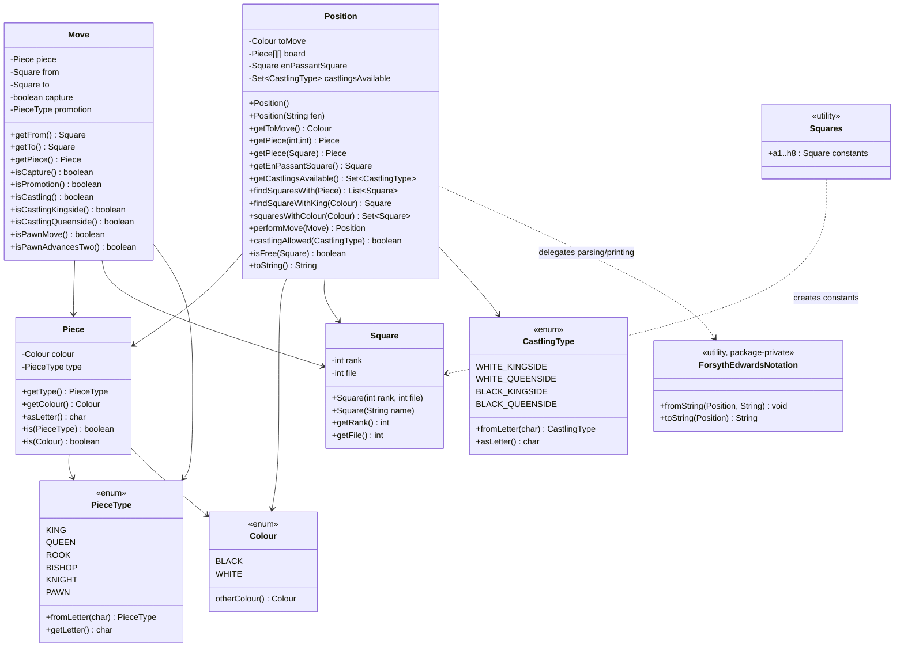
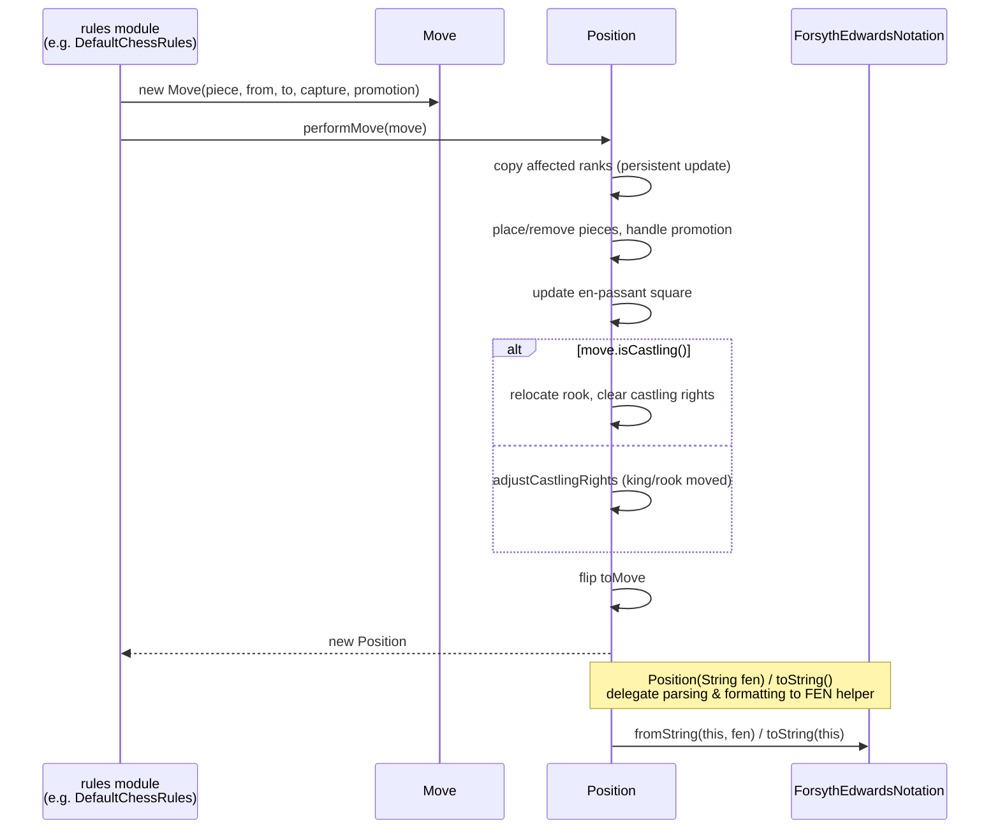
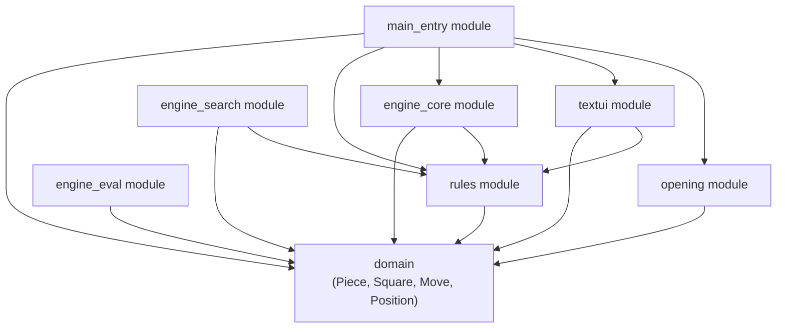

# Domain Module

## 1. Purpose

The **domain** module is the foundational data model of DokChess. It defines the
core chess vocabulary — pieces, squares, moves and positions — that every other
part of the system builds upon. There is no game logic (legality checking,
search, evaluation, I/O) in this module; it purely models *what a chess
position and a move are* and offers a small set of well-defined operations to
read and transform them.

Because it sits at the bottom of the dependency graph, the domain module has
**no dependencies on any other DokChess module**. All other modules depend on
it:

- [rules.md](rules.md) — implements the actual chess rules (legal move
  generation, check detection, castling, etc.) on top of `Position` and `Move`.
- [engine_core.md](engine_core.md), [engine_search.md](engine_search.md),
  [engine_eval.md](engine_eval.md) — use `Position`/`Move` to search for and
  evaluate candidate moves.
- [opening.md](opening.md) — reads opening-book moves and turns them into
  `Move`/`Position` objects (using FEN notation internally).
- [textui.md](textui.md) — the xboard protocol adapter parses/prints moves and
  positions using this module's types.
- [main_entry.md](main_entry.md) — wires the above modules together to run the
  engine as a whole application.

## 2. Architecture Overview

The domain module consists of six classes/files in package
`org.dokchess.domain`, plus three small supporting enums (`Colour`,
`PieceType`, `CastlingType`) that are referenced by the core classes but were
not listed as core components — they are documented here as part of the
domain vocabulary since they are inseparable from it.

### Design principles

- **Immutability.** `Piece`, `Square`, and `Move` are immutable value objects
  with `equals()`/`hashCode()` overrides, making them safe to share across
  threads (important for the parallel search in
  [engine_search.md](engine_search.md)).
- **Persistent position updates.** `Position.performMove(Move)` never mutates
  the receiver; it returns a **new** `Position` that shares unaffected board
  ranks with the source object (only the two affected ranks are copied), which
  keeps move generation and search memory-efficient while still avoiding
  aliasing bugs.
- **FEN as the interchange format.** Both the public `Position(String fen)`
  constructor and the informal `toString()` route through the package-private
  `ForsythEdwardsNotation` helper, keeping all textual parsing/formatting
  logic in one place.
- **No rule knowledge.** `Position` only tracks *state* (piece placement, side
  to move, castling rights, en-passant square) and performs *bookkeeping*
  during `performMove` (moving the rook on castling, clearing/granting
  castling rights, tracking the en-passant square). It does **not** check
  whether a move is legal — that responsibility belongs entirely to the
  [rules module](rules.md).

## 3. Core Components

### 3.1 `Colour`, `PieceType`, `CastlingType` (supporting enums)

Small, self-contained enums used throughout the model:

- `Colour` — `WHITE` / `BLACK`, with `otherColour()` to flip sides.
- `PieceType` — the six chess piece types, each carrying its FEN/SAN letter
  (`K`, `Q`, `R`, `B`, `N`, `P`) and a `fromLetter(char)` factory.
- `CastlingType` — the four castling rights (`WHITE_KINGSIDE`,
  `WHITE_QUEENSIDE`, `BLACK_KINGSIDE`, `BLACK_QUEENSIDE`), each mapped to its
  FEN letter (`K`, `Q`, `k`, `q`).

### 3.2 `Piece`

An immutable value object combining a `PieceType` and a `Colour` — e.g. white
king, black pawn. Provides:
- `asLetter()` — FEN-style single-character representation (uppercase for
  white, lowercase for black).
- `is(PieceType)` / `is(Colour)` — convenient type/colour checks used
  extensively by the [rules module](rules.md) when generating moves.

### 3.3 `Square`

An immutable board coordinate using 0-based `rank`/`file` indices (rank 0 =
the 8th rank, file 0 = the a-file — matching the row order used when scanning
a FEN string top-to-bottom). Can be constructed either numerically
(`new Square(rank, file)`) or algebraically (`new Square("e4")`), and prints
itself back in algebraic notation via `toString()`.

### 3.4 `Squares`

A pure utility/constants class exposing all 64 squares as static fields
(`Squares.a1` … `Squares.h8`) for convenient, readable references — primarily
used in unit tests and rule implementations instead of repeatedly constructing
`new Square("e4")`.

### 3.5 `Move`

An immutable description of a single ply: the moving `Piece`, `from`/`to`
squares, whether it is a capture, and an optional `promotion` piece type. It
also derives several semantic flags purely from its own fields:
- `isPawnMove()`, `isPawnAdvancesTwo()` — pawn-specific checks used by
  `Position` to set up en-passant state.
- `isCastling()`, `isCastlingKingside()`, `isCastlingQueenside()` — detected
  from the king moving two files, used both by `Position.performMove` (to
  relocate the rook) and by the [rules module](rules.md) (to validate
  castling).
- `isPromotion()` — true whenever a promotion piece type is set.

`Move` is produced by rule implementations (see
[rules.md](rules.md)) and consumed by `Position.performMove`, the
[search algorithms](engine_search.md), and the
[xboard text UI](textui.md).

### 3.6 `Position`

The central mutable-looking-but-functionally-persistent representation of a
chess position:

- **State**: an 8×8 `Piece[][]` board, side to move, the set of available
  `CastlingType`s, and an optional en-passant target `Square`.
- **Construction**: default constructor builds the standard starting
  position (via a hard-coded FEN string); `Position(String fen)` builds an
  arbitrary position from FEN; a package-private copy constructor supports
  efficient persistent updates.
- **Queries**: `getPiece(...)`, `isFree(Square)`, `findSquaresWith(Piece)`,
  `findSquareWithKing(Colour)`, `squaresWithColour(Colour)`,
  `castlingAllowed(CastlingType)` — all used heavily by the
  [rules module](rules.md) to generate and validate moves.
- **Mutation via `performMove(Move)`**: returns a new `Position` reflecting
  the move — relocating pieces, handling promotion, updating the en-passant
  square, moving the castling rook and adjusting castling rights, and
  flipping the side to move.
- **Serialization**: `toString()` delegates to `ForsythEdwardsNotation` to
  produce a FEN string, and `Position(String fen)` uses the same helper to
  parse one.

### 3.7 `ForsythEdwardsNotation` (package-private helper)

A stateless tool class (private constructor, only static methods) that
converts between `Position` objects and
[FEN strings](https://www.chessprogramming.org/Forsyth-Edwards_Notation):

- `fromString(Position, String)` — parses piece placement, side to move,
  castling availability, and en-passant square from a FEN string and populates
  the given `Position`. (Halfmove clock and fullmove number groups are parsed
  positionally but not stored — see the `toString` note below.)
- `toString(Position)` — renders a `Position` back into FEN. Note the
  halfmove-clock/fullmove-number suffix is currently hard-coded to `" 0 1"`
  (marked with a `TODO` in the source), since `Position` does not track move
  counters.

This class is only used internally by `Position`; other modules should always
go through `Position`'s public constructor/`toString()` rather than calling
`ForsythEdwardsNotation` directly (it is package-private and inaccessible
outside `org.dokchess.domain` in any case).

## 4. Data Flow Example: Applying a Move

## 5. How Other Modules Depend on `domain`

- **[rules.md](rules.md)** generates legal `Move`s for a given `Position`
  (e.g. `PawnMoves`, `RookMoves`, `CastlingMoves`) and enforces check/legality
  rules (`DefaultChessRules`), always operating on the immutable domain types
  described here.
- **[engine_search.md](engine_search.md)** and
  **[engine_eval.md](engine_eval.md)** traverse trees of `Position`s (produced
  via repeated `performMove` calls) to find and score the best `Move`.
- **[engine_core.md](engine_core.md)** orchestrates opening-book lookup and
  search to return a `Move` for a given `Position` through the `Engine`
  interface.
- **[opening.md](opening.md)** looks up known-good moves for a `Position`
  from a Polyglot opening book, converting between `Position`/`Move` and
  Polyglot's own encoding.
- **[textui.md](textui.md)** implements the xboard protocol, translating
  textual commands into `Move`/`Position` operations and back.
- **[main_entry.md](main_entry.md)** is the application entry point wiring
  all of the above together.
