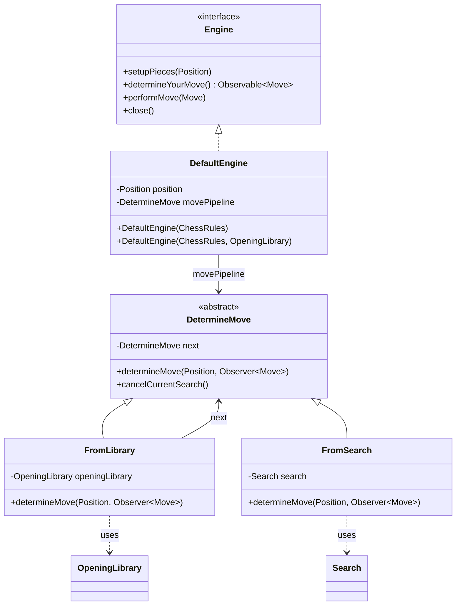
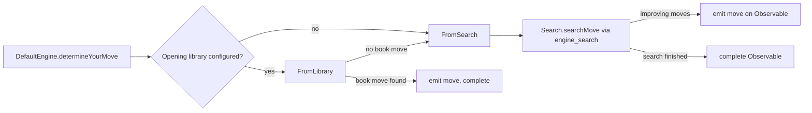
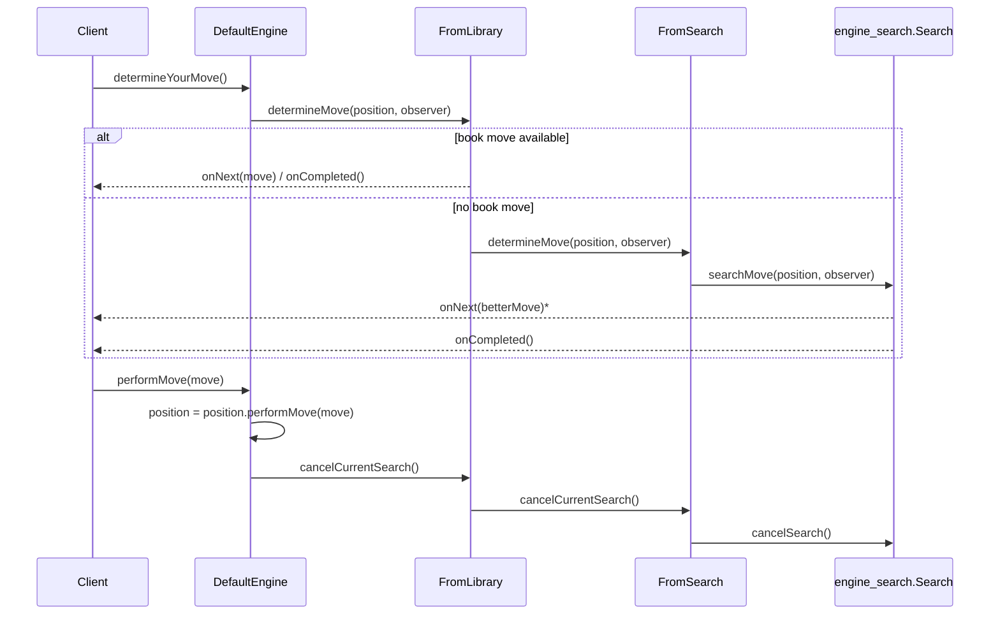
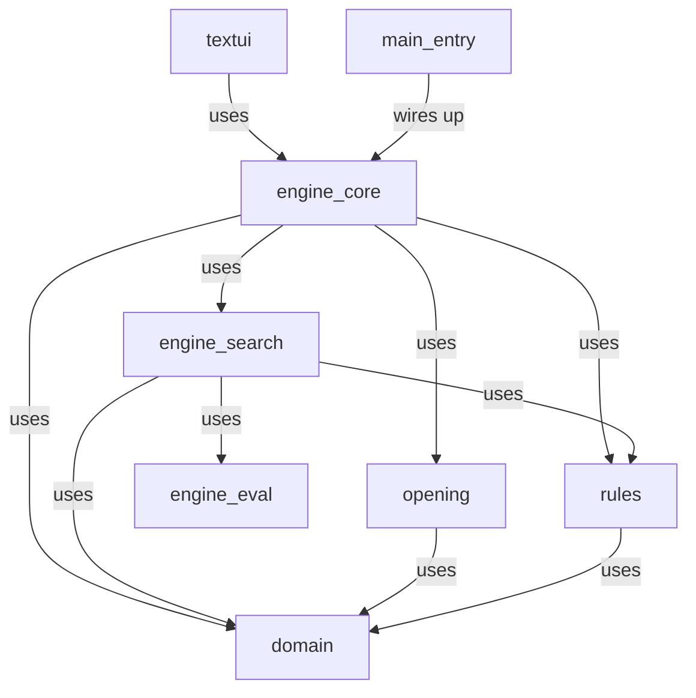

# Engine Core Module

## Introduction

The **engine_core** module is the heart of DokChess's move-decision subsystem. It defines the
public `Engine` API used by client code (such as the [`textui`](textui.md) module's XBoard
adapter or the application's [`main_entry`](main_entry.md)) and provides the default
implementation that ties together the opening book and the search algorithm to actually decide
which move to play.

Conceptually, engine_core does not implement chess rules, evaluation, or search itself — it
**orchestrates** those concerns, which live in dedicated modules:

- [`rules`](rules.md) — legal move generation and game rules, required by any move search.
- [`engine_eval`](engine_eval.md) — static position evaluation (material, etc.).
- [`engine_search`](engine_search.md) — the search algorithms (e.g. Minimax) that use rules and
  evaluation to find the best move.
- [`opening`](opening.md) — opening book lookups that can short-circuit search for well-known
  positions.
- [`domain`](domain.md) — fundamental chess data types (`Position`, `Move`, `Piece`, `Square`,
  etc.) used throughout the engine.

## Purpose

The module answers one central question for a given `Position`: **"What move should be played
next?"** It does so by combining, in priority order:

1. A lookup in an opening library (fast, deterministic, "book" moves).
2. A full search using configurable rules and evaluation heuristics (used when no book move is
   available, or when no opening library is configured at all).

The result is delivered asynchronously via an RxJava `Observable<Move>`, allowing callers to
receive progressively improving move suggestions and a final decision without blocking the
calling thread.

## Architecture Overview

### Component Diagram

### Move-Determination Pipeline

`DefaultEngine` wires up a **chain of responsibility** made of `DetermineMove` links. Each link
either produces a move itself or delegates to the next link in the chain:

- **`FromLibrary`** wraps an `OpeningLibrary` (from the [`opening`](opening.md) module). If a
  known move exists for the current position, it is emitted immediately and the observer chain
  completes — the search stage is skipped entirely.
- **`FromSearch`** wraps a `Search` implementation (from the [`engine_search`](engine_search.md)
  module, e.g. `MinimaxParallelSearch`). It always triggers a search and forwards notifications
  to the observer; because it has no next link, it is the terminal stage of the chain.

If no `OpeningLibrary` is supplied to `DefaultEngine`, the pipeline consists of `FromSearch`
alone.

### Sequence: Determining and Playing a Move

### Dependency Diagram

## Core Components

### `Engine` (interface)

The public contract of the engine subsystem. It is intentionally minimal and stateful:

- `setupPieces(Position)` — resets/sets the engine's internal game state; cancels any running
  search.
- `determineYourMove()` — starts an asynchronous move search, returning an `Observable<Move>`
  that emits progressively better moves (`onNext`) and signals completion (`onCompleted`) when
  done. The engine never applies the move itself.
- `performMove(Move)` — applies a move to the engine's internal `Position`, cancelling any
  ongoing search (the position has changed, so the previous search is no longer valid).
- `close()` — releases resources (e.g. thread pools used by the search); no further move
  calculations are permitted afterward.

Consumers such as the [`textui`](textui.md) XBoard adapter depend only on this interface, not on
`DefaultEngine` directly.

### `DefaultEngine` (implementation of `Engine`)

The concrete, production `Engine` implementation. Responsibilities:

- Holds the current `Position` (starting from `new Position()`, the initial chess setup, from
  [`domain`](domain.md)).
- Builds the `movePipeline` (a chain of `DetermineMove` links) at construction time:
  - Always creates a `MinimaxParallelSearch` (from [`engine_search`](engine_search.md))
    configured with:
    - a search depth of 4,
    - the supplied `ChessRules` (from [`rules`](rules.md)),
    - a `StandardMaterialEvaluation` (from [`engine_eval`](engine_eval.md)).
  - Wraps that search in a `FromSearch` link.
  - If an `OpeningLibrary` (from [`opening`](opening.md)) is provided, prepends a `FromLibrary`
    link so that book moves are preferred over searching.
- Delegates `determineYourMove()` to the pipeline, using an RxJava `ReplaySubject` so that late
  subscribers still receive all previously emitted moves.
- On `performMove` and `setupPieces`, cancels any in-flight search via
  `movePipeline.cancelCurrentSearch()` to avoid wasted computation on a stale position.
- `close()` simply cancels any current search (delegating cleanup down the chain, ultimately to
  the underlying `Search` implementation).

Two constructors are provided: one requiring only `ChessRules` (no opening book), and one
additionally accepting an `OpeningLibrary`.

### `DetermineMove` (abstract base class)

The abstract link type for the chain-of-responsibility pattern used internally by
`DefaultEngine`. Each concrete subclass may:

- Attempt to resolve a move itself and notify the given `Observer<Move>`, **or**
- Delegate to the `next` link in the chain via the default `determineMove` implementation.

It also defines `cancelCurrentSearch()`, which by default simply propagates the cancellation
request down the chain — this ensures that cancelling a search on `DefaultEngine` reaches the
actual `Search` implementation regardless of how many links precede it.

This class is package-private; it is an internal implementation detail of engine_core, not part
of the public API.

### `FromLibrary` (chain link)

Wraps an `OpeningLibrary`. On `determineMove`:

- Looks up a move for the given `Position` via `openingLibrary.lookUpMove(position)`.
- If found, emits it via `observer.onNext(move)` followed by `observer.onCompleted()` — the
  chain stops here, search is never invoked.
- If not found, delegates to the next link (typically `FromSearch`).

This link does not override `cancelCurrentSearch()`, so cancellation requests pass through
transparently to subsequent links.

### `FromSearch` (chain link)

Wraps a `Search` (from [`engine_search`](engine_search.md)). On `determineMove`:

- Always invokes `search.searchMove(position, observer)`, letting the search implementation
  push move improvements and completion events directly to the observer.
- Also calls `super.determineMove(...)`, forwarding to any further link — though in the
  `DefaultEngine` wiring, `FromSearch` is always the terminal link (`next == null`), so this is
  effectively a no-op in practice, and exists mainly for compositional flexibility.

Because `DetermineMove` does not override `cancelCurrentSearch()` in `FromSearch`, cancellation
requests reach the wrapped `Search` implementation only if `FromSearch` itself overrides it — in
this codebase cancellation propagation to the underlying `Search.cancelSearch()`/`close()` occurs
via the `Search` object's own lifecycle as invoked elsewhere in the chain; see
[`engine_search`](engine_search.md) for search cancellation semantics.

## Extensibility

The chain-of-responsibility design in this module makes it straightforward to add new move
sources without modifying existing components — for example, a future "tablebase lookup" link
could be inserted between `FromLibrary` and `FromSearch` by extending `DetermineMove` and
adjusting the pipeline construction in `DefaultEngine`.

Similarly, because `DefaultEngine` depends on the `ChessRules`, `Search`, and `Evaluation`
abstractions (not concrete classes), alternative rule sets, search algorithms, or evaluation
functions can be substituted by supplying different implementations at construction time.

## Related Modules

| Module | Relationship |
|---|---|
| [`domain`](domain.md) | Provides `Position`, `Move`, and other chess data types used across the pipeline. |
| [`rules`](rules.md) | Supplies `ChessRules`, required to configure the search. |
| [`engine_eval`](engine_eval.md) | Supplies `Evaluation` implementations (e.g. `StandardMaterialEvaluation`) used by the search. |
| [`engine_search`](engine_search.md) | Supplies `Search` implementations (e.g. `MinimaxParallelSearch`) that perform the actual move search. |
| [`opening`](opening.md) | Supplies `OpeningLibrary` implementations for book-move lookups. |
| [`textui`](textui.md) | Consumes the `Engine` interface (e.g. via XBoard protocol) to drive gameplay. |
| [`main_entry`](main_entry.md) | Wires up and starts the application, constructing a `DefaultEngine` with concrete rules/library implementations. |
