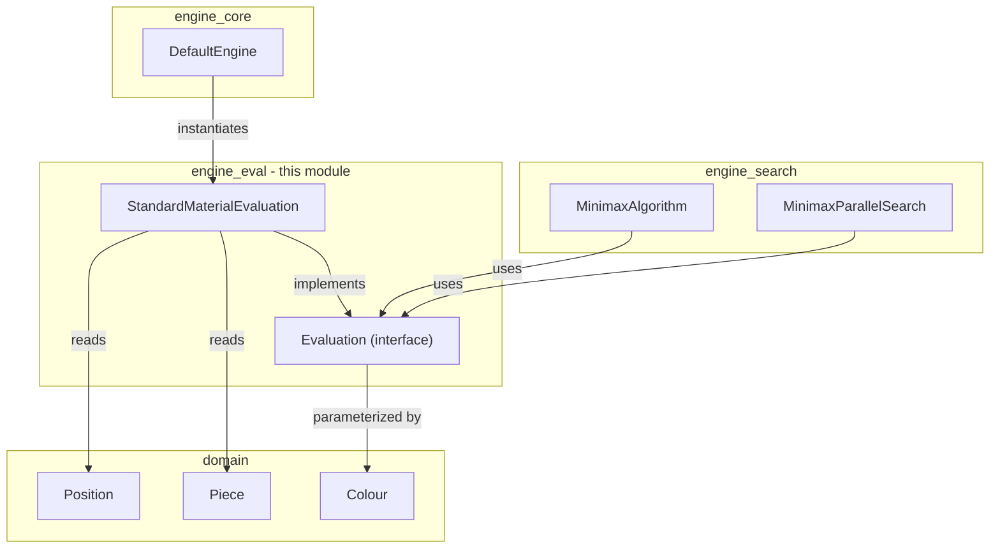
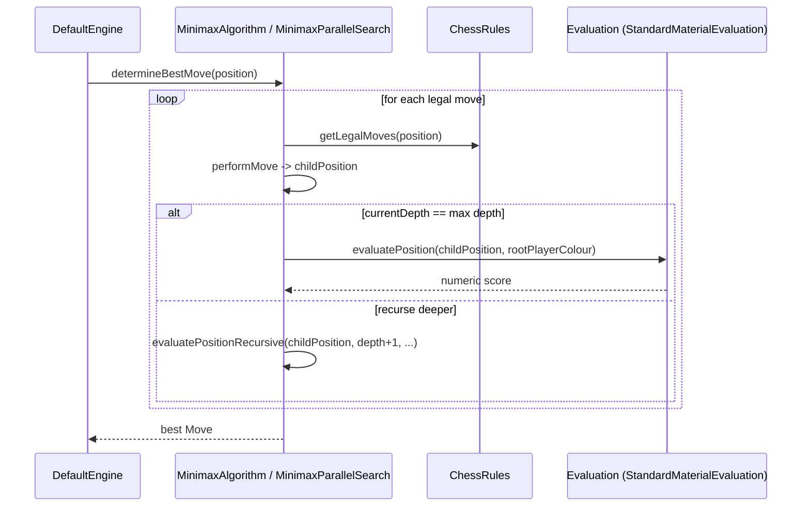

# Engine Eval Module

## 1. Purpose

The `engine_eval` module provides the **position evaluation** capability for the DokChess engine. Evaluation is the function that turns a chess `Position` into a single numeric score representing how favorable that position is for a given player. This score is the core signal that search algorithms (see [engine_search](engine_search.md)) use to decide which move is "best" among the legal alternatives.

The module consists of:

- **`Evaluation`** — a small interface defining the evaluation contract and the shared constants (`BEST`, `WORST`, `BALANCED`) used throughout the search/evaluation machinery.
- **`StandardMaterialEvaluation`** — the default, concrete implementation, which scores a position purely by counting material (piece values), independent of piece placement.

Because evaluation is decoupled behind the `Evaluation` interface, alternative evaluation strategies (e.g. positional heuristics, piece-square tables, endgame tablebases) can be introduced later without touching the search algorithms or the rest of the engine.

## 2. Architecture Overview

`engine_eval` sits between the domain model (which describes positions and pieces) and the search algorithms (which explore the game tree and need a leaf-scoring function).



Key relationships:

- `Evaluation` is the single abstraction the rest of the engine depends on. Search components ([`MinimaxAlgorithm`](engine_search.md), [`MinimaxParallelSearch`](engine_search.md)) hold a reference to an `Evaluation` instance and invoke it at the leaves (or truncation depth) of their tree search.
- `StandardMaterialEvaluation` is the concrete strategy currently wired up by [`DefaultEngine`](engine_core.md) (from the [engine_core](engine_core.md) module), which constructs a `MinimaxParallelSearch` and injects a `new StandardMaterialEvaluation()` into it.
- Evaluation implementations only depend on the [domain](domain.md) module (`Position`, `Piece`, `Colour`) — they have no dependency on rules, search, or engine orchestration, keeping the module small and easily testable/replaceable.

## 3. Core Components

### 3.1 `Evaluation` (interface)

Defines the contract for scoring a position from a specific player's point of view:

```java
int evaluatePosition(Position position, Colour pointOfView);
```

- Higher values are better for `pointOfView`.
- `BALANCED` (0) represents an even position.
- `BEST` (`Integer.MAX_VALUE`) and `WORST` (`Integer.MIN_VALUE`) are sentinel bounds used by search algorithms for alpha/beta-like comparisons and initialization (e.g. `MinimaxAlgorithm` initializes `bestValue = Evaluation.WORST` before iterating candidate moves, and uses `Evaluation.BEST` as the basis for scaling checkmate scores).

Because these constants are shared, any evaluation implementation must be careful not to return values so extreme that they collide with or overflow relative to `BEST`/`WORST`, especially since search algorithms derive checkmate scores from `Evaluation.BEST / 2`.

### 3.2 `StandardMaterialEvaluation` (implementation)

A straightforward material-counting evaluator:

- Iterates over all 64 squares of the `Position` (via `Position.getPiece(rank, file)`).
- For each occupied square, looks up a fixed piece value:

| Piece Type      | Value |
|------------------|-------|
| Pawn             | 1     |
| Knight           | 3     |
| Bishop           | 3     |
| Rook             | 5     |
| Queen            | 9     |
| King             | 0     |

- Adds the value if the piece belongs to `pointOfView`'s colour, subtracts it otherwise.
- Returns the running total as the evaluation score.

This produces an intuitive score: equal material yields `0`; losing a queen relative to the opponent lowers the score by `9`, etc. It deliberately ignores piece placement, mobility, king safety, and other positional factors — it is meant as a simple, fast baseline evaluation suitable for use inside a depth-limited minimax search.

The `pieceValue` method is `protected`, allowing subclasses to override piece values (e.g. to experiment with different material weightings) while reusing the board-scanning logic in `evaluatePosition`.

## 4. Evaluation in the Search Process

Evaluation is invoked at the "leaves" of a game-tree search — i.e., positions reached after searching to the configured maximum depth. The diagram below illustrates how `MinimaxAlgorithm` (from [engine_search](engine_search.md)) calls into `Evaluation`:



At depth boundaries, the recursive minimax simply delegates scoring to `evaluation.evaluatePosition(position, rootPlayerColour)`. All intermediate min/max layers propagate the best/worst of these leaf scores back up to the root, ultimately selecting the move with the highest resulting value for the side to move.

## 5. Extensibility

To introduce a new evaluation strategy:

1. Implement the `Evaluation` interface with a new class (e.g. `PositionalEvaluation`).
2. Wire it into the move-determination pipeline by passing it to a search algorithm's `setEvaluation(...)` method (see [`MinimaxAlgorithm.setEvaluation`](engine_search.md) / [`MinimaxParallelSearch`](engine_search.md)), typically at engine construction time in [`DefaultEngine`](engine_core.md).
3. No changes are required in the [engine_search](engine_search.md), [engine_core](engine_core.md), or [rules](rules.md) modules, since they only depend on the `Evaluation` abstraction.

## 6. Related Modules

- [domain](domain.md) — defines `Position`, `Piece`, `Colour`, and other chess data types consumed by evaluation implementations.
- [engine_search](engine_search.md) — contains `MinimaxAlgorithm` and `MinimaxParallelSearch`, the primary consumers of `Evaluation`, which drive the game-tree search and call the evaluation function at search-depth boundaries.
- [engine_core](engine_core.md) — contains `DefaultEngine`, `DetermineMove`, `FromSearch`, and `FromLibrary`, which orchestrate move determination and wire a concrete `Evaluation` (`StandardMaterialEvaluation`) into the search pipeline.
- [rules](rules.md) — supplies `ChessRules` used by search algorithms to generate legal moves and detect check/checkmate/stalemate, working alongside evaluation to score positions.
- [opening](opening.md) — supplies an `OpeningLibrary` which, when available, is consulted before falling back to search-and-evaluate for early-game moves.
