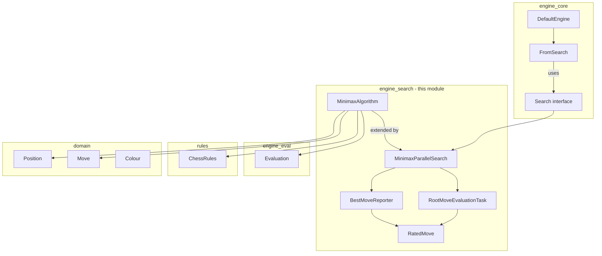
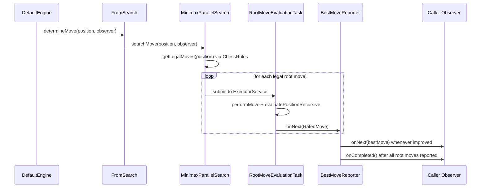

# Engine Search Module

## Purpose

The `engine_search` module implements DokChess's core move-finding algorithm: a
depth-limited **minimax** search over legal chess moves, evaluated with a
pluggable position [Evaluation](engine_eval.md) function and driven by the
[rules](rules.md) engine for legal move generation and check/mate/stalemate
detection.

The module provides two complementary building blocks:

1. **A sequential minimax algorithm** (`MinimaxAlgorithm`) that can compute
   the best move for a position in a single blocking call.
2. **A parallelized, asynchronous search** (`MinimaxParallelSearch`) that
   evaluates every root move concurrently on a thread pool and streams
   progressively better moves to a caller via an RxJava `Observer`. This is
   the implementation of the `Search` abstraction that the rest of the engine
   depends upon.

This module is consumed by [engine_core](engine_core.md), specifically by
`DefaultEngine`, which wires a `MinimaxParallelSearch` instance (configured
with a search depth and a `StandardMaterialEvaluation`) into its
`DetermineMove` pipeline (`FromSearch`, optionally chained after
`FromLibrary` for [opening book](opening.md) lookups).

## Architecture Overview

### Sub-modules

| Sub-module | Contents | Description |
|---|---|---|
| [Minimax Algorithm](engine_search_minimax_algorithm.md) | `MinimaxAlgorithm`, `RatedMove` | The core, single-threaded recursive minimax scoring logic shared by both synchronous and parallel search, plus the value object used to carry a move together with its numeric score. |
| [Parallel Search Execution](engine_search_parallel_execution.md) | `Search`, `MinimaxParallelSearch`, `RootMoveEvaluationTask`, `BestMoveReporter` | The asynchronous, thread-pool-based `Search` implementation that fans out root-move evaluation across CPU cores and streams improving results via RxJava. |

## High-Level Functionality

### 1. Minimax evaluation (synchronous core)

`MinimaxAlgorithm` walks the legal move tree to a configured ply `depth`,
alternating minimizing/maximizing layers, and falls back to a leaf
`Evaluation` once the depth limit is reached. It explicitly special-cases
checkmate (scored so that shorter mates are preferred) and stalemate (scored
as balanced). See [Minimax Algorithm](engine_search_minimax_algorithm.md) for
details.

### 2. Parallel, asynchronous search

`MinimaxParallelSearch` extends `MinimaxAlgorithm`, reusing its recursive
scoring routine, but parallelizes work **at the root**: every legal root move
is dispatched as an independent `RootMoveEvaluationTask` to a fixed thread
pool sized to the number of available CPU cores. As each task finishes, it
publishes a `RatedMove` on a shared RxJava `ReplaySubject`; a `BestMoveReporter`
observer tracks the best-so-far move and forwards improvements to the
engine's caller, completing the stream once every root move has reported.
See [Parallel Search Execution](engine_search_parallel_execution.md) for
details.

## Data Flow: Determining a Move

## Relationship to Other Modules

- **[domain](domain.md)** — supplies the immutable `Position`, `Move`,
  `Colour`, `Piece`, and `Square` types manipulated throughout the search.
- **[rules](rules.md)** — `ChessRules` (implemented by `DefaultChessRules`)
  supplies legal move generation and check/mate/stalemate detection that the
  minimax recursion depends on at every ply.
- **[engine_eval](engine_eval.md)** — `Evaluation` (e.g.
  `StandardMaterialEvaluation`) supplies the leaf-node scoring function used
  once the configured search depth is reached.
- **[engine_core](engine_core.md)** — `DefaultEngine` configures and owns a
  `MinimaxParallelSearch`, chaining it into a `DetermineMove` pipeline
  (`FromSearch`, optionally preceded by `FromLibrary` which consults the
  [opening](opening.md) book before falling back to search).

## Sub-module Documentation

- [Minimax Algorithm](engine_search_minimax_algorithm.md)
- [Parallel Search Execution](engine_search_parallel_execution.md)
