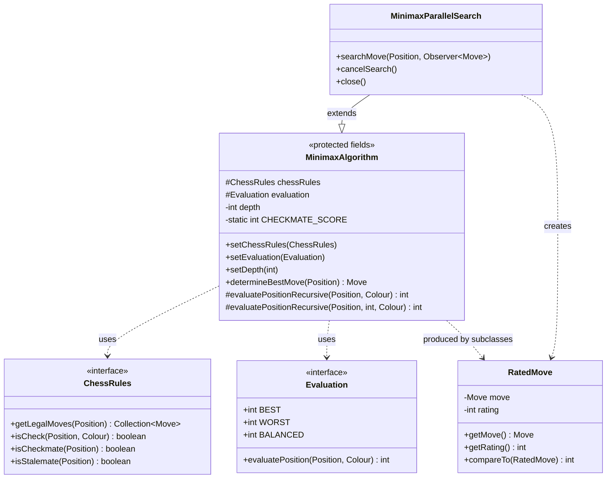
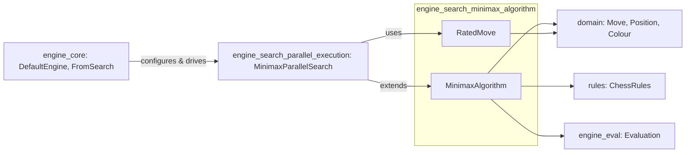
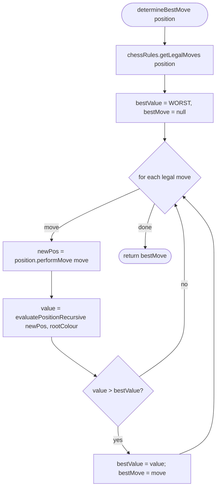
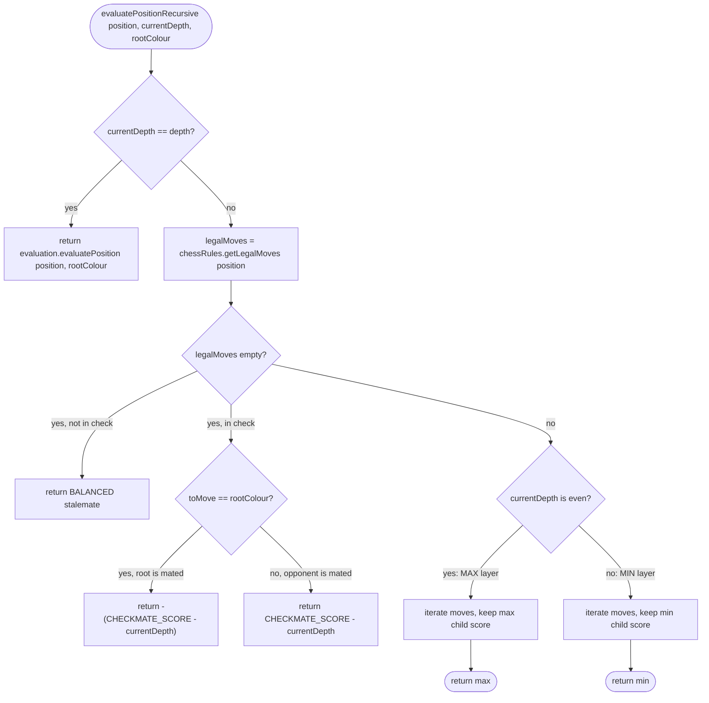
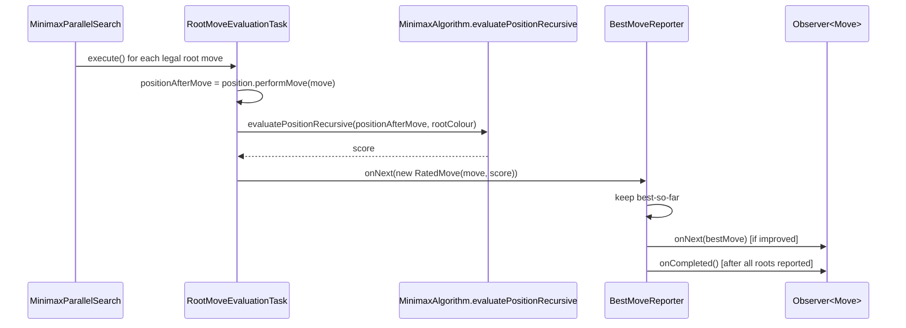
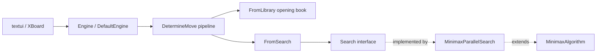

# Engine Search: Minimax Algorithm

## Introduction

The **engine_search_minimax_algorithm** module implements the core game-tree
search strategy used by DokChess to pick a move: a depth-limited
**minimax** algorithm. It walks the tree of legal moves up to a configurable
ply depth, alternates between maximizing and minimizing layers to model the
two opposing players, and falls back to a pluggable static
[`Evaluation`](engine_eval.md) function at the search horizon. Checkmate and
stalemate are detected and scored explicitly so that the algorithm always
prefers a forced mate over a merely favorable material evaluation, and
prefers *shorter* mates over longer ones.

This module contains two closely related classes:

* **`MinimaxAlgorithm`** – the sequential, single-threaded search engine.
  It exposes a simple, blocking `determineBestMove(Position)` API.
* **`RatedMove`** – a small immutable value object pairing a `Move` with its
  numeric evaluation (`rating`). It is the currency used to communicate
  search results, both internally and to consumers such as the parallel
  search implementation.

`MinimaxAlgorithm` is also the **base class** for the concurrent search
strategy documented separately in
[engine_search_parallel_execution](engine_search_parallel_execution.md),
which reuses its recursive evaluation logic (`evaluatePositionRecursive`)
but distributes the evaluation of root moves across worker threads.

---

## Purpose and Core Functionality

| Responsibility | Description |
|---|---|
| Move enumeration | Delegates to [`ChessRules.getLegalMoves`](rules.md) to obtain all legal moves for the side to move. |
| Recursive search | Explores the resulting position tree to a fixed ply `depth`, alternating min/max layers. |
| Leaf evaluation | Calls a pluggable [`Evaluation`](engine_eval.md) (e.g. `StandardMaterialEvaluation`) once the depth limit is reached. |
| Terminal-node handling | Explicitly detects checkmate and stalemate when no legal moves exist at a node, short-circuiting evaluation. |
| Result packaging | Returns the single best `Move` (sequential API) or, in the parallel variant, a stream of `RatedMove`s. |

### Key configuration (`MinimaxAlgorithm`)

* `setChessRules(ChessRules)` — supplies move generation and check/mate detection.
* `setEvaluation(Evaluation)` — supplies the static leaf-node scoring function.
* `setDepth(int)` — search depth in **plies (half-moves)**. E.g. `depth = 4` looks two full moves ahead for each side.

These setters must be called before invoking `determineBestMove`; `DefaultEngine` wires them up (see [Integration](#integration-with-the-engine) below).

---

## Architecture



`MinimaxAlgorithm` itself does **not** depend on `RatedMove` directly (its
public API returns a plain `Move`); `RatedMove` is used by the derived
parallel search to carry an evaluated score for each root move across
thread boundaries. It is grouped in this module because both classes
together form the "pure" minimax abstraction, before parallelization is
layered on top.

---

## Dependencies



* [`domain`](domain.md) — `Move`, `Position`, `Colour` are the data types the algorithm operates on. `Position.performMove` is used to generate child positions; it returns a new immutable `Position` rather than mutating the current one.
* [`rules`](rules.md) — `ChessRules.getLegalMoves` supplies legal moves at every node; the algorithm relies on the contract that an **empty move collection** always indicates checkmate or stalemate (never "no rules to apply").
* [`engine_eval`](engine_eval.md) — `Evaluation` supplies the static score used exactly at the configured leaf depth; `Evaluation.BEST`/`WORST`/`BALANCED` constants are reused as sentinel values inside the minimax recursion.
* [`engine_search_parallel_execution`](engine_search_parallel_execution.md) — `MinimaxParallelSearch` subclasses `MinimaxAlgorithm` to reuse `evaluatePositionRecursive` while parallelizing the *root* move evaluation across CPU cores, and implements the `Search` interface used by the engine pipeline.
* [`engine_core`](engine_core.md) — `DefaultEngine` wires a `MinimaxParallelSearch` (configured with `depth`, `ChessRules`, `Evaluation`) into the `FromSearch` stage of its move-determination pipeline.

---

## Algorithm Details

### Root move selection (`determineBestMove`)



Note: the root player's own move is applied *before* recursion starts at
ply depth `1`, which is treated as a **min layer** in
`evaluatePositionRecursive` (see below) — this correctly represents the
opponent's reply as the next decision point.

### Recursive minimax evaluation (`evaluatePositionRecursive`)



Layer semantics:

* **Odd ply (`currentDepth % 2 == 1`)** → **MIN layer**. Ply 1 corresponds to the
  opponent's reply to the root move, so the algorithm picks the move that is
  *worst* for the root player (i.e., best for the opponent).
* **Even ply** → **MAX layer**, representing the root player's subsequent
  move, so the algorithm picks the *best* score for the root player.

This alternation, combined with applying the root move once before
recursion begins at depth 1, implements a standard fixed-depth minimax
without explicit negation of scores — instead, the evaluation function
itself is always called from a single, consistent point of view
(`rootPlayerColour`), and the min/max choice at each layer encodes whose
turn it is.

### Checkmate / stalemate scoring

* **Stalemate** (`no legal moves` and `not in check`) → `Evaluation.BALANCED` (0), i.e. a draw.
* **Checkmate**, root player has been mated → `-(CHECKMATE_SCORE - currentDepth)`, a large negative number.
* **Checkmate**, opponent has been mated → `+(CHECKMATE_SCORE - currentDepth)`, a large positive number.

`CHECKMATE_SCORE` is `Evaluation.BEST / 2`. Subtracting `currentDepth` means
that a mate found at a **shallower** depth (fewer moves away) yields a
**higher magnitude** score than one found deeper in the tree — the
algorithm therefore naturally prefers the fastest forced mate available at
its search horizon, and, symmetrically, prefers to delay being mated for as
long as possible.

---

## `RatedMove`

`RatedMove` is a minimal, comparable wrapper:

```java
public class RatedMove implements Comparable<RatedMove> {
    Move move;
    int rating;
    // getMove(), getRating(), compareTo() by rating
}
```

It is not consumed by `MinimaxAlgorithm` itself but is the message type
passed between worker threads in
[`MinimaxParallelSearch`](engine_search_parallel_execution.md): each root
move is evaluated independently on a thread pool, and its resulting
`RatedMove` is published to a reactive stream so the best-so-far move can be
reported incrementally while the search is still running.



---

## Integration with the Engine

`MinimaxAlgorithm`'s subclass `MinimaxParallelSearch` is the concrete
`Search` implementation instantiated by
[`DefaultEngine`](engine_core.md) (see `engine_core`):

```java
MinimaxParallelSearch minimax = new MinimaxParallelSearch();
minimax.setDepth(4);
minimax.setChessRules(chessRules);
minimax.setEvaluation(new StandardMaterialEvaluation());

FromSearch fromSearch = new FromSearch(minimax);
```



* [`engine_core`](engine_core.md) documents the `DetermineMove` pipeline (`FromLibrary` → `FromSearch`) that decides whether to consult the opening book (see [`opening`](opening.md)) before falling back to search.
* [`engine_search_parallel_execution`](engine_search_parallel_execution.md) documents the `Search` interface, threading model, and reactive result reporting built on top of this module's recursive minimax core.
* [`engine_eval`](engine_eval.md) documents the evaluation functions (e.g. material counting) plugged into the leaf nodes.
* [`rules`](rules.md) documents legal move generation, check, checkmate and stalemate detection consumed at every recursion step.
* [`domain`](domain.md) documents the `Position`/`Move`/`Colour` model manipulated throughout the search.

---

## Design Notes & Characteristics

* **Determinism**: `determineBestMove` is deterministic for a given
  `Position`, `ChessRules`, `Evaluation`, and `depth` — the same inputs
  always yield the same move, since ties are broken by move iteration
  order (`>` rather than `>=` keeps the *first* best move found).
* **Blocking API**: the sequential `MinimaxAlgorithm.determineBestMove`
  blocks the calling thread until the full depth-limited tree has been
  explored. There is no cancellation support at this level; cancellation is
  only meaningful for the asynchronous `Search`-based implementations (see
  [engine_search_parallel_execution](engine_search_parallel_execution.md)).
* **No pruning**: this is a plain minimax without alpha-beta pruning or
  transposition tables; every node up to `depth` is evaluated exhaustively.
  Search speed therefore scales with branching factor raised to the power
  of `depth`, which is why `MinimaxParallelSearch` parallelizes across root
  moves rather than reducing the search space itself.
* **Immutable positions**: because `Position.performMove` always returns a
  new `Position` object, the recursive search naturally avoids
  shared-mutable-state hazards, which is also what makes the parallel
  extension safe to run concurrently across threads without extra
  synchronization inside the recursion itself.
