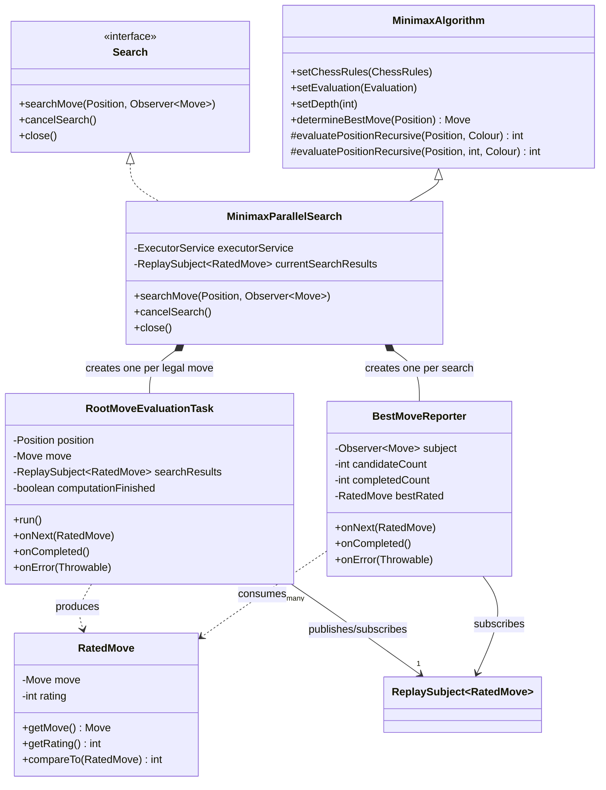
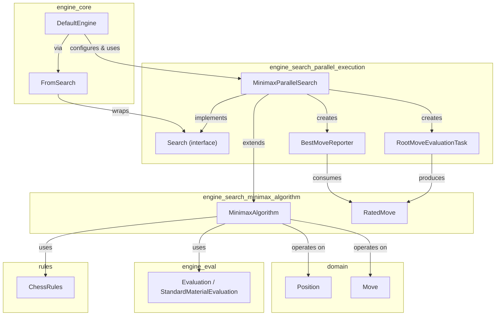
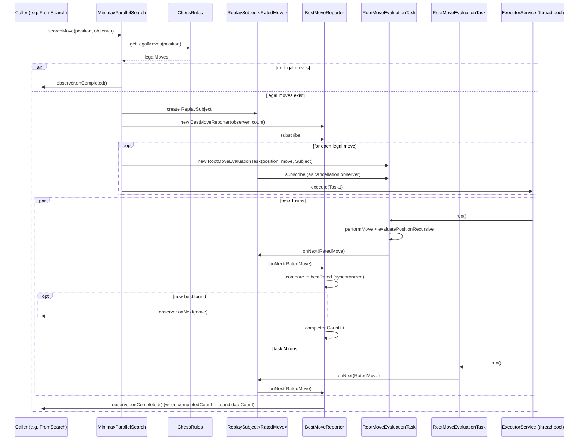
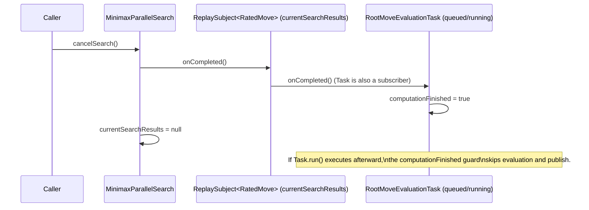
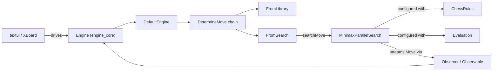

# Engine Search — Parallel Execution

## Introduction

The **`engine_search_parallel_execution`** module provides a multi-threaded implementation of the `Search` contract used by the DokChess [engine core](engine_core.md) to find a good move for the current position. Its centerpiece, `MinimaxParallelSearch`, evaluates every legal root move concurrently on a thread pool by extending the sequential [`MinimaxAlgorithm`](engine_search_minimax_algorithm.md) with a parallel, event-driven root-move scheduler built on RxJava (`Observer`/`Subject`).

This module answers the question *"how does the engine search many candidate moves at once and stream improving results back to the caller?"* — as opposed to the [`engine_search_minimax_algorithm`](engine_search_minimax_algorithm.md) module, which answers *"how is a single position tree evaluated?"*.

It is a child of the [`engine_search`](engine_search.md) module and is consumed directly by [`engine_core`](engine_core.md) (specifically `DefaultEngine`), which wires it together with rules, evaluation, and an opening library to build a complete chess engine.

---

## Purpose & Responsibilities

| Responsibility | Description |
|---|---|
| **Parallel root-move evaluation** | For a given `Position`, every legal move is dispatched as an independent task to a fixed-size thread pool (sized to available CPU cores), each recursively scoring its resulting position with the inherited minimax search. |
| **Streaming of improving moves** | As each task finishes, its rated result is compared against the best found so far; whenever a *new best* move appears, it is pushed to the caller's `Observer<Move>` immediately — the caller does not have to wait for the entire search to finish to see improvements. |
| **Search lifecycle management** | Implements the `Search` interface's `searchMove`, `cancelSearch`, and `close` semantics, including graceful cancellation of in-flight work and orderly executor shutdown. |
| **Asynchronous, non-blocking API** | Unlike `MinimaxAlgorithm.determineBestMove()` (blocking), `MinimaxParallelSearch.searchMove()` returns immediately; results and completion are signaled asynchronously via RxJava. |

---

## Core Components

### `Search` (interface)

Defines the asynchronous move-search contract implemented by this module (and any other search strategy in the [`engine_search`](engine_search.md) family):

```java
public interface Search {
    void searchMove(Position position, Observer<Move> observer);
    void cancelSearch();
    void close();
}
```

- **`searchMove`** — starts (or restarts) a search; the observer receives zero or more `onNext(Move)` calls with progressively better moves, followed by exactly one `onCompleted()` (or `onError()`).
- **`cancelSearch`** — aborts the currently running search without releasing engine resources; a subsequent `searchMove` call is still valid.
- **`close`** — permanently shuts down the search, releasing resources (e.g., thread pools); no further searches are permitted afterward.

### `MinimaxParallelSearch`

```java
public class MinimaxParallelSearch extends MinimaxAlgorithm implements Search
```

The primary implementation in this module. It:

1. Inherits `chessRules`, `evaluation`, `depth`, and the recursive `evaluatePositionRecursive(...)` scoring logic from [`MinimaxAlgorithm`](engine_search_minimax_algorithm.md) — reusing the exact same tree-search semantics (minimax with checkmate/stalemate handling), just applied per-root-move instead of sequentially over all root moves.
2. Owns a fixed-size `ExecutorService` (`Executors.newFixedThreadPool(cores)`), sized by `Runtime.getRuntime().availableProcessors()`.
3. On `searchMove`:
   - Retrieves all legal moves via `chessRules.getLegalMoves(position)`.
   - If there are none, immediately signals `onCompleted()` on the caller's observer (mate/stalemate case — mirrors `MinimaxAlgorithm.determineBestMove()` returning `null`).
   - Otherwise, creates a `ReplaySubject<RatedMove>` (`currentSearchResults`) as the internal event bus for this search run, subscribes a `BestMoveReporter`, and for every legal move creates and submits a `RootMoveEvaluationTask`.
4. On `cancelSearch`: completes the internal `ReplaySubject`, which stops the `BestMoveReporter` from reporting further and marks all subscribed tasks as finished (via their `onCompleted()` callback) so any tasks that have not yet started their computation skip it.
5. On `close`: cancels any running search and shuts down the executor service — no further searches are possible afterward, per the `Search` contract.

### `RootMoveEvaluationTask` (inner class)

```java
class RootMoveEvaluationTask implements Runnable, Observer<RatedMove>
```

One instance is created **per legal root move**. It plays two roles simultaneously:

- **`Runnable`** — the unit of work submitted to the executor. When run, it:
  1. Applies the move to the root `Position` (`position.performMove(move)`).
  2. Recursively evaluates the resulting position from ply 1 using the inherited `evaluatePositionRecursive(positionAfterMove, rootPlayerColour)`.
  3. Publishes a `RatedMove(move, score)` onto the shared `searchResults` subject.
  4. Skips the computation entirely if it has already been marked `computationFinished` (i.e., the search was cancelled before this task started executing on the thread pool) — a cheap guard against wasted work.
- **`Observer<RatedMove>`** — each task also subscribes to the *same* `searchResults` subject as a **cancellation signal**: when the subject completes (via `cancelSearch()`) or errors, `onCompleted`/`onError` set `computationFinished = true`, so the task's own `run()` (if not yet executed, or currently blocked on the queue) becomes a no-op.

This dual role lets a single lightweight object act as both a worker and its own cancellation flag, without needing a separate `Future`-cancellation mechanism.

### `BestMoveReporter` (inner class)

```java
class BestMoveReporter implements Observer<RatedMove>
```

Subscribed once per search to the shared `ReplaySubject<RatedMove>`. Its job is to reduce the stream of per-move `RatedMove` results down to a stream of *strictly improving* `Move`s for the external caller:

- Tracks `bestRated` (best `RatedMove` seen so far) and `completedCount` (how many of the `candidateCount` root moves have reported).
- `onNext` is `synchronized` because multiple worker threads publish onto the same subject concurrently:
  - If the new `RatedMove` beats the current best (or there is no best yet), it becomes the new best and is forwarded via `subject.onNext(ratedMove.getMove())` to the original caller's observer.
  - Regardless of whether it was an improvement, `completedCount` is incremented; once every candidate move has reported, `subject.onCompleted()` signals the end of the search to the caller.

### `RatedMove`

A simple value type (also used by the [`engine_search_minimax_algorithm`](engine_search_minimax_algorithm.md) module) pairing a `Move` with its integer evaluation `rating`, and implementing `Comparable` by rating. It is the internal currency exchanged between `RootMoveEvaluationTask` and `BestMoveReporter`.

---

## Architecture



### Dependency relationships



Related documentation:
- [`engine_search`](engine_search.md) — parent module describing the general search abstraction.
- [`engine_search_minimax_algorithm`](engine_search_minimax_algorithm.md) — the sequential minimax tree-search logic reused by this module via inheritance.
- [`engine_core`](engine_core.md) — the module that wires `MinimaxParallelSearch` into the overall `Engine` pipeline (`DefaultEngine`, `FromSearch`, `DetermineMove` chain).
- [`engine_eval`](engine_eval.md) — supplies the `Evaluation` strategy (e.g. `StandardMaterialEvaluation`) used at the search's leaf depth.
- [`rules`](rules.md) — supplies `ChessRules` for legal-move generation and check/mate/stalemate detection.
- [`domain`](domain.md) — supplies the `Position` and `Move` value types operated on throughout the search.

---

## Data & Control Flow

### Sequence: a single `searchMove` call



### Sequence: cancellation mid-search



### State diagram: `RootMoveEvaluationTask` lifecycle

```mermaid
stateDiagram-v2
    [*] --> Created : constructed with position, move, subject
    Created --> Queued : executorService.execute(task)
    Queued --> Running : thread picks up task
    Running --> Published : evaluatePositionRecursive completes; onNext(RatedMove)
    Published --> [*]

    Created --> Cancelled : subject.onCompleted() / onError() before run()
    Queued --> Cancelled : subject.onCompleted() / onError() before run()
    Cancelled --> Skipped : run() executes but computationFinished == true
    Skipped --> [*]
```



---

## Concurrency Design Notes

- **Thread pool sizing**: the pool has exactly `Runtime.getRuntime().availableProcessors()` threads, aiming to fully utilize available CPU cores without oversubscription. Because each root-move task performs CPU-bound recursive minimax evaluation, this sizing is appropriate for compute-bound parallelism (in contrast to I/O-bound thread pools, which typically use more threads than cores).
- **Shared mutable state is minimized**: each `RootMoveEvaluationTask` operates on its own copy of the position (`position.performMove(move)`) and has no shared mutable state with other tasks — `Position` and `Move` are immutable value types (see [`domain`](domain.md)), eliminating the need for locking within the recursive search itself.
- **Synchronization point**: the only shared, mutable state across threads is inside `BestMoveReporter`, protected by a `synchronized` `onNext` method. This keeps the critical section small (just comparison/bookkeeping), while the expensive tree search runs fully in parallel without contention.
- **RxJava as the coordination mechanism**: rather than using `Future`/`CompletableFuture` composition or explicit `CountDownLatch`/locks, the module uses a `ReplaySubject<RatedMove>` as a lightweight in-process event bus. This allows:
  - Multiple producers (`RootMoveEvaluationTask`s) and one consumer (`BestMoveReporter`) to communicate without direct references to each other's internals.
  - Uniform cancellation: completing the subject naturally notifies all subscribers (including the tasks themselves acting as observers) that the search is over.
- **Cancellation is cooperative, not preemptive**: `cancelSearch()` does not interrupt threads already executing `run()`; it only prevents *new* evaluations from starting (via the `computationFinished` flag) and stops the `BestMoveReporter`/caller observer from being notified after cancellation. A task already deep in `evaluatePositionRecursive` will run to completion, but its result will simply not affect the reported best move once the subject has completed. Note: the reporter itself does not check `computationFinished`, so a straggling task's `onNext` (published to the already-completed subject) is simply dropped per RxJava `Subject` semantics — the reporter's own subscription was severed when `onCompleted()` fired.
- **Reuse instead of duplication of search logic**: rather than reimplementing minimax, `MinimaxParallelSearch` *extends* `MinimaxAlgorithm`, inheriting `evaluatePositionRecursive` — the same recursive tree-walking, checkmate/stalemate handling, and configuration (`setChessRules`, `setEvaluation`, `setDepth`) used by the sequential algorithm documented in [`engine_search_minimax_algorithm`](engine_search_minimax_algorithm.md). This module's value-add is purely the *root-level parallelization and streaming* layer on top.

---

## Integration with the Engine

`MinimaxParallelSearch` is the search strategy actually used in production by `DefaultEngine` (see [`engine_core`](engine_core.md)):

```java
MinimaxParallelSearch minimax = new MinimaxParallelSearch();
minimax.setDepth(4);
minimax.setChessRules(chessRules);
minimax.setEvaluation(new StandardMaterialEvaluation());

FromSearch fromSearch = new FromSearch(minimax);
```

`FromSearch` (part of `engine_core`'s `DetermineMove` chain) delegates to this module's `Search.searchMove(...)` whenever no result can be found in the opening book (`FromLibrary`), forwarding the observer supplied by `Engine.determineYourMove()`. This means:

- Every call to `Engine.determineYourMove()` that reaches the search stage results in a new `searchMove` invocation on this module.
- `Engine.setupPieces(...)` and `Engine.performMove(...)` both trigger `movePipeline.cancelCurrentSearch()`, which propagates down to this module's `cancelSearch()` — ensuring stale searches for a now-outdated position are stopped promptly.
- `Engine.close()` propagates to `cancelCurrentSearch()` but, notably, `DefaultEngine` does not call `Search.close()` directly on the pipeline — the `MinimaxParallelSearch`'s `close()` (which shuts down its executor) would need to be invoked explicitly by any long-lived engine wrapper that wants to release the thread pool.



For details on how moves reach the search from the opening book fallback chain, see [`engine_core`](engine_core.md). For details on evaluation functions pluggable into `setEvaluation`, see [`engine_eval`](engine_eval.md).
