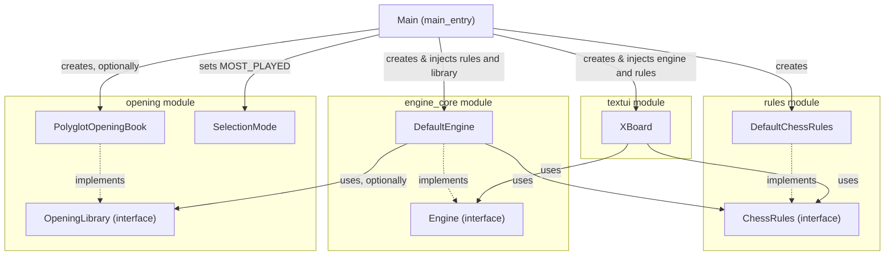
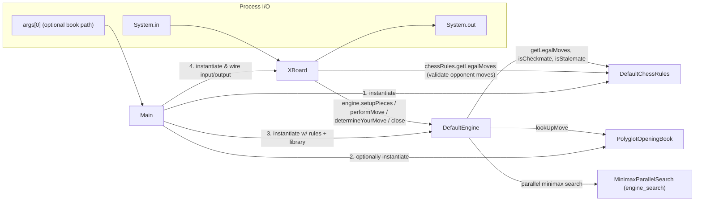
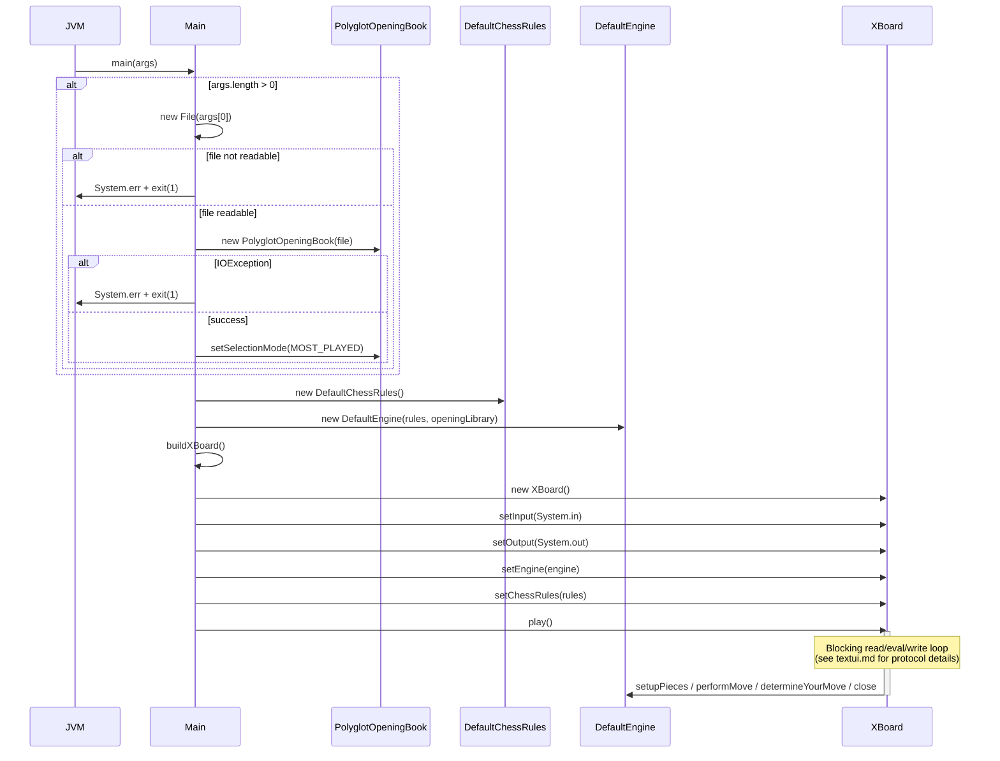
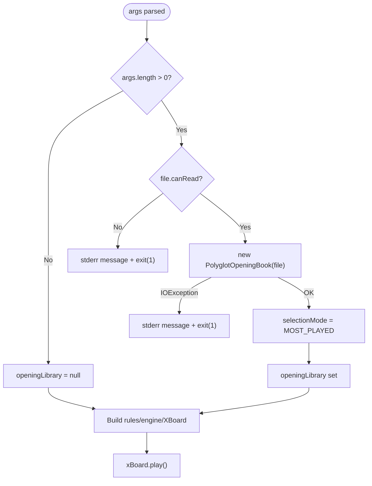

# Main Entry Module

## Introduction

The **main_entry** module is the executable entry point of the DokChess application. It contains a single class, [`Main`](#main-class), whose `main(String[] args)` method wires together all the other subsystems of DokChess — rules, engine, opening book, and the text-based XBoard user interface — and starts the interactive chess-playing session.

Architecturally, `Main` acts as the **composition root** of the application: it is the only place where concrete implementations of the various interfaces ([`ChessRules`](#dependency-chessrules), [`Engine`](#dependency-engine), [`OpeningLibrary`](#dependency-openinglibrary)) are instantiated and injected into each other. Every other module in the system is designed against interfaces and is unaware of how (or whether) an opening book is configured, or which UI drives the engine.

This document explains:
1. The responsibilities of `Main`
2. How it depends on and wires together the other modules
3. The startup/runtime data flow
4. How the module fits into the overall DokChess architecture

---

## Module Purpose

`Main` performs three jobs, in order, every time the JVM launches DokChess:

1. **Optional opening book loading** — if a file path is passed as the first command-line argument, it attempts to load a Polyglot-format opening book ([`PolyglotOpeningBook`](opening.md)) from that path. Failures (unreadable file, I/O error) cause the program to print an error and exit with status code 1.
2. **Engine assembly** — creates a [`DefaultChessRules`](rules.md) instance and a [`DefaultEngine`](engine_core.md) instance, injecting the rules and (optionally) the opening library into the engine.
3. **UI startup** — builds an [`XBoard`](textui.md) protocol handler wired to `System.in`/`System.out`, injects the engine and rules into it, and calls `xBoard.play()` to start the blocking read-eval-write loop that drives the whole game session.

Because `Main` has a private constructor and only a static `main` method (plus a package-visible `buildXBoard()` helper used for testability), it is not meant to be instantiated — it exists purely as a bootstrap/composition class.

---

## Component Overview

### `Main` class

| Member | Description |
|---|---|
| `private Main()` | Prevents instantiation; this class is a static utility/bootstrap class. |
| `public static void main(String[] args)` | Application entry point. Parses arguments, builds the rules/engine/UI graph, and starts the game loop. |
| `static XBoard buildXBoard()` | Package-visible factory method that creates an `XBoard` instance wired to standard input/output. Extracted as a separate method to allow tests to verify UI wiring without invoking `main`. |

### Command-line contract

```
java -jar dokchess.jar [path-to-polyglot-book]
```

* **No arguments** — DokChess starts without an opening book; every move (including the first) is computed by the search engine.
* **One argument** — treated as a filesystem path to a Polyglot `.bin` opening book. If the file cannot be read, or an `IOException` occurs while parsing it, the program prints an error to `stderr` and exits with code `1` **before** any engine or UI object is created.

---

## Dependencies on Other Modules

`Main` is a pure integration/composition class — it contains no chess logic itself. It depends on concrete classes and interfaces from four other modules:

| Module | Used Types | Purpose |
|---|---|---|
| [rules](rules.md) | `ChessRules` (interface), `DefaultChessRules` (impl) | Supplies legal-move generation, check/mate/stalemate detection used both by the engine's search and by XBoard's move validation. |
| [engine_core](engine_core.md) | `Engine` (interface), `DefaultEngine` (impl) | The move-selection engine that combines opening-book lookups with a parallel minimax search (see [engine_search](engine_search.md) and [engine_eval](engine_eval.md)). |
| [opening](opening.md) | `OpeningLibrary` (interface), `PolyglotOpeningBook` (impl), `SelectionMode` | Optional opening-book move source, loaded from a Polyglot binary file when supplied on the command line. |
| [textui](textui.md) | `XBoard` | Implements the XBoard/WinBoard chess engine communication protocol over stdin/stdout, translating protocol commands into calls on `Engine` and `ChessRules`. |

It also transitively depends on the [domain](domain.md) module (e.g. `Position`) through the types it wires together, though `Main` itself never references domain classes directly.

### Dependency Diagram



---

## Runtime Architecture

`Main` builds a small object graph and then hands control to `XBoard.play()`, which loops for the lifetime of the process. The diagram below shows the resulting object graph and its runtime relationships.



For details of how `DefaultEngine` combines the opening library and the search algorithm (`FromLibrary` → `FromSearch` → `MinimaxParallelSearch`), see [engine_core](engine_core.md) and [engine_search](engine_search.md). For the material evaluation function used during search, see [engine_eval](engine_eval.md).

---

## Startup Sequence (Process Flow)

The following sequence diagram shows the exact order of operations performed by `Main.main()`, including the failure paths for an unreadable or malformed opening book file.



Once `play()` returns (on `quit` or end-of-input), `XBoard` calls `engine.close()` internally and `main()` returns, terminating the JVM.

---

## Error Handling

`Main` deliberately fails fast and loudly for opening-book problems, since a broken `--book` argument should not silently degrade into "engine plays without a book":



All other runtime errors (illegal moves, protocol errors, search exceptions) are handled inside `XBoard` and `Engine`/`DefaultEngine` respectively — see [textui](textui.md) and [engine_core](engine_core.md) for those flows. `Main` itself has no error handling beyond the opening-book-loading stage.

---

## Design Notes

* **Composition root pattern**: `Main` is intentionally the *only* class in the codebase that instantiates concrete implementations (`DefaultChessRules`, `DefaultEngine`, `PolyglotOpeningBook`, `XBoard`) directly. All collaborating modules communicate through interfaces (`ChessRules`, `Engine`, `OpeningLibrary`), which keeps them independently testable and substitutable.
* **Testability hook**: the package-visible `buildXBoard()` method exists solely so that tests within the same package can verify that `System.in`/`System.out` are correctly wired to a fresh `XBoard`, without having to invoke the blocking `main` method.
* **Selection mode choice**: when an opening book is supplied, `Main` hard-codes `SelectionMode.MOST_PLAYED` (see [opening](opening.md)), meaning the engine always prefers the most popular recorded continuation rather than a random or first-listed one. There is currently no command-line option to change this.
* **Fixed search depth**: the search depth (4 ply) and evaluation function (`StandardMaterialEvaluation`) are configured inside `DefaultEngine`'s constructor, not in `Main` — see [engine_core](engine_core.md) and [engine_eval](engine_eval.md) for details on tuning these.

---

## Related Documentation

* [domain](domain.md) — core chess data types (`Position`, `Move`, `Piece`, `Square`, FEN notation) used throughout the system.
* [rules](rules.md) — legal move generation, check/mate/stalemate detection (`ChessRules`, `DefaultChessRules`).
* [engine_core](engine_core.md) — the `Engine` abstraction and `DefaultEngine`, which assembles the move-decision pipeline (`FromLibrary` → `FromSearch`).
* [engine_search](engine_search.md) — the minimax search algorithm and its parallel execution.
* [engine_eval](engine_eval.md) — position evaluation functions used by the search.
* [opening](opening.md) — the `OpeningLibrary` abstraction and the Polyglot opening book implementation.
* [textui](textui.md) — the XBoard/WinBoard text protocol implementation that drives the engine interactively.
