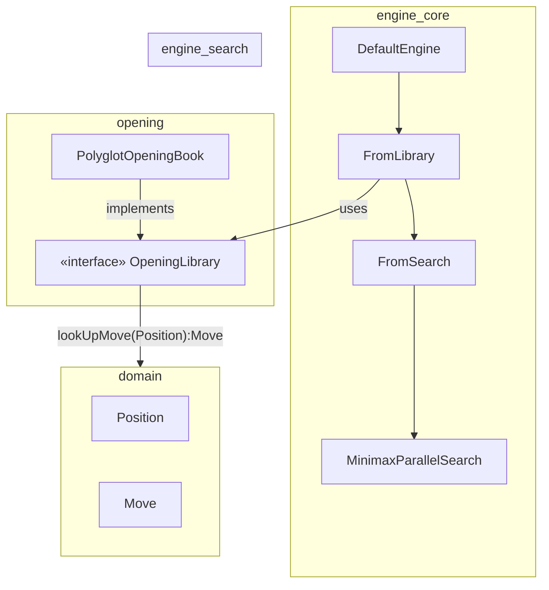
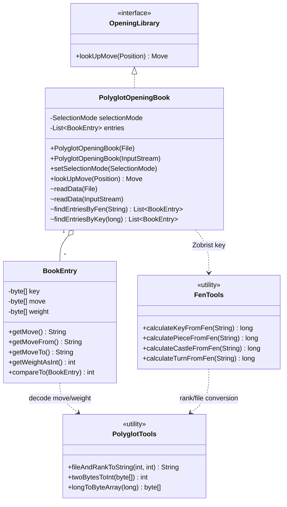
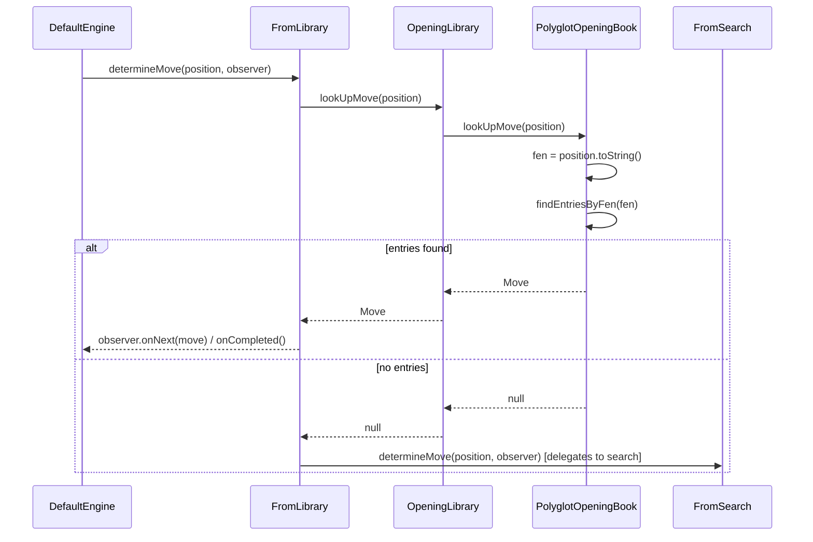

# Opening Module

## Purpose

The **opening** module supplies DokChess with an *opening book* mechanism: a
way to short-circuit the engine's expensive search algorithm during the
early moves of a game by looking up well-known, pre-analyzed moves instead
of computing them. This speeds up play, keeps the engine's behaviour aligned
with established opening theory, and reduces the load on the
[search subsystem](engine_search.md).

The module is intentionally small and consists of two conceptual parts:

1. A minimal, engine-agnostic **contract** (`OpeningLibrary`) that any
   opening-book implementation must fulfil.
2. A concrete implementation, `PolyglotOpeningBook`, that reads the
   widely-used binary **Polyglot** (`.bin`) opening book format and answers
   lookups against it.

## Where it fits in the system



The [`engine_core`](engine_core.md) module wires the opening module into the
move-determination pipeline. `DefaultEngine` builds a chain of
`DetermineMove` handlers: an optional `FromLibrary` step (used only when an
`OpeningLibrary` instance is supplied) followed by `FromSearch`, which
delegates to the [`engine_search`](engine_search.md) subsystem. When
`FromLibrary.determineMove` is called, it asks the injected `OpeningLibrary`
for a move for the current [`Position`](domain.md); if a move is found the
search is skipped entirely, otherwise the request is forwarded down the
chain to the search-based move determination.

## Architecture Overview



## Sub-modules

| Sub-module | Description |
|---|---|
| [opening_polyglot](opening_polyglot.md) | Implementation of the `OpeningLibrary` contract backed by the Polyglot binary opening-book format: file/stream parsing, Zobrist-hash-based position lookup, entry decoding and selection strategies. |

### `OpeningLibrary` — the contract

`OpeningLibrary` (`org.dokchess.opening.OpeningLibrary`) is a single-method
interface:

```java
Move lookUpMove(Position position);
```

It returns a known [`Move`](domain.md) for the given
[`Position`](domain.md), or `null` when the position is not present in the
library. Being a simple interface, it decouples the
[`engine_core`](engine_core.md) move-determination pipeline from any
particular opening-book format or storage mechanism — additional
implementations (e.g. other book formats, or a purely in-memory book) can be
added without touching the engine.

## Data Flow: Move Lookup



## Relationship to Other Modules

- [`domain`](domain.md) — provides the `Position`, `Move`, `Piece`, and
  `Square` value types used both as lookup input and as the shape of
  returned moves.
- [`engine_core`](engine_core.md) — consumes `OpeningLibrary` through the
  `FromLibrary` step of its `DetermineMove` chain, making the opening book
  an optional, transparently-skippable stage before falling back to
  [`engine_search`](engine_search.md).
- [`rules`](rules.md) — not used directly by this module; the opening book
  trusts its source data and does not itself validate move legality against
  chess rules.
