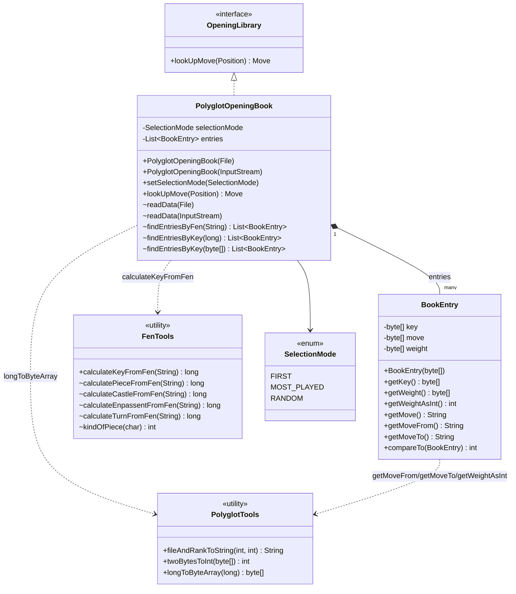
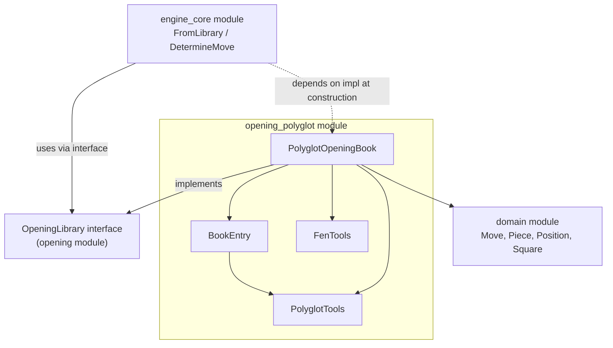
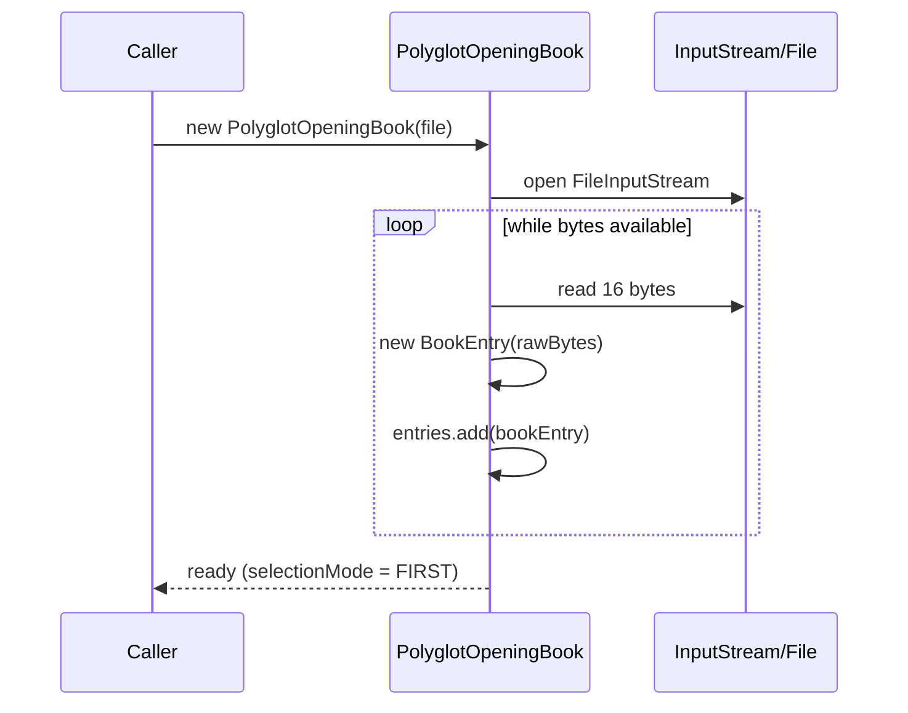
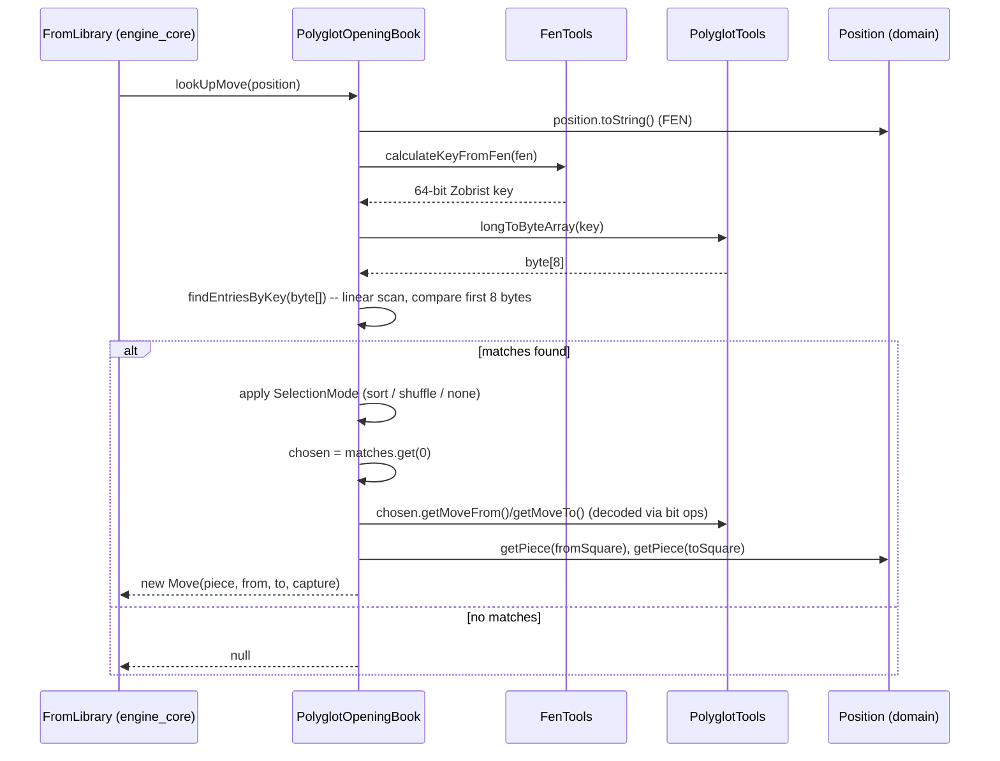
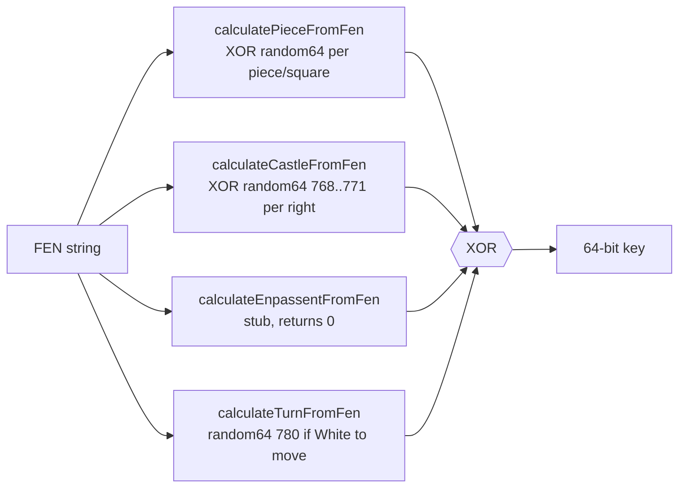
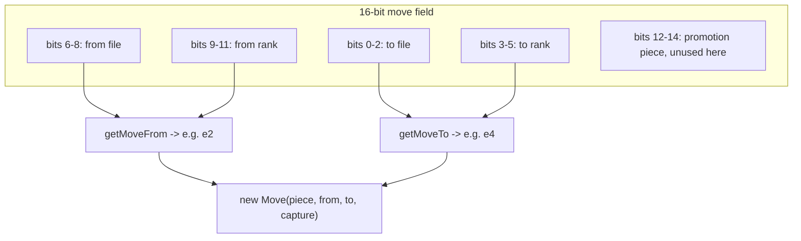
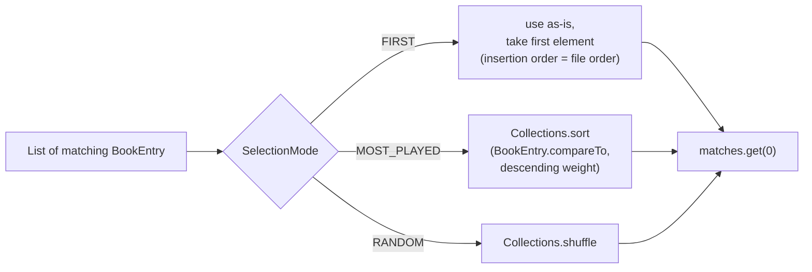
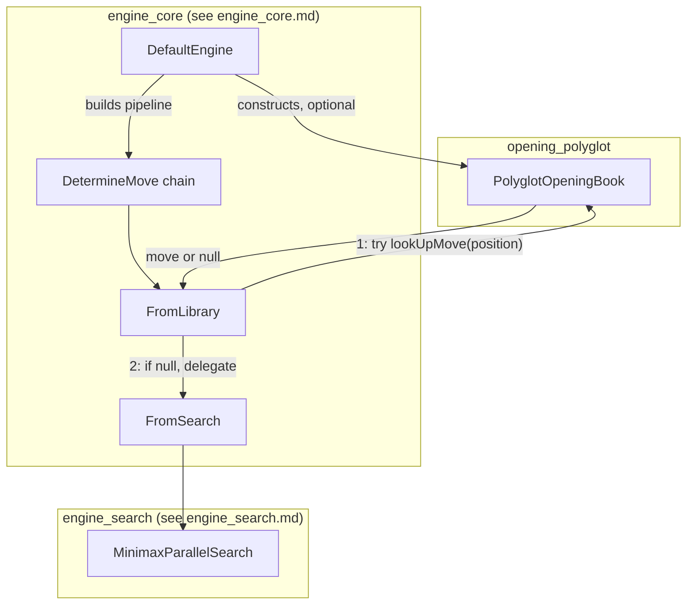

# Opening Polyglot Module

## Introduction

The **opening_polyglot** module provides DokChess's implementation of the
`OpeningLibrary` interface backed by the widely-used **Polyglot** binary
opening book format (`.bin` files). It allows the chess engine to look up
known, pre-analyzed moves for the current position instead of relying on
expensive search, which speeds up play in well-studied openings and injects
opening theory/variety into the engine's behaviour.

The module reads a Polyglot book file into memory, computes a Zobrist hash
key for a given board position (expressed as FEN), finds matching book
entries, decodes them into playable `Move` objects, and returns them to the
caller. It is a leaf module in the dependency graph: it depends on the
[domain](domain.md) model and the [opening](opening.md) parent
interface, but nothing in the wider engine depends on its internals — only on
the `OpeningLibrary` contract it implements.

---

## 1. Purpose and Core Functionality

| Concern | Responsibility |
|---|---|
| **Book loading** | Parse a Polyglot `.bin` file/stream into a list of 16-byte records (`BookEntry`) |
| **Position hashing** | Compute the 64-bit Zobrist hash key of a FEN position using the standard Polyglot random constants (`FenTools`) |
| **Entry lookup** | Find all book entries whose key matches the position's hash |
| **Move selection** | Choose one matching entry according to a configurable strategy (first / most played / random) |
| **Move decoding** | Convert the compact Polyglot move encoding (from-square/to-square bit-packed in 2 bytes) into a domain `Move` |
| **Byte/bit utilities** | Low level helpers for endian conversion, bit extraction and file/rank string conversion (`PolyglotTools`) |

The module exposes a single public entry point, `PolyglotOpeningBook`, which
implements `OpeningLibrary`:

```java
public interface OpeningLibrary {
    Move lookUpMove(Position position);
}
```

Everything else (`BookEntry`, `FenTools`, `PolyglotTools`) is
package-private and exists purely to support this one public class.

---

## 2. Component Overview



### Component Roles

- **`PolyglotOpeningBook`** — the module's public façade. Loads the book,
  answers `lookUpMove(Position)` calls, and owns the selection strategy.
- **`BookEntry`** — a decoded 16-byte Polyglot record: 8-byte Zobrist key,
  2-byte packed move, 2-byte weight (popularity/preference), 2-byte learn
  value (unused). Implements `Comparable` so entries can be sorted by weight
  (descending) for the `MOST_PLAYED` strategy.
- **`FenTools`** — reproduces the standard Polyglot Zobrist hashing scheme
  using the canonical 781-entry `random64` table (piece placement, castling
  rights, side to move). *En passant* hashing is a known incomplete stub
  (`calculateEnpassentFromFen` always returns `0`).
- **`PolyglotTools`** — small bit/byte manipulation helpers shared by
  `BookEntry` (decoding move/weight bytes) and `PolyglotOpeningBook`
  (encoding the lookup key to bytes for comparison).
- **`SelectionMode`** *(nested enum in `PolyglotOpeningBook`)* — `FIRST`,
  `MOST_PLAYED`, `RANDOM`; controls how ties among multiple matching book
  entries are resolved.

---

## 3. Architecture & Dependencies



The module has **no outgoing dependency on the engine or rules modules** — it
only needs the domain types (`Move`, `Piece`, `Position`, `Square`) to build
its result and the `OpeningLibrary` contract to be pluggable. See
[domain](domain.md) and [opening](opening.md) for those definitions.

Consumers live in [engine_core](engine_core.md): `DefaultEngine` optionally
constructs a `PolyglotOpeningBook` and wires it into the move-determination
pipeline via `FromLibrary`, a `DetermineMove` chain link that tries the
library first and falls back to search (see [engine_search](engine_search.md)
for what happens when the book has no answer).

---

## 4. Data Flow: Position → Move

### 4.1 Loading the book



Each 16-byte Polyglot record is split by `BookEntry`'s constructor into three
byte arrays: `key` (8 bytes), `move` (2 bytes), `weight` (2 bytes). The
remaining 2 "learn" bytes of the original format are not stored.

### 4.2 Looking up a move



### 4.3 Zobrist key computation (`FenTools`)



This is the standard Polyglot/Zobrist hashing algorithm: every occupied
square contributes `random64[64 * pieceIndex + 8 * rank + file]`, castling
rights contribute fixed indices `768..771`, and side-to-move contributes
index `780` when White is to move. All contributions are combined with XOR,
which makes incremental updates possible in principle (not used here — the
key is always recomputed from scratch via FEN).

### 4.4 Move decoding (`BookEntry` bit layout)

Polyglot packs a move into 2 bytes (16 bits) as follows, decoded by
`BookEntry`/`PolyglotTools`:



Note: promotion bits (12-14) present in the Polyglot spec are **not**
currently decoded by `BookEntry` — only from/to squares are used when
constructing the `Move`.

---

## 5. Selection Modes



- **`FIRST`** *(default)* — no reordering; the first entry encountered while
  reading the file for that position is used.
- **`MOST_PLAYED`** — entries are sorted by `weight` descending
  (`BookEntry.compareTo` implements descending order), so the most frequently
  played/preferred continuation is chosen.
- **`RANDOM`** — entries are shuffled, giving varied opening play across
  games/runs.

---

## 6. Integration with the Engine



`DefaultEngine` (in [engine_core](engine_core.md)) wires the book in as the
first link of a chain-of-responsibility (`DetermineMove`):

1. If an `OpeningLibrary` was supplied at construction, `FromLibrary` calls
   `PolyglotOpeningBook.lookUpMove(position)`.
2. If a move is found, it is emitted immediately and the search
   ([engine_search](engine_search.md)) is skipped entirely.
3. If no book move exists (`null`), the request falls through to
   `FromSearch`, which runs the minimax search as normal.

This means the opening_polyglot module's cost is negligible compared to
search: a single FEN-based hash computation and a linear scan of in-memory
entries, versus a full depth-4 parallel minimax evaluation.

---

## 7. Design Notes & Limitations

- **In-memory, linear scan**: all book entries are loaded into a
  `List<BookEntry>` and lookups are `O(n)` linear scans comparing the first 8
  key bytes. This is simple but not optimized for very large books (Polyglot
  books are typically sorted by key to allow binary search — this
  implementation does not exploit that ordering).
- **Incomplete en passant hashing**: `FenTools.calculateEnpassentFromFen`
  always returns `0`. Per the Polyglot spec, en passant should only
  contribute to the hash when a capture is actually possible; omitting it
  entirely can cause key mismatches against standard Polyglot books for
  positions right after a two-square pawn push where en passant is legal.
- **No promotion decoding**: `BookEntry` does not decode the promotion bits
  of the packed move, so book-driven promotions are not represented
  explicitly (the `Move` produced by `PolyglotOpeningBook.lookUpMove` never
  sets a promotion type).
- **Package-private helper classes**: `BookEntry`, `FenTools`, and
  `PolyglotTools` are intentionally not part of the public API; only
  `PolyglotOpeningBook` (via `OpeningLibrary`) is meant to be used from
  outside the module.
- **Thread-safety**: `entries` is populated once during construction and
  read-only afterwards apart from sorting/shuffling temporary copies
  (`matches`), which does not mutate the backing list — `lookUpMove` is safe
  to call concurrently, matching the parallel search usage pattern in
  [engine_search](engine_search.md).

---

## 8. Related Documentation

- [domain.md](domain.md) — `Move`, `Piece`, `Position`, `Square`, FEN
  handling used to build lookup keys and result moves.
- [opening.md](opening.md) — the `OpeningLibrary` contract this module
  implements.
- [engine_core.md](engine_core.md) — `DefaultEngine`, `DetermineMove`,
  `FromLibrary`, `FromSearch`: how the opening book fits into move
  determination.
- [engine_search.md](engine_search.md) — the fallback path used when the
  opening book has no matching move.
