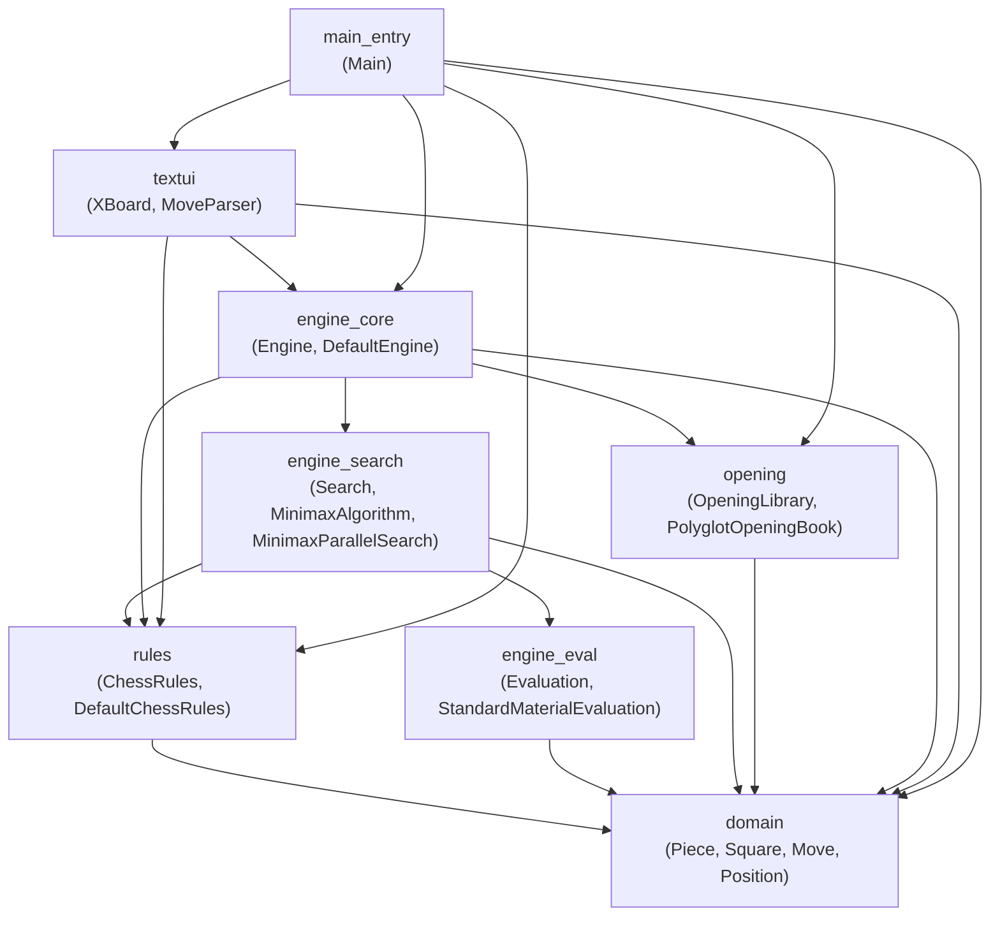
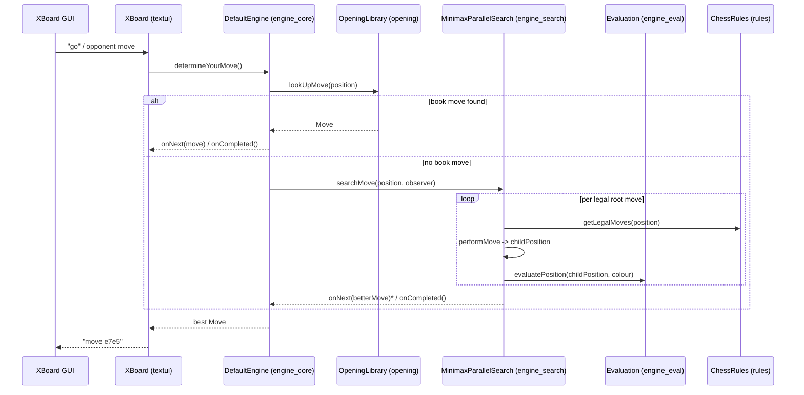
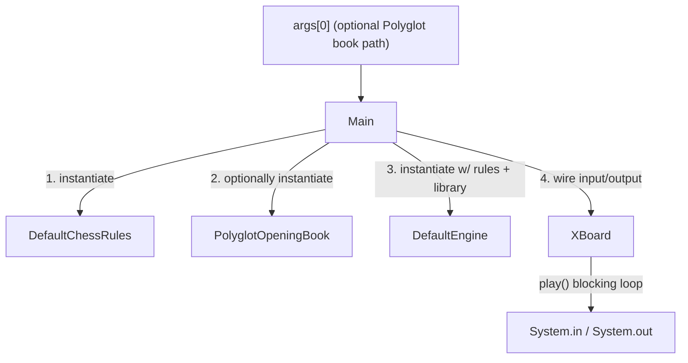

# DokChess-EN Repository Overview

## 1. Purpose

**DokChess** is a modular, Java-based chess engine that communicates with chess GUIs (and humans) via the **XBoard/WinBoard protocol**. It plays chess by combining:

- An immutable domain model of chess positions, pieces, squares, and moves.
- A rules engine that generates legal moves and detects check/checkmate/stalemate.
- A depth-limited, parallelized **minimax search** guided by a pluggable static evaluation function.
- An optional **Polyglot opening book** to short-circuit search during well-known openings.
- A text-based UI (`XBoard`) that adapts the engine to the standard XBoard protocol over stdin/stdout.

The system is designed around small, well-defined interfaces (`ChessRules`, `Engine`, `Evaluation`, `Search`, `OpeningLibrary`) so that each concern — rules, search, evaluation, opening book, and UI — can evolve or be replaced independently. The `Main` class acts as the single **composition root**, wiring concrete implementations together at startup.

## 2. End-to-End Architecture

### 2.1 Module Dependency Graph

### 2.2 Runtime Flow: Determining and Playing a Move

### 2.3 Application Startup (Composition Root)

## 3. Core Modules Documentation

| Module | Description | Reference |
|---|---|---|
| **domain** | Foundational chess data model: `Position`, `Move`, `Piece`, `Square`, `Squares`, and FEN (de)serialization. No dependencies on other modules. | [domain.md](domain.md) |
| **rules** | Implements the Laws of Chess: legal move generation (per piece type), castling/en-passant handling, check/checkmate/stalemate detection via `ChessRules` / `DefaultChessRules`. | [rules.md](rules.md) — see also [rules_movement.md](rules_movement.md), [rules_core.md](rules_core.md) |
| **engine_eval** | Static position evaluation via the `Evaluation` interface; default `StandardMaterialEvaluation` scores positions by material count. | [engine_eval.md](engine_eval.md) |
| **engine_search** | Depth-limited minimax search (`MinimaxAlgorithm`) and its parallelized, RxJava-based execution (`MinimaxParallelSearch`) implementing the `Search` contract. | [engine_search.md](engine_search.md) — see also [engine_search_minimax_algorithm.md](engine_search_minimax_algorithm.md), [engine_search_parallel_execution.md](engine_search_parallel_execution.md) |
| **opening** | `OpeningLibrary` abstraction and its `PolyglotOpeningBook` implementation for binary Polyglot opening-book lookups. | [opening.md](opening.md) — see also [opening_polyglot.md](opening_polyglot.md) |
| **engine_core** | The `Engine` interface and `DefaultEngine` implementation; orchestrates opening-book lookup and search via a chain-of-responsibility (`FromLibrary` → `FromSearch`). | [engine_core.md](engine_core.md) |
| **textui** | XBoard/WinBoard protocol adapter (`XBoard`, `MoveParser`) translating textual protocol commands to/from domain `Move`/`Position` objects and driving the `Engine`. | [textui.md](textui.md) |
| **main_entry** | Application entry point (`Main`) and composition root; wires rules, engine, opening library, and UI together and starts the session. | [main_entry.md](main_entry.md) |