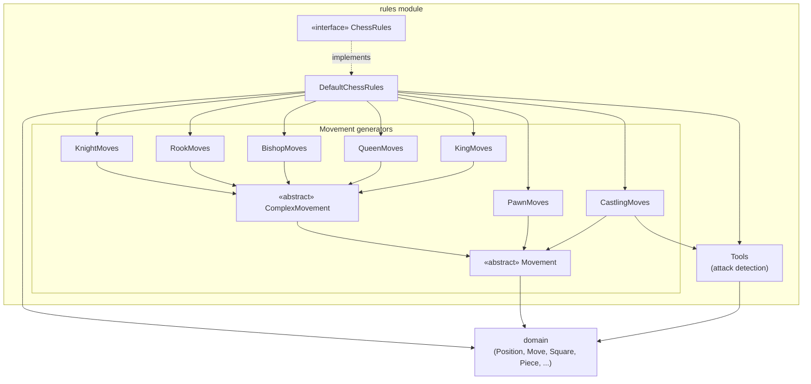
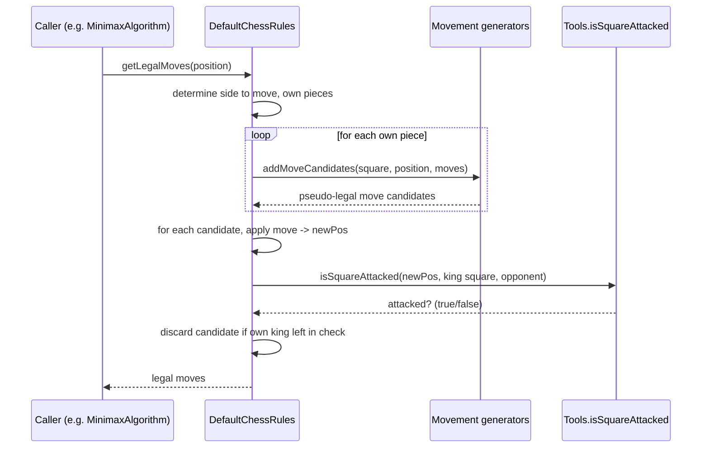
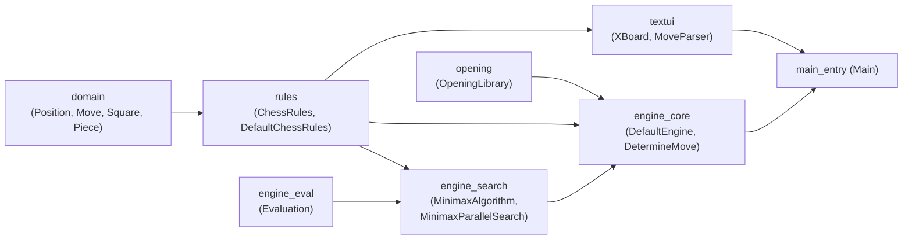

# Rules Module

## Purpose

The `rules` module (`org.dokchess.rules`) implements **the Laws of Chess** for
DokChess. It is the single source of truth for:

- Which moves are *legal* in a given [`Position`](domain.md) (including
  castling, en passant, and pawn promotion).
- Whether a king is in **check**.
- Whether a position is **checkmate** or **stalemate**.

It has no knowledge of engines, evaluation, search strategies, or UI/protocol
concerns. Every other part of the system that needs to know "what can move
where" depends on this module through the small, stable `ChessRules`
interface — most notably:

- [`engine_core`](engine_core.md) — `DefaultEngine` wires a `ChessRules`
  implementation into the move-determination pipeline.
- [`engine_search`](engine_search.md) — `MinimaxAlgorithm` and
  `MinimaxParallelSearch` call `ChessRules.getLegalMoves()` /
  `isCheck()` at every node of the search tree to generate successor
  positions and detect terminal (mate/stalemate) nodes.
- [`textui`](textui.md) — the XBoard adapter uses rules to validate moves
  coming from a human/GUI opponent and to detect end-of-game conditions.

The module depends only on [`domain`](domain.md) (`Position`, `Move`,
`Square`, `Piece`, `Colour`, `PieceType`, `CastlingType`, `Squares`), which
provide the immutable board/move representation that the rules operate on.

## Architecture Overview

The module is organized around one small public interface,
`ChessRules`, and one public implementation, `DefaultChessRules`, which is
composed of a family of package-private *movement generators* — one per
piece type — plus a static helper (`Tools`) used for attack/check detection.

### Two functional halves

| Sub-module | Responsibility | Documentation |
|---|---|---|
| **Move generation** | Per-piece-type "pseudo-legal" move candidate generation (knight/rook/bishop/queen/king/pawn geometry, plus castling rights & path checks) | [rules_movement.md](rules_movement.md) |
| **Rule enforcement & check detection** | The public `ChessRules` contract, `DefaultChessRules` orchestration (candidate generation → self-check filtering), and the `Tools.isSquareAttacked` attack-detection primitive shared by check/checkmate/castling logic | [rules_core.md](rules_core.md) |

## How a "legal moves" query flows through the module

`DefaultChessRules` never mutates a `Position` in place — `domain.Position`
is immutable, and `performMove` returns a new instance — so "trying" a move
to test for self-check is simply generating a new `Position` and discarding
it if illegal.

## Relationship to the rest of the system

- **[domain](domain.md)** supplies the board model consumed and produced by
  every method in this module.
- **[engine_core](engine_core.md)** and **[engine_search](engine_search.md)**
  are the primary consumers: the minimax search tree is built entirely from
  repeated calls to `ChessRules.getLegalMoves()`, and terminal-node detection
  relies on `isCheck()` and the emptiness of the legal-move set (mate/stalemate).
- **[textui](textui.md)** uses `ChessRules` to validate externally supplied
  moves (e.g. from an XBoard-speaking GUI) and to report game-over conditions.

## Further Reading

- [rules_movement.md](rules_movement.md) — piece-by-piece move generation
  (`Movement`, `ComplexMovement`, `KnightMoves`, `RookMoves`, `BishopMoves`,
  `QueenMoves`, `KingMoves`, `PawnMoves`, `CastlingMoves`).
- [rules_core.md](rules_core.md) — the public API (`ChessRules`), its
  implementation (`DefaultChessRules`), and shared attack detection (`Tools`).
- [domain.md](domain.md) — board/move value types used throughout.
- [engine_search.md](engine_search.md) — how the search algorithms consume
  `ChessRules`.
- [engine_core.md](engine_core.md) — how the engine wires rules, search, and
  opening book together.
