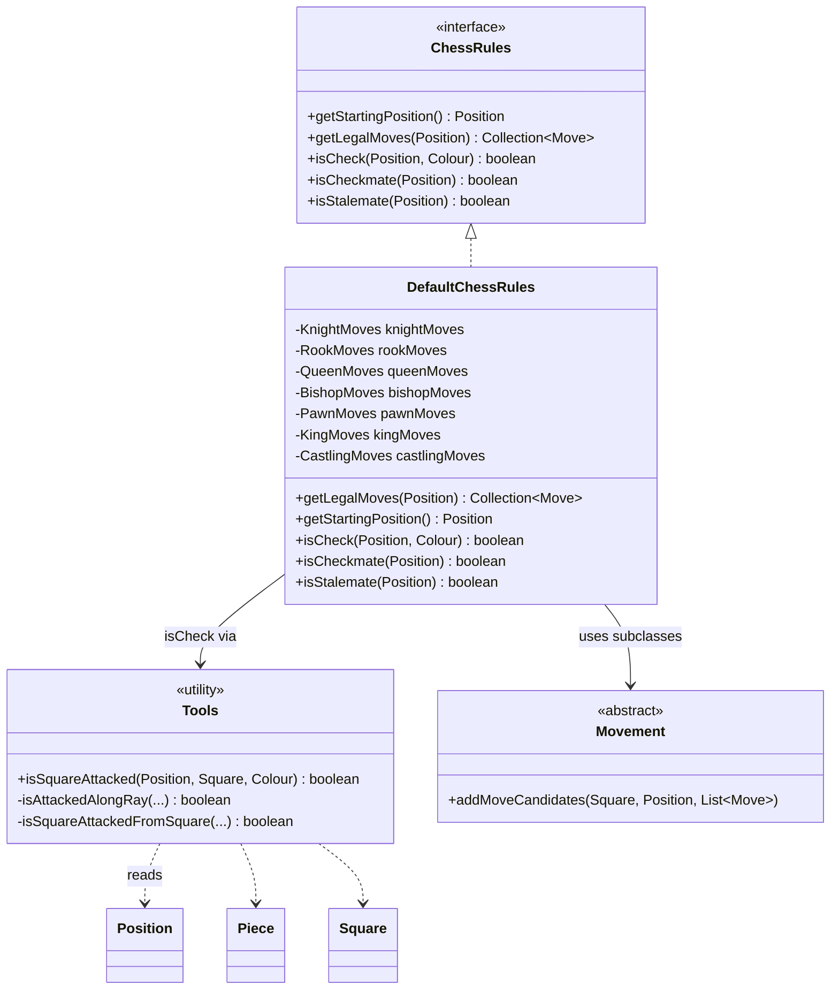
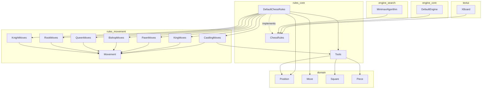
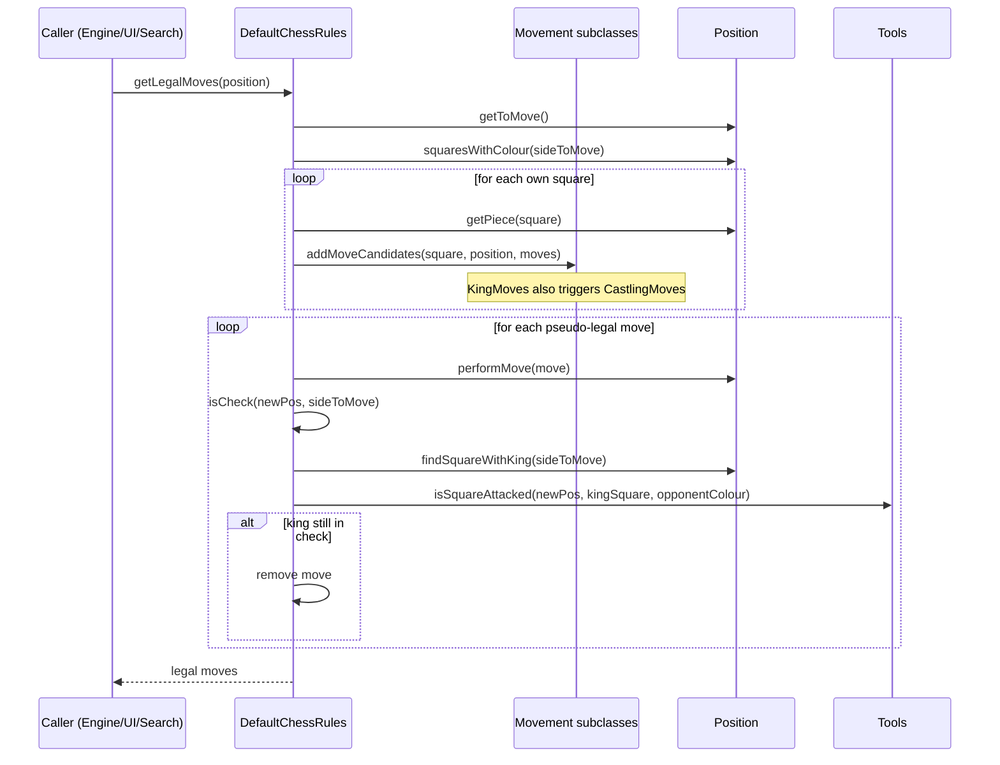
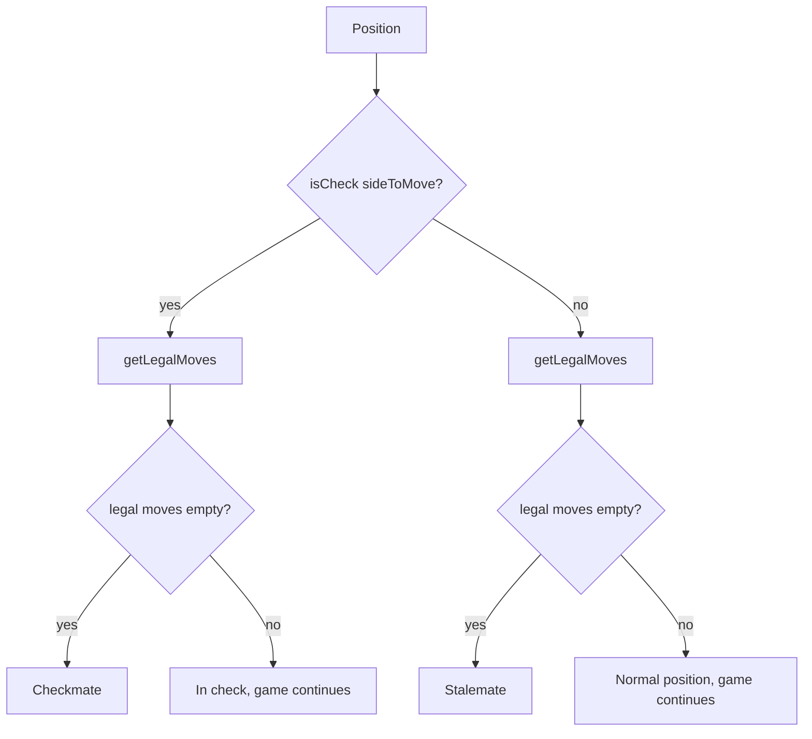
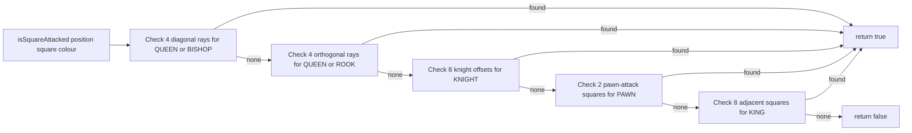

# Rules Core Module

## Introduction

The **rules_core** module is the authoritative implementation of the *Laws of Chess* in DokChess. It defines the `ChessRules` contract — the single entry point through which the rest of the system (engine, UI, opening book integration) queries legal moves, check, checkmate, and stalemate — and provides the standard implementation `DefaultChessRules`. A package-private helper, `Tools`, supplies square-attack detection that both `DefaultChessRules` and the piece-specific movement generators (see [rules_movement](rules_movement.md)) rely on for king-safety checks.

This module sits at the heart of the rules layer. It does not know how individual pieces move (that responsibility belongs to [rules_movement](rules_movement.md)); instead it orchestrates those piece-movement generators against a `Position` (see [domain](domain.md)) to produce the complete set of legal moves and to answer higher-level questions about the state of the game.

## Purpose and Responsibilities

| Responsibility | Description |
|---|---|
| **Rules contract** | `ChessRules` defines the API every rules engine must expose: starting position, legal moves, check, checkmate, stalemate. |
| **Legal move generation** | `DefaultChessRules` aggregates pseudo-legal moves from every piece type, then filters out moves that leave the mover's own king in check. |
| **Game-state queries** | Determines check, checkmate, and stalemate based on legal moves and king safety. |
| **Attack detection** | `Tools` (package-private) implements a generic "is this square attacked by colour X" algorithm used both here and by castling logic in [rules_movement](rules_movement.md). |

## Component Overview

### ChessRules (interface)

The public contract of the rules layer. It is deliberately narrow and side-effect free — every method takes an immutable `Position` and returns a fresh result:

- `getStartingPosition()` — canonical initial position (White to move).
- `getLegalMoves(Position)` — the full set of legal moves for the side to move; empty on mate/stalemate.
- `isCheck(Position, Colour)` — whether the given side's king is attacked.
- `isCheckmate(Position)` — true if the side to move is in check with no legal moves.
- `isStalemate(Position)` — true if the side to move has no legal moves but is not in check.

Consumers such as the [engine_search](engine_search.md) minimax algorithm, [engine_core](engine_core.md), and [textui](textui.md) depend only on this interface, not on `DefaultChessRules` directly, which allows alternative rule implementations to be substituted.

### DefaultChessRules

The standard implementation of `ChessRules`. It composes one `Movement`-derived generator per piece type from [rules_movement](rules_movement.md):

- `KnightMoves`, `RookMoves`, `QueenMoves`, `BishopMoves`, `PawnMoves`, `KingMoves`, `CastlingMoves`

**Legal move algorithm** (`getLegalMoves`):
1. Determine the side to move from the `Position`.
2. For every square occupied by a piece of that colour, dispatch to the matching `Movement` generator (kings additionally consult `CastlingMoves`) to collect *pseudo-legal* move candidates — moves that respect piece movement patterns and basic capture rules but may still expose the king to check.
3. For each candidate, simulate it via `Position.performMove(Move)` and discard it if the resulting position leaves the mover's king in check (`isCheck`).
4. The remaining moves are legal.

**Check/mate/stalemate**:
- `isCheck` locates the king square of the given colour (`Position.findSquareWithKing`) and asks `Tools.isSquareAttacked` whether the opposing colour attacks it.
- `isCheckmate` returns true only if the side to move is in check *and* has zero legal moves.
- `isStalemate` returns true if there are zero legal moves *and* the side to move is not in check.

### Tools (package-private utility)

A stateless helper used to answer: *"Is this square attacked by any piece of a given colour?"* — independent of what currently occupies the square itself. This makes it suitable both for check detection (attacking the king's square) and for castling legality (attacking squares the king passes through, in [rules_movement](rules_movement.md)'s `CastlingMoves`).

Implementation strategy — `isSquareAttacked(Position, Square, Colour)`:
- **Sliding attacks (diagonal)**: walks the four diagonal rays looking for the first piece; if it is of the given colour and is a `QUEEN` or `BISHOP`, the square is attacked.
- **Sliding attacks (orthogonal)**: walks the four rank/file rays looking for `QUEEN` or `ROOK`.
- **Knight attacks**: checks the eight knight-offset squares for a `KNIGHT` of that colour.
- **Pawn attacks**: checks the two diagonal-forward squares (direction depends on colour) for a `PAWN`.
- **King attacks**: checks the eight adjacent squares for a `KING` (needed to prevent kings from moving adjacent to each other).

Each ray-walk stops at the first occupied square encountered (blocking), mirroring standard chess attack semantics.

## Architecture Diagram

## Dependency Diagram

## Legal Move Generation Flow

## Check / Checkmate / Stalemate Decision Flow

## Square-Attack Detection (Tools)

## Integration with the Rest of the System

- **[domain](domain.md)**: `rules_core` operates exclusively on domain types — `Position`, `Move`, `Piece`, `Square`, `Colour`. `Position.performMove` (immutable, returns a new `Position`) is central to legal-move filtering, since it lets `DefaultChessRules` simulate a move and inspect the resulting board without mutating the original.
- **[rules_movement](rules_movement.md)**: Supplies the per-piece-type `Movement` subclasses (`KnightMoves`, `RookMoves`, `QueenMoves`, `BishopMoves`, `PawnMoves`, `KingMoves`, `CastlingMoves`) that `DefaultChessRules` composes to generate pseudo-legal candidates. `CastlingMoves` also depends on `Tools.isSquareAttacked` to verify the king does not pass through or land on an attacked square.
- **[engine_search](engine_search.md)**: The minimax search (`MinimaxAlgorithm`, `MinimaxParallelSearch`) calls `ChessRules.getLegalMoves` at every node to expand the search tree, and uses `isCheckmate`/`isStalemate` for terminal-node evaluation.
- **[engine_core](engine_core.md)**: `DefaultEngine` is constructed with a `ChessRules` implementation (typically `DefaultChessRules`) and passes it through to the search pipeline.
- **[textui](textui.md)**: The XBoard protocol adapter uses `ChessRules` to validate moves received from external GUIs and to detect end-of-game conditions.
- **[main_entry](main_entry.md)**: Wires together `DefaultChessRules` with the engine and UI at application startup.

## Design Notes

- **Separation of concerns**: `ChessRules` is a pure interface; all piece-specific movement logic is factored out into [rules_movement](rules_movement.md), keeping `DefaultChessRules` focused solely on aggregation and legality filtering (king safety).
- **Correctness over performance in filtering**: Legality filtering is done by literally applying each pseudo-legal move and checking for self-check afterward, rather than using more elaborate pin-detection heuristics. This is simple and provably correct, at the cost of extra `Position.performMove` calls per candidate move.
- **Package-private `Tools`**: Deliberately not part of the public API; it is an internal implementation detail shared between `rules_core` and `rules_movement` (both in the `org.dokchess.rules` package), avoiding duplicate attack-detection logic between check detection and castling-through-check checks.
- **Immutability of `Position`**: Because `Position.performMove` returns a new instance rather than mutating state, `getLegalMoves` can safely simulate many candidate moves without needing to undo them, simplifying the legality-filtering loop.
