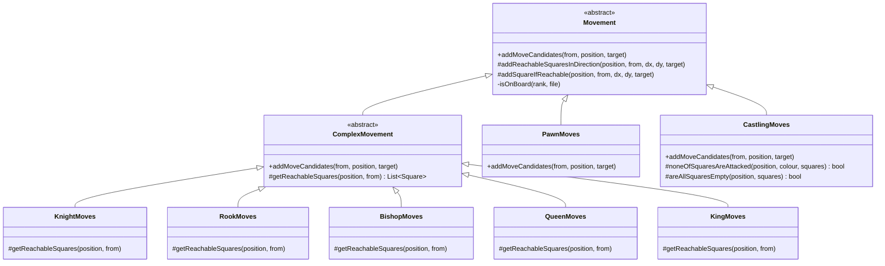
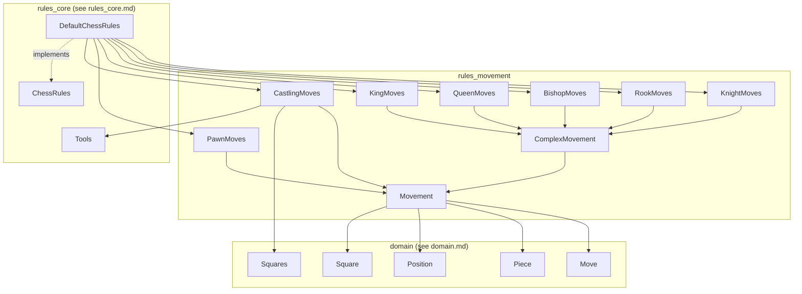
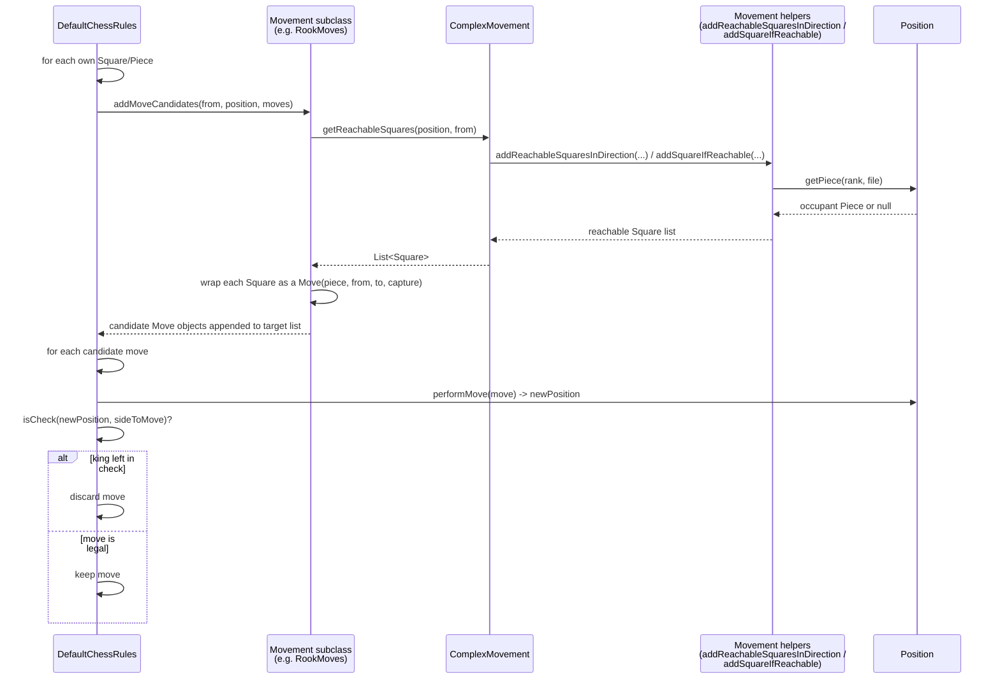
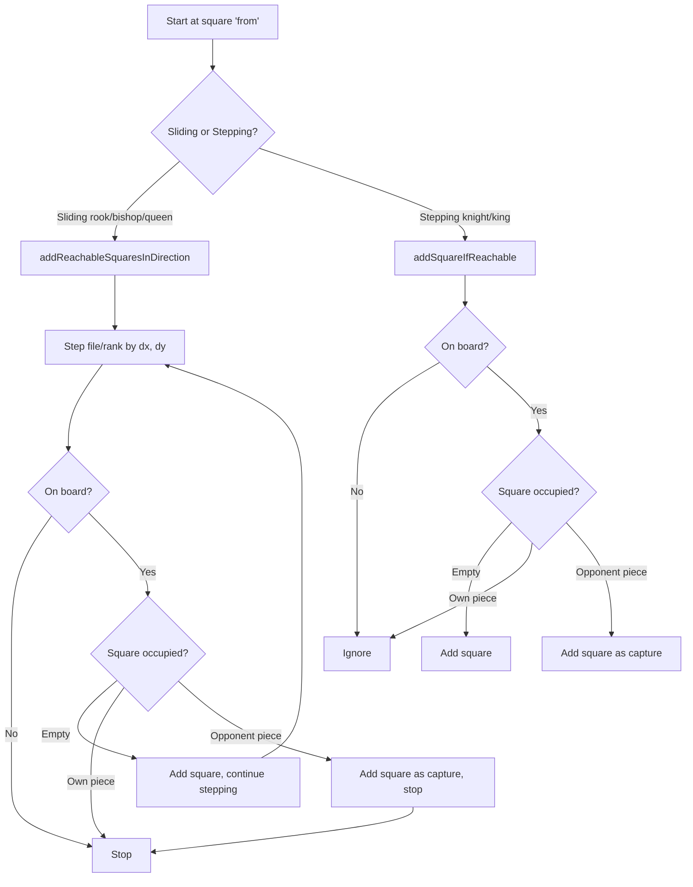
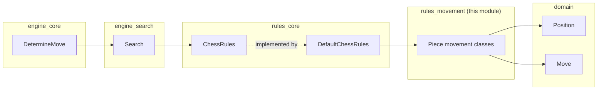

# Rules Movement Module

## Introduction

The **rules_movement** module implements the *piece-specific move-generation logic* of the DokChess engine. It is the lowest-level building block of the chess rules subsystem: for every piece type (knight, bishop, rook, queen, king, pawn) and for the special case of castling, it knows exactly which squares a piece could reach on an otherwise unconstrained board.

This module does **not** decide whether a move is fully legal in the chess sense (e.g. whether it leaves the mover's own king in check) — that responsibility belongs to [rules_core](rules_core.md), specifically `DefaultChessRules`, which consumes the *move candidates* produced here and filters out moves that would leave the king in check.

The module is intentionally small and package-private (most classes have no access modifier), because it is meant to be used exclusively from within the `org.dokchess.rules` package. Only `ComplexMovement` is `public`, since it establishes the extension pattern used by all sliding/leaping piece movement classes.

## Purpose and Core Functionality

The module answers one question for each piece on the board: *"Given this piece on this square, in this position, what squares could it move to (ignoring check)?"*

It converts that geometric answer into a list of `Move` objects (see [domain](domain.md)) that downstream rule-checking code can filter and use.

Key responsibilities:

- Provide a common abstraction (`Movement`) for computing move candidates from a square.
- Provide directional/geometric helper routines shared by all sliding and stepping pieces (`addReachableSquaresInDirection`, `addSquareIfReachable`).
- Provide a template (`ComplexMovement`) that turns a list of *reachable squares* into a list of `Move` objects — used by all pieces except the pawn (which has irregular movement: one/two-square advance, diagonal-only captures, en-passant, promotion) and castling (which has special legality preconditions).
- Implement per-piece movement classes: `KnightMoves`, `RookMoves`, `BishopMoves`, `QueenMoves`, `KingMoves`, `PawnMoves`.
- Implement `CastlingMoves`, which generates kingside/queenside castling moves when castling rights, empty squares, and attack-safety conditions are satisfied (using `Tools.isSquareAttacked` from [rules_core](rules_core.md)).

## Architecture

### Class Hierarchy

All movement classes descend from the abstract `Movement` base class. Sliding and single-step pieces share a further abstraction, `ComplexMovement`, which reduces their implementation to "list the squares I can reach"; `PawnMoves` and `CastlingMoves` override `Movement` directly because their move-generation logic doesn't reduce cleanly to a simple reachable-squares list (promotion choices, en-passant, capture-only diagonals, castling preconditions).

### Component Responsibilities

| Component        | Movement pattern                                                                 | Base class       |
|-------------------|-----------------------------------------------------------------------------------|-------------------|
| `KnightMoves`     | 8 fixed L-shaped jumps                                                            | `ComplexMovement` |
| `RookMoves`        | Sliding along the 4 orthogonal directions until blocked                          | `ComplexMovement` |
| `BishopMoves`      | Sliding along the 4 diagonal directions until blocked                            | `ComplexMovement` |
| `QueenMoves`       | Combination of rook + bishop directions                                          | `ComplexMovement` |
| `KingMoves`        | 8 single-step directions (castling handled separately)                           | `ComplexMovement` |
| `PawnMoves`        | Forward advance (1 or 2 squares), diagonal captures, en-passant, promotion       | `Movement`        |
| `CastlingMoves`    | Kingside/queenside castling subject to rights, empty path, and attack safety      | `Movement`        |

## Dependencies

The module depends on:

- **[domain](domain.md)**: `Move`, `Piece`, `Position`, `Square`, `Squares` (named square constants used by `CastlingMoves`), and enums such as `Colour`, `PieceType`, `CastlingType`.
- **[rules_core](rules_core.md)**: `Tools.isSquareAttacked(...)`, used by `CastlingMoves` to verify that the king does not pass through or land on an attacked square. `Tools` and `DefaultChessRules` are siblings of this module within the `rules` package and together implement `ChessRules`.

## Data Flow: From Position to Move Candidates

The typical caller is `DefaultChessRules.getLegalMoves(Position)` in [rules_core](rules_core.md). For each of the side-to-move's pieces, it dispatches to the matching `Movement` subclass based on `PieceType`, collecting all candidates before filtering out any move that would leave the mover's own king in check.

### Sliding vs. Stepping Movement

`Movement` provides two geometric primitives used across the sliding (rook/bishop/queen) and stepping (knight/king) pieces:

- `addReachableSquaresInDirection(position, from, dx, dy, target)` — walks repeatedly in one direction, stopping at the board edge, an own piece, or immediately after capturing an opponent piece.
- `addSquareIfReachable(position, from, dx, dy, targetList)` — checks exactly one square offset from `from`; used for knight jumps, king steps, and pawn captures/en-passant checks.

## Component Details

### `Movement` (abstract, package-private)

The foundational abstraction. Declares the template method `addMoveCandidates(Square from, Position position, List<Move> target)` that every concrete piece-movement class must implement, and supplies the two geometric helper methods described above plus a private `isOnBoard(rank, file)` bounds check (0–7 inclusive on both axes).

### `ComplexMovement` (abstract, public)

Implements `addMoveCandidates` once for all "regular" pieces: it fetches the moving piece from `position`, asks the subclass for `getReachableSquares(position, from)`, and wraps each resulting `Square` into a `Move`, marking it as a capture if the destination square is not free (`!position.isFree(to)`). Subclasses only need to supply the geometric reachable-squares logic.

### `KnightMoves`

Generates the 8 fixed knight-jump offsets `(±1, ±2)` and `(±2, ±1)` via `addSquareIfReachable`.

### `RookMoves`

Slides along the four orthogonal directions `(0,1) (1,0) (0,-1) (-1,0)` via `addReachableSquaresInDirection`.

### `BishopMoves`

Slides along the four diagonal directions `(1,1) (1,-1) (-1,1) (-1,-1)`.

### `QueenMoves`

Combines the rook's orthogonal directions and the bishop's diagonal directions — the queen's movement is a strict union of both.

### `KingMoves`

Single-step movement in all 8 surrounding directions via `addSquareIfReachable`. Castling is deliberately **not** handled here; it is delegated to `CastlingMoves`, and `DefaultChessRules` invokes both classes for a king square.

### `PawnMoves`

The most irregular mover, and the only concrete class (besides `CastlingMoves`) that overrides `Movement` directly rather than `ComplexMovement`, because its behavior mixes several rules that don't reduce to a plain "reachable squares" list:

- **Single advance**: one square forward (direction depends on `position.getToMove()`), only onto an empty square. If it lands on rank 0 or 7, generates one move per possible promotion piece type (`QUEEN`, `ROOK`, `BISHOP`, `KNIGHT`) instead of a single move.
- **Double advance**: two squares forward from each colour's starting rank (rank 6 for White, rank 1 for Black), only if both the intermediate and destination squares are empty.
- **Diagonal capture**: uses `addSquareIfReachable` with the pawn's forward-diagonal offsets. A destination is a valid capture if it is occupied by an enemy piece, or if it equals `position.getEnPassantSquare()` (en-passant). Captures landing on the back rank also enumerate all promotion piece types.

### `CastlingMoves`

Generates castling moves (`O-O` / `O-O-O`) for the side to move, expressed as a two-square king move (consistent with `Move.isCastling()`, which detects a king moving 2 files). For each side/direction it checks three conditions, sourced from `Position` and [rules_core](rules_core.md)'s `Tools`:

1. **Right to castle**: `position.getCastlingsAvailable()` contains the relevant `CastlingType` (`WHITE_KINGSIDE`, `WHITE_QUEENSIDE`, `BLACK_KINGSIDE`, `BLACK_QUEENSIDE`).
2. **Clear path**: `areAllSquaresEmpty(...)` — the squares between king and rook (excluding the king's own square) must be unoccupied.
3. **Safety**: `noneOfSquaresAreAttacked(...)` — none of the squares the king passes through or lands on (including its starting square) may be attacked by the opposing colour, checked via `Tools.isSquareAttacked` from [rules_core](rules_core.md).

Named square constants (`e1`, `f1`, `g1`, `b1`, `c1`, `d1`, and their rank-8 equivalents) come from `Squares` in [domain](domain.md).

## How This Module Fits Into the Overall System

`rules_movement` sits at the bottom of the rules stack. It has no knowledge of check/checkmate/stalemate detection, search, evaluation, or the engine — those concerns live in [rules_core](rules_core.md) and above:

- [rules_core](rules_core.md) (`ChessRules`, `DefaultChessRules`, `Tools`) consumes this module's move candidates, filters illegal ones (king left in check), and exposes the public `getLegalMoves`, `isCheck`, `isCheckmate`, and `isStalemate` API.
- The search subsystem ([engine_search](engine_search.md)) and the engine ([engine_core](engine_core.md)) use `ChessRules.getLegalMoves` transitively, without ever depending on `rules_movement` classes directly, since they are package-private except for `ComplexMovement`.
- The [domain](domain.md) module supplies all the value objects (`Position`, `Move`, `Piece`, `Square`, `Squares`) this module operates on.

## Extension Points

To add a new movement pattern (e.g. a chess-variant piece):

1. If the piece's movement reduces to "list of reachable squares from a given square" (like existing standard pieces), extend `ComplexMovement` and implement `getReachableSquares(Position, Square)` using `addReachableSquaresInDirection` (sliding) and/or `addSquareIfReachable` (stepping).
2. If the movement has special rules that don't fit that model (like pawns or castling), extend `Movement` directly and implement `addMoveCandidates(...)` from scratch, reusing the two protected helper methods where possible.
3. Register the new movement class in `DefaultChessRules.getLegalMoves` (in [rules_core](rules_core.md)) so it is dispatched for the relevant `PieceType`.
