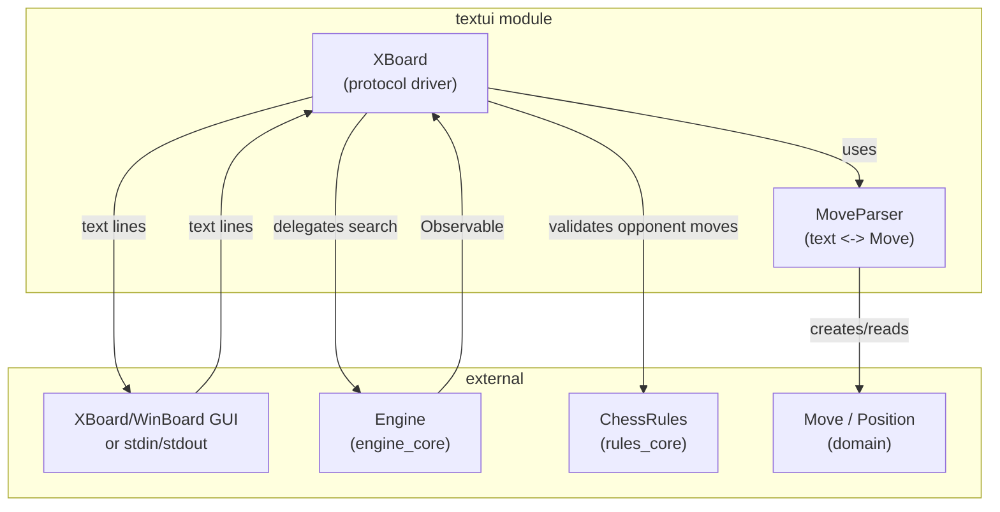
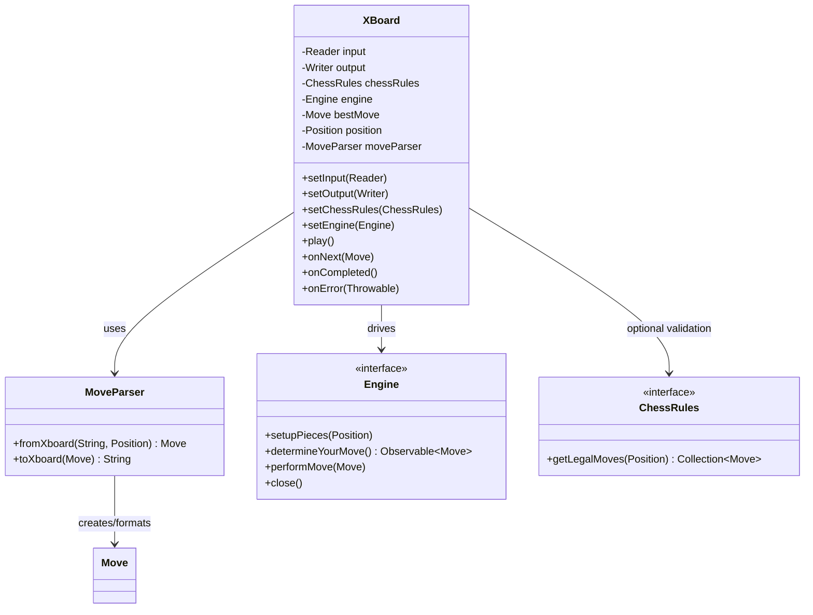
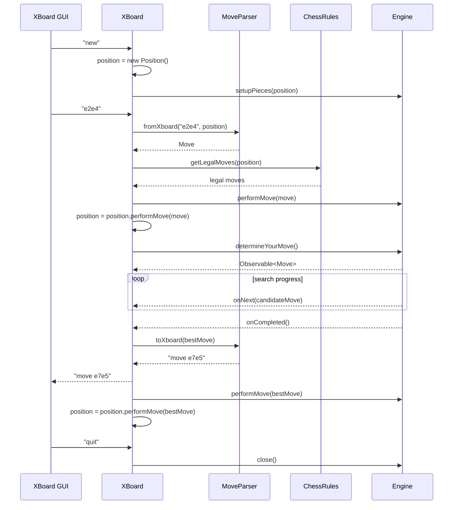
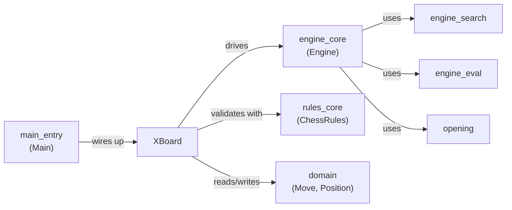

# TextUI Module

## Purpose

The `textui` module provides a **text-based user interface** for the DokChess engine, implemented as an adapter for the [XBoard/WinBoard protocol](https://www.gnu.org/software/xboard/engine-intf.html). It allows any XBoard-compatible chess GUI (or a human/script driving the protocol directly through stdin/stdout) to communicate with a DokChess `Engine` instance using plain text commands.

The module is intentionally small and focused: it does not implement chess rules or move search itself. Instead, it translates between the textual XBoard wire format and the strongly-typed domain objects (`Move`, `Position`) used by the rest of the system, and orchestrates the protocol's command loop against an `Engine` implementation.

It is the primary entry point used by [`main_entry`](main_entry.md) (`Main.java`) to expose a runnable chess engine process.

## Architecture Overview

The module consists of two classes that work together:

- **`XBoard`** — the protocol driver. Reads commands line by line from an input stream, interprets them, and writes protocol responses to an output stream. It delegates move calculation to an injected [`Engine`](engine_core.md) and (optionally) validates opponent moves using [`ChessRules`](rules_core.md).
- **`MoveParser`** — a stateless translator between XBoard's plain-text move notation (e.g. `e2e4`, `e7e8q`) and the domain's `Move` objects (from the [`domain`](domain.md) module).

### Component Relationships

## Core Components

### `MoveParser`

`MoveParser` is a small, stateless utility with two responsibilities:

- **`fromXboard(String input, Position position)`** — parses a move string matching the pattern `[a-h][1-8][a-h][1-8][qrnb]?` (e.g. `e2e4`, `e7e8q`) into a fully-populated `Move`. It uses the supplied `Position` to look up the moving `Piece`, detect captures (target square occupied), and detect promotions (pawn reaching the last rank, with the promotion piece type decoded from the trailing letter via `PieceType.fromLetter`). Returns `null` if the input does not match the expected move syntax.
- **`toXboard(Move move)`** — formats a `Move` back into the XBoard wire format, e.g. `move e7e8q`, including the `move ` command prefix expected by the protocol and a lowercase promotion letter when applicable.

This class has no state and no dependency on the engine or rules; it depends only on domain types (`Move`, `Position`, `Square`, `Piece`, `PieceType`) from the [`domain`](domain.md) module.

### `XBoard`

`XBoard` implements `rx.Observer<Move>` and drives a simple line-based command loop implementing a practical subset of the XBoard protocol:

| Command received | Behavior |
|---|---|
| `xboard` | Acknowledges with an empty line |
| `protover 2` | Replies `feature done=1` (feature negotiation complete) |
| `new` | Resets to the initial `Position` and calls `engine.setupPieces(position)` |
| `go` | Starts asynchronous move search via `engine.determineYourMove()` and subscribes `this` as observer |
| `<move text>` (e.g. `e2e4`) | Parsed via `MoveParser.fromXboard`; if valid and (optionally) legal per `ChessRules`, applies the move to the engine and internal position, then triggers the engine to compute its reply (like `go`) |
| `quit` / end of input | Terminates the loop and calls `engine.close()` |
| anything else | Replies `Error (unknown command): <line>` |

**Dependency injection**: `XBoard` is configured via simple setters rather than a constructor, making it easy to wire up in `Main` or in tests:

- `setInput(Reader)` / `setOutput(Writer)` — the I/O streams (typically `System.in`/`System.out` in production, `StringReader`/`StringWriter` in tests).
- `setEngine(Engine)` — **required**; the [`Engine`](engine_core.md) implementation (e.g. `DefaultEngine`) that performs move search.
- `setChessRules(ChessRules)` — **optional**; when set, opponent moves received over the protocol are checked against `ChessRules.getLegalMoves(position)` before being accepted, rejecting illegal moves with an `Illegal move:` message.

**Asynchronous move search**: The engine's `determineYourMove()` returns an `rx.Observable<Move>` that may emit zero or more intermediate "better move found" updates via `onNext`, followed by `onCompleted` once the search settles on a final choice:

- `onNext(Move move)` — logs a comment line (`# better move found: ...`) and remembers the move as the current best candidate.
- `onCompleted()` — sends the final move to the GUI in XBoard format (`move ...`), applies it to the engine's internal state via `performMove`, and updates the local `Position` copy.
- `onError(Throwable e)` — reports engine failures to the GUI using the `tellusererror` command.

**Move application flow**: For a human/opponent move received over the protocol, `XBoard`:
1. Parses it with `MoveParser.fromXboard`.
2. Optionally validates it against `ChessRules.getLegalMoves(position)`.
3. Applies it to the engine (`engine.performMove`) and to the locally tracked `Position` (`position.performMove`).
4. Immediately asks the engine for its own move (same as handling `go`).

## Process Flow

## Relationship to Other Modules

- **[`domain`](domain.md)** — supplies the core value types (`Move`, `Position`, `Square`, `Piece`, `PieceType`) that `MoveParser` translates to/from XBoard's textual format, and that `XBoard` uses to track game state.
- **[`engine_core`](engine_core.md)** — supplies the `Engine` interface (and its implementation, `DefaultEngine`) that `XBoard` drives to obtain moves and to which it forwards opponent moves. The reactive `Observable<Move>` returned by `determineYourMove()` is consumed directly by `XBoard` (which implements `Observer<Move>`).
- **[`rules_core`](rules_core.md)** — supplies the optional `ChessRules` interface used by `XBoard` to validate that opponent-submitted moves are legal before forwarding them to the engine.
- **[`main_entry`](main_entry.md)** — the `Main` class is responsible for constructing and wiring together an `Engine`, `ChessRules`, and an `XBoard` instance (with `System.in`/`System.out`), then invoking `play()` to start the interactive session. This is the typical composition root for the whole application.

## Summary

The `textui` module is a thin, well-isolated protocol adapter: `MoveParser` handles pure text-to-domain translation, while `XBoard` handles the stateful command loop and I/O concerns, reactive integration with the engine's asynchronous search, and optional rule validation. Its narrow responsibility and simple two-class design keep it easy to test (via injected `Reader`/`Writer`) and easy to replace with alternative UIs without touching the engine, rules, or domain layers.
