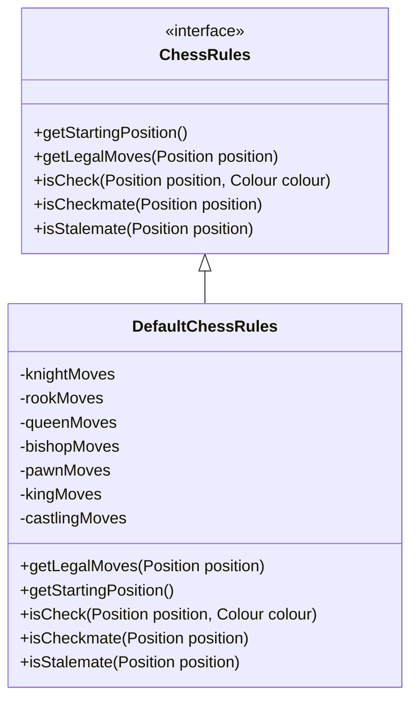
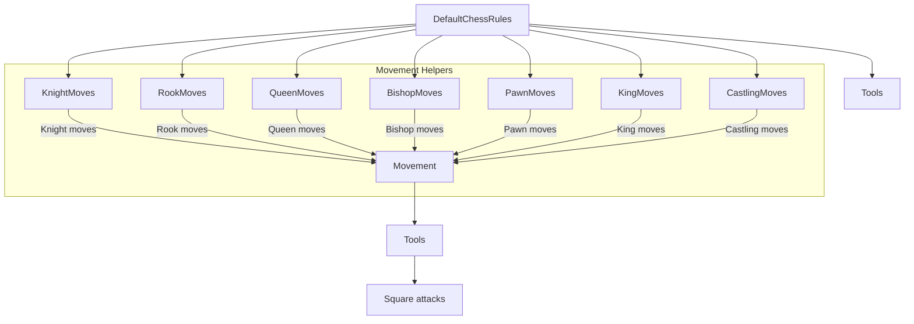
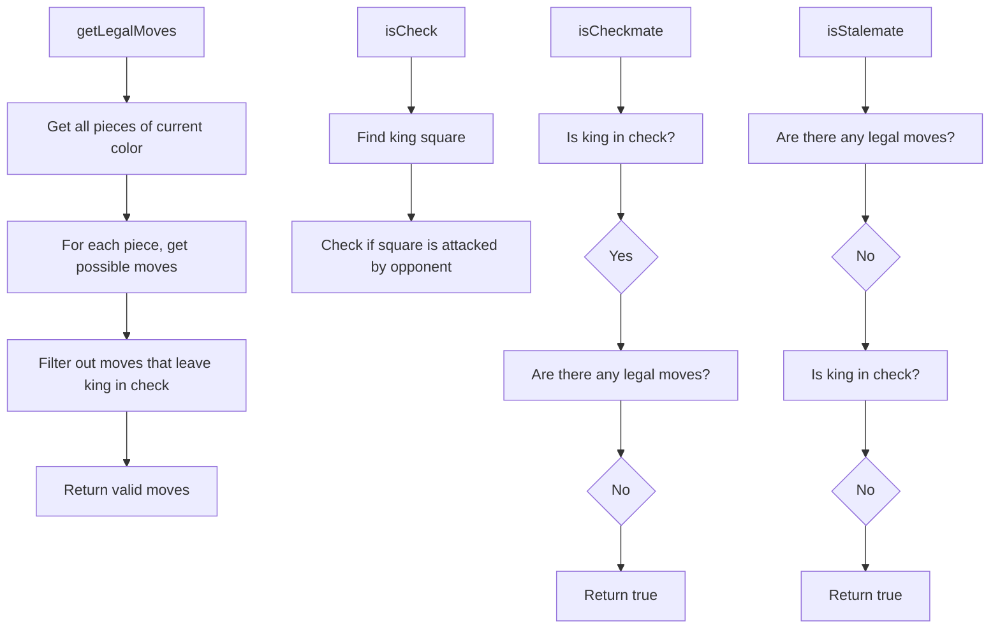
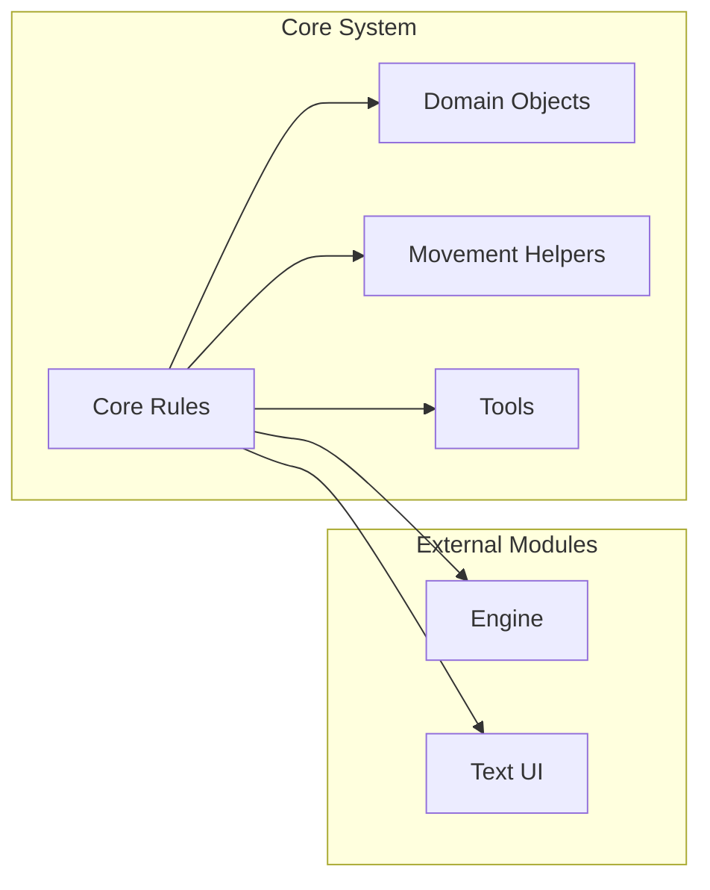

# Core Rules Module Documentation

## Overview

The **core_rules** module defines the fundamental chess rules implementation for the DokChess engine. It provides the core logic for determining legal moves, checking for check, checkmate, and stalemate conditions. This module serves as the foundation for all chess rule enforcement in the system.

## Purpose and Functionality

The core_rules module implements the standard chess rules through two main components:

1. **ChessRules Interface**: Defines the contract for chess rule enforcement
2. **DefaultChessRules Implementation**: Provides the actual implementation of chess rules using piece movement helpers

## Module Architecture

### Core Components



### Component Relationships

The DefaultChessRules implementation delegates to specialized movement classes for each piece type:



## Detailed Component Descriptions

### ChessRules Interface

The `ChessRules` interface defines the contract for all chess rule implementations:

- **getStartingPosition()**: Returns the initial chess position where white begins
- **getLegalMoves(Position position)**: Calculates all legal moves for a given position
- **isCheck(Position position, Colour colour)**: Determines if a king is under attack
- **isCheckmate(Position position)**: Checks if the current player is in checkmate
- **isStalemate(Position position)**: Verifies if the game is in stalemate

### DefaultChessRules Implementation

The `DefaultChessRules` class provides the standard chess rule implementation:

#### Key Features:
1. **Piece-Specific Movement Handling**: Uses specialized movement classes for each piece type
2. **Legal Move Generation**: Generates all possible moves for each piece
3. **Check Detection**: Uses the `Tools.isSquareAttacked()` method to determine king safety
4. **Mate and Stalemate Detection**: Implements proper checkmate and stalemate logic

#### Implementation Details:



## Integration with Other Modules

The core_rules module integrates with several other modules in the system:

1. **Domain Layer**: Depends on `Position`, `Move`, and `Colour` classes from the domain module
2. **Movement Helpers**: Uses specialized movement classes from the piece_moves sub-module
3. **Tools Module**: Leverages the `Tools.isSquareAttacked()` method for king safety checks
4. **Engine Module**: Used by the engine to validate moves during game play



## Relationship to Related Modules

The core_rules module works closely with the following related modules:

- **[Movement Base Module](movement_base.md)**: Provides the base `Movement` class used by piece-specific movement implementations
- **[Piece Moves Sub-module](piece_moves.md)**: Contains specialized movement logic for individual piece types
- **[Tools Module](tools.md)**: Supplies utility methods for determining square attacks
- **[Domain Module](domain.md)**: Uses core data structures for representing game state

This modular approach ensures clean separation of concerns while maintaining tight integration between related components.

## Data Flow

The typical data flow in the core_rules module follows this pattern:

1. **Input**: A `Position` object representing the current game state
2. **Processing**: 
   - Generate candidate moves for each piece
   - Filter out illegal moves (those leaving king in check)
   - Check for special conditions (check, checkmate, stalemate)
3. **Output**: Legal moves collection or boolean results for game state conditions

## Usage Examples

### Getting Legal Moves
```java
ChessRules rules = new DefaultChessRules();
Position position = rules.getStartingPosition();
Collection<Move> legalMoves = rules.getLegalMoves(position);
```

### Checking Game State
```java
ChessRules rules = new DefaultChessRules();
boolean inCheck = rules.isCheck(position, Colour.WHITE);
boolean isMate = rules.isCheckmate(position);
boolean isStalemate = rules.isStalemate(position);
```

## Dependencies

The core_rules module depends on:
- **Domain Module**: For `Position`, `Move`, and `Colour` classes
- **Movement Base Module**: For the `Movement` base class
- **Tools Module**: For `Tools.isSquareAttacked()` method
- **Piece Moves Sub-module**: For specialized movement implementations

## Module Structure

The core_rules module contains the following key components:

1. **ChessRules Interface** (`src/main/java/org/dokchess/rules/ChessRules.java`)
   - Defines the contract for chess rule enforcement
   - Provides methods for legal move calculation and game state detection

2. **DefaultChessRules Implementation** (`src/main/java/org/dokchess/rules/DefaultChessRules.java`)
   - Implements the standard chess rules
   - Coordinates movement generation and validation
   - Handles check, checkmate, and stalemate detection

## Related Documentation

- [Domain Module](domain.md): Core data structures for chess positions and moves
- [Movement Base Module](movement_base.md): Base movement functionality used by piece-specific implementations
- [Piece Moves Sub-module](piece_moves.md): Individual piece movement logic (knight, rook, queen, bishop, pawn, king)
- [Tools Module](tools.md): Utility methods for chess operations including square attack detection
- [Engine Module](engine.md): Game engine that utilizes these rules for move validation
- [Text UI Module](textui.md): User interface that relies on these rules for game state management

## Design Principles

The core_rules module follows several important design principles:

1. **Interface Segregation**: The `ChessRules` interface separates the contract from implementation
2. **Single Responsibility**: Each component has a well-defined responsibility
3. **Dependency Injection**: Movement helpers are injected rather than hardcoded
4. **Immutability**: Position objects are not modified directly, but new positions are created through move operations
5. **Testability**: Clear separation allows for unit testing of individual rule components

## Performance Considerations

The implementation considers performance through:

1. **Efficient Move Filtering**: Illegal moves (that would leave king in check) are filtered out early
2. **Lazy Evaluation**: Only generates moves for pieces that can actually move
3. **Optimized Attack Detection**: Uses efficient algorithms for determining square attacks
4. **Memory Management**: Avoids unnecessary object creation during move validation

## Design Considerations

1. **Separation of Concerns**: Rule logic is separated from move generation
2. **Extensibility**: Interface-based design allows for alternative rule implementations
3. **Performance**: Efficient filtering of illegal moves through king safety checks
4. **Correctness**: Proper handling of edge cases like check, checkmate, and stalemate

## Future Enhancements

Potential improvements could include:
- Support for variant chess rules
- Performance optimizations for move generation
- Additional rule validation methods
- Integration with chess variants