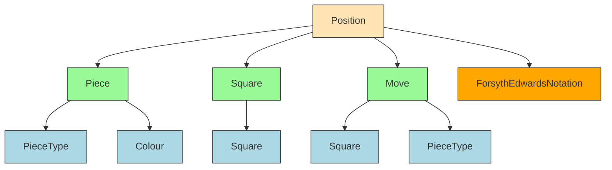

# Domain Module Documentation

## Overview

The Domain module represents the core chess logic and data structures of the DokChess engine. It provides the fundamental building blocks for representing chess positions, pieces, moves, and the rules of chess. This module is essential for all other components in the system as it defines the basic chess domain entities and their interactions.

## Architecture Overview

The Domain module consists of several interconnected classes that represent different aspects of chess:



## Core Components

### Position Module
The Position module handles complete chess positions including:
- Piece placement on the board
- Side to move
- Castling rights
- En passant target square
- FEN string representation

This is the central class that maintains the state of the chess game. [More details](position.md).

### Piece Module
The Piece module represents individual chess pieces with:
- Type (pawn, rook, knight, bishop, queen, king)
- Color (white or black)
- Methods for FEN representation

It also includes Square classes that represent specific locations on the chessboard with:
- Rank (row) and file (column) coordinates
- String representation (e.g., "e4")
- Immutable design for safety

[More details](piece.md).

### Move Module
The Move module represents a single chess move with:
- Source and target squares
- Piece being moved
- Capture information
- Promotion details
- Special move types (castling, pawn double advance)

[More details](move.md).

### ForsythEdwardsNotation Class
The `ForsythEdwardsNotation` utility class handles conversion between:
- FEN string representations and Position objects
- Position objects to FEN string representations

## Module Dependencies

This module is foundational and is used by:
- [Engine](engine.md) - for game state management and move generation
- [Rules](rules.md) - for validating moves according to chess rules
- [Opening](opening.md) - for opening book handling
- [TextUI](textui.md) - for displaying and parsing chess positions

The domain module's sub-modules are integrated as follows:
- [Position](position.md) and [Move](move.md) are core components used throughout the system
- [Piece](piece.md) and [Square](piece.md) form the basic building blocks for all chess representations

## Data Flow

1. **Position Creation**: Positions are created either from FEN strings or as initial positions
2. **Move Execution**: Moves are performed on positions to create new game states
3. **State Representation**: Positions are converted to FEN strings for storage or display
4. **Validation**: Rules are applied to validate moves against current positions

## Key Relationships

- `Position` contains multiple `Piece` objects arranged on `Square` objects
- `Move` objects describe transitions between `Position` states
- `Square` objects are referenced by both `Position` and `Move` classes
- `Piece` objects contain `PieceType` and `Colour` information
- `ForsythEdwardsNotation` acts as a bridge between string representations and `Position` objects

## Usage Examples

### Creating a Position
```java
// Create initial position
Position position = new Position();

// Create position from FEN string
Position position = new Position("rnbqkbnr/pppppppp/8/8/8/8/PPPPPPPP/RNBQKBNR w KQkq - 0 1");
```

### Making a Move
```java
// Create a move
Move move = new Move(piece, fromSquare, toSquare);

// Apply move to position
Position newPosition = currentPosition.performMove(move);
```

### Converting to FEN
```java
// Get FEN string from position
String fen = position.toString();
```