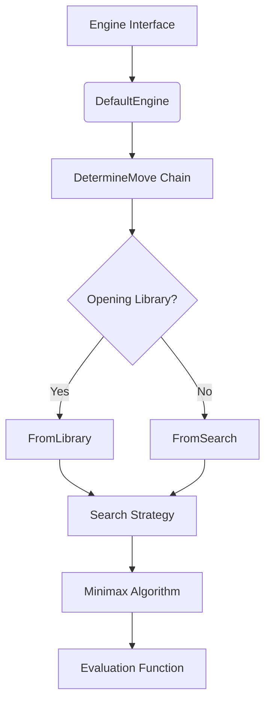

# Engine Module Documentation

## Overview

The Engine module is the core decision-making component of the DokChess chess engine. It handles the process of determining the best moves for a given chess position, incorporating opening book strategies, search algorithms, and evaluation functions.

## Architecture Overview

The engine follows a chain-of-responsibility pattern to determine moves, allowing for different strategies such as opening book lookups, search algorithms, and fallback mechanisms. The architecture is designed to be extensible and modular.

## Core Components

### Engine Interface
The `Engine` interface defines the contract for the chess engine, providing methods for setting up positions, determining moves, performing moves, and closing the engine.

### DefaultEngine
The `DefaultEngine` is the primary implementation that orchestrates the move determination process. It sets up the chain of responsibility with optional opening library support and a search strategy.

### DetermineMove Chain
The `DetermineMove` abstract class implements a chain-of-responsibility pattern for move determination. Each concrete implementation can either provide a move or delegate to the next handler in the chain.

### Search Strategies
The engine supports multiple search strategies through the `Search` interface:
- `MinimaxParallelSearch`: Implements parallel minimax search for efficient move evaluation
- `MinimaxAlgorithm`: Core minimax algorithm implementation with depth limiting

### Evaluation Functions
The evaluation system provides scoring mechanisms for chess positions:
- `Evaluation`: Interface defining the evaluation contract
- `StandardMaterialEvaluation`: Basic material-based evaluation

## Module Relationships

The Engine module integrates with several other modules in the system:

- **Domain Layer**: Uses `Position` and `Move` objects from the domain package
- **Rules Module**: Depends on `ChessRules` for legal move generation and game state detection
- **Opening Module**: Integrates with `OpeningLibrary` for opening book moves
- **TextUI Module**: Communicates with the engine through the defined interface

## Data Flow

1. Game position is set via `setupPieces()`
2. Move determination is initiated via `determineYourMove()`
3. The chain of responsibility determines whether to use opening book or search
4. Search algorithms evaluate positions and return best moves
5. Evaluation functions score positions during search
6. Moves are applied via `performMove()` when selected

## Key Features

- **Opening Book Support**: Optional integration with opening libraries
- **Parallel Search**: Multi-threaded minimax search for performance
- **Extensible Evaluation**: Pluggable evaluation functions
- **Asynchronous Move Selection**: Non-blocking move determination
- **Resource Management**: Proper cleanup through the `close()` method

## Sub-modules

The engine module contains several sub-components that are documented separately:

- [engine_search](search.md): Search algorithms and parallel processing
- [engine_eval](eval.md): Evaluation functions and scoring systems