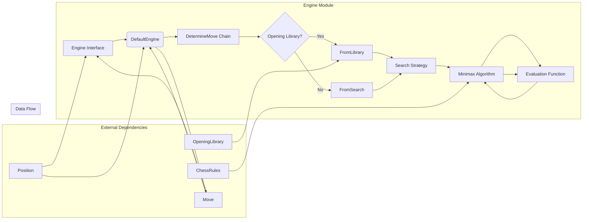
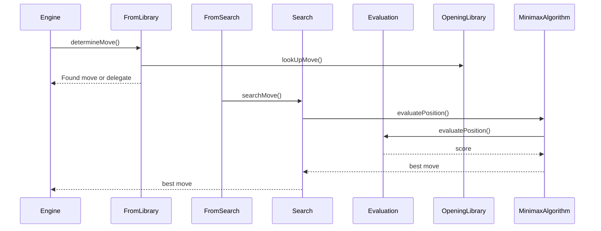

# Engine Module Architecture

## Complete System Architecture Diagram

## Component Interactions

### Chain of Responsibility Pattern
The engine uses a chain-of-responsibility pattern implemented through the `DetermineMove` abstract class:

## Data Flow Through Engine

1. **Setup Phase**: 
   - `setupPieces()` sets the current game position
   - Cancels any ongoing searches

2. **Move Determination Phase**:
   - `determineYourMove()` initiates asynchronous move search
   - Chain evaluates opening library first (if available)
   - Falls back to search algorithm if no opening move found
   - Search algorithm evaluates positions using minimax
   - Evaluation function scores positions
   - Best move is reported through RxJava Observable

3. **Move Execution Phase**:
   - `performMove()` applies move to internal position
   - Cancels ongoing searches

4. **Cleanup Phase**:
   - `close()` method shuts down resources
   - Cancels any pending searches