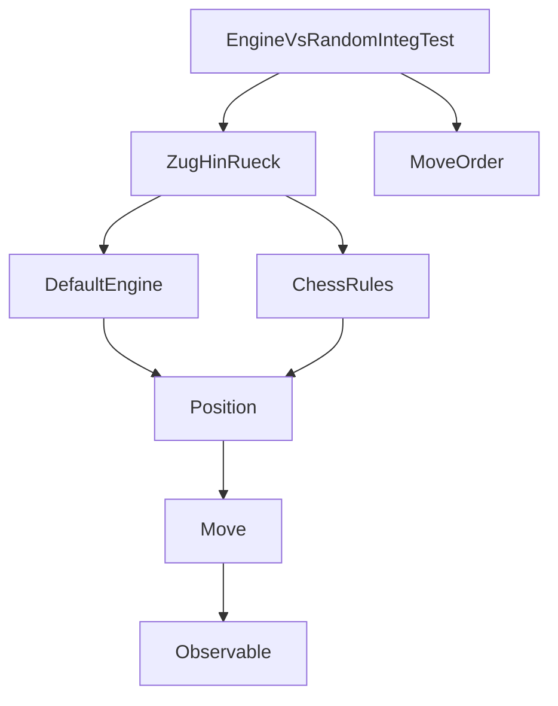
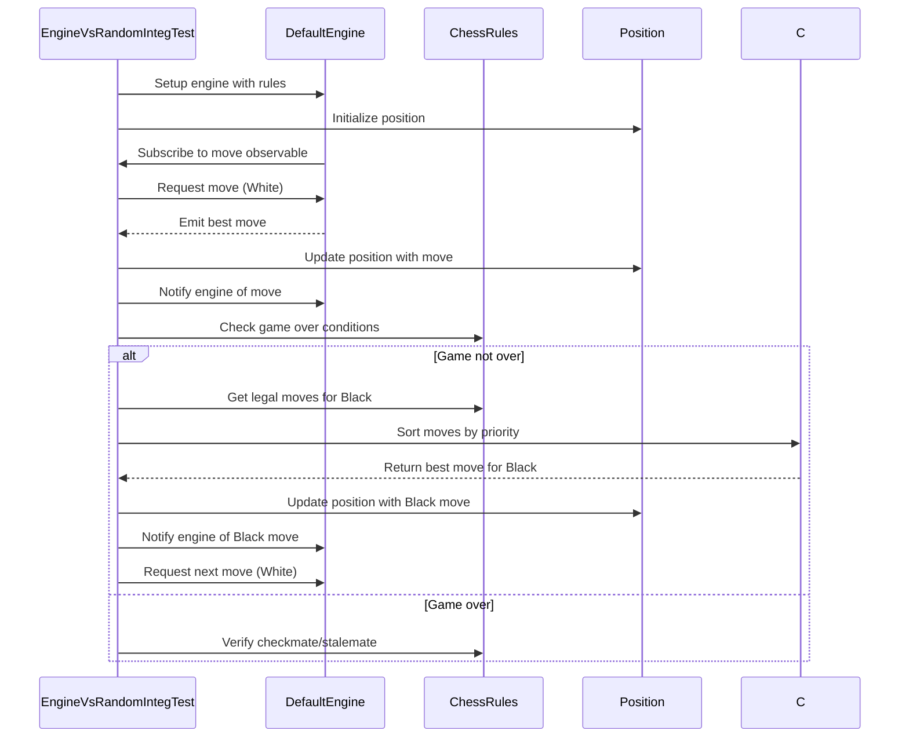

# Engine vs Random Integration Test Module

## Overview

The `engine_vs_random_integration` module represents an integration test suite that evaluates the performance of the chess engine by playing against a simplified computer opponent that makes random but rule-valid moves. This module serves as a crucial testing mechanism to validate the engine's decision-making capabilities in realistic game scenarios.

## Purpose and Functionality

This module implements a comprehensive integration test that demonstrates how the chess engine performs against a basic opponent strategy. The test creates a scenario where:
- The engine plays as White using its standard configuration
- A computer opponent (black) makes moves based on a simple heuristic that prioritizes captures, castling, and pawn moves
- The test verifies that the engine can successfully navigate through a complete game to checkmate

## Architecture and Components

### Core Components

The main components of this integration test include:

1. **EngineVsRandomIntegTest** - The primary test class that orchestrates the game simulation
2. **ZugHinRueck** - An observer implementation that handles move processing and game state updates
3. **MoveOrder** - A comparator that ranks moves based on strategic value for the random opponent

### Component Relationships

## Integration with Other Modules

This module integrates with several core components of the chess system:

- **[Engine Module](engine.md)**: Uses `DefaultEngine` to make moves for White
- **[Rules Module](rules.md)**: Utilizes `DefaultChessRules` to validate moves and detect game end conditions
- **[Domain Module](domain.md)**: Works with `Position` and `Move` objects to represent game state
- **[TextUI Module](textui.md)**: While not directly used here, the integration pattern follows similar principles

## Data Flow

## Process Flow

1. **Initialization**: Sets up the chess engine, rules, and initial board position
2. **Game Loop**: 
   - Engine determines and executes White's move
   - Checks if game is over after White's move
   - If not over, random opponent determines and executes Black's move
   - Checks if game is over after Black's move
   - Continues until game ends
3. **Validation**: Verifies that the game ended in checkmate with Black to move

## Key Features

### Strategic Move Prioritization
The random opponent uses a simple but effective move prioritization system:
- Captures are valued at 1000 points
- Castling moves are valued at 100 points  
- Pawn moves are valued at 10 points

This ensures the opponent makes meaningful moves rather than completely random selections.

### Asynchronous Processing
The test uses RxJava's Observable pattern to handle asynchronous move determination and execution, allowing for realistic game simulation.

### Game State Management
The module properly manages the chess position state throughout the game, ensuring that each move is correctly applied to the board and that the engine is notified of all moves.

## Testing Approach

This integration test validates:
- Engine move generation accuracy
- Proper handling of game state transitions
- Correct implementation of chess rules validation
- Ability to handle complete game cycles
- Integration between engine and rules components

## Dependencies

This module depends on:
- **Engine Module**: For `DefaultEngine` and move determination
- **Rules Module**: For `DefaultChessRules` and game state validation
- **Domain Module**: For `Position`, `Move`, and `Colour` objects
- **RxJava**: For reactive programming patterns in move handling

## Usage

The test can be executed as part of the broader integration test suite to verify that the engine maintains proper functionality when playing against a reasonable opponent. It serves both as a functional test and a demonstration of the engine's capabilities in a real-world scenario.

## Related Documentation

For more information on related components, see:
- [Engine Module Documentation](engine.md)
- [Rules Module Documentation](rules.md)
- [Domain Module Documentation](domain.md)
- [Integration Test Suite Overview](integration_tests.md)