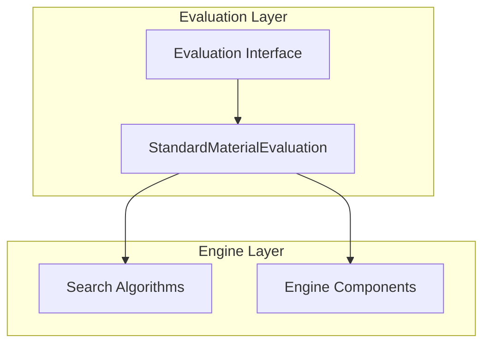
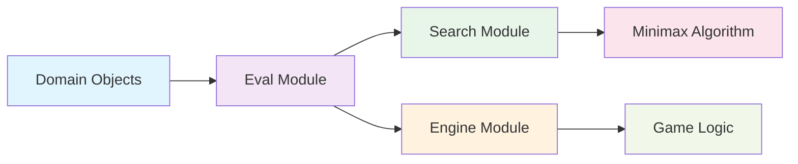
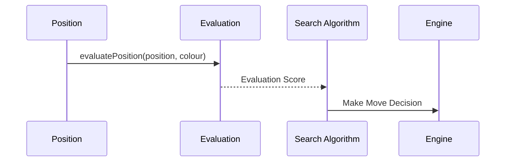

# Eval Module Documentation

## Overview

The eval module in DokChess provides the evaluation framework for chess positions. It defines the interface and implementations for evaluating chess positions from a player's perspective, which is crucial for the engine's decision-making process during game play.

## Purpose and Core Functionality

The eval module serves as the evaluation layer in the chess engine architecture. Its primary purpose is to assign numerical values to chess positions that indicate how favorable they are for a given player. This evaluation is essential for algorithms like minimax search that need to determine the best moves.

### Key Components

1. **Evaluation Interface** - Defines the contract for position evaluation
2. **StandardMaterialEvaluation Implementation** - Provides basic material-based evaluation

## Module Architecture

The eval module sits at a critical level in the engine architecture, providing evaluation services that are consumed by search algorithms and other engine components.

### Component Relationships



## Detailed Component Documentation

### Evaluation Interface

The `Evaluation` interface defines the contract for position evaluation in the chess engine. It specifies methods for evaluating positions from a player's perspective and establishes constants for extreme evaluation values.

Key features:
- Defines standard constants for best, worst, and balanced evaluation values
- Provides a method to evaluate positions from a specific player's viewpoint
- Returns integer values where higher numbers indicate better positions for the player

### StandardMaterialEvaluation Implementation

The `StandardMaterialEvaluation` class implements the `Evaluation` interface with a basic material-based evaluation approach. It calculates position values based solely on piece values without considering positional factors.

#### Algorithm Details

The implementation follows these steps:
1. Iterates through all squares on the chessboard
2. For each occupied square, determines the piece type and color
3. Assigns material values based on piece type:
   - Pawn: 1 point
   - Knight/Bishop: 3 points
   - Rook: 5 points
   - Queen: 9 points
4. Adds values for own pieces and subtracts values for opponent pieces
5. Returns the net material advantage

#### Material Values

| Piece Type | Value |
|------------|-------|
| Pawn       | 1     |
| Knight     | 3     |
| Bishop     | 3     |
| Rook       | 5     |
| Queen      | 9     |

## Integration with Other Modules

The eval module integrates with several other components in the DokChess system:

### With Search Module
The evaluation results are used by search algorithms (like Minimax) to determine the best moves by comparing position values.

### With Engine Module
The engine uses evaluation scores to make decisions about which moves to pursue during gameplay.

### With Domain Module
The evaluation directly depends on domain objects like `Position` and `Piece` to assess board states.



## Data Flow



## Usage Examples

### Basic Usage
```java
Evaluation evaluator = new StandardMaterialEvaluation();
Position position = ... // get current position
int score = evaluator.evaluatePosition(position, Colour.WHITE);
```

### Integration with Search
```java
// In a search algorithm
int evaluation = evaluator.evaluatePosition(currentPosition, currentPlayer);
```

## Design Considerations

1. **Extensibility**: The interface design allows for multiple evaluation strategies
2. **Performance**: Simple material calculation ensures fast evaluation
3. **Separation of Concerns**: Evaluation logic is separated from search logic
4. **Consistency**: Standardized return values make integration easier

## Future Enhancements

Potential improvements could include:
- More sophisticated positional evaluation
- Piece-square tables
- Tactical pattern recognition
- Endgame tablebases integration

## Related Documentation

For more information on related modules, see:
- [Engine Module](engine.md)
- [Search Module](search.md)
- [Domain Module](domain.md)