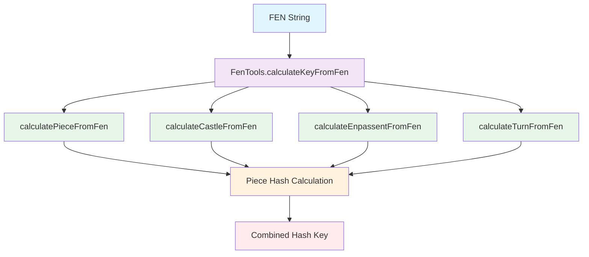
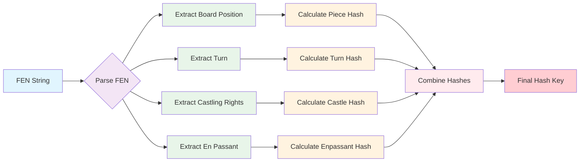

# FenTools Module Documentation

## Overview

The `FenTools` module provides functionality for calculating hash keys from Forsyth-Edwards Notation (FEN) strings, which is essential for chess engine implementations. This module is part of the opening library system and is specifically designed to work with Polyglot-compatible FEN representations.

## Architecture Diagram



## Data Flow Diagram



## Purpose and Core Functionality

The primary purpose of the `FenTools` class is to compute unique hash keys for chess positions represented in FEN notation. These hash keys are crucial for:

- Efficient position lookup in opening books
- Transposition table management in chess engines
- Position identification and comparison

The implementation uses a predefined array of 64-bit random numbers (`random64`) to generate these hash keys through XOR operations, following standard chess engine practices.

## Architecture and Component Relationships

### Core Components

The module contains a single class:
- **FenTools**: A utility class with static methods for FEN parsing and hash key calculation

### Dependencies

This module depends on:
- [Opening Library](opening_library.md) - For integration with Polyglot opening books
- [Polyglot Tools](polyglot_tools.md) - For FEN-related utilities
- [Domain Models](domain_models.md) - For understanding chess position representation

### Data Flow

```
[Input FEN String] 
      ↓
[FenTools.calculateKeyFromFen()] 
      ↓
[Piece Hash Calculation]
      ↓
[Castling Hash Calculation]
      ↓
[En Passant Hash Calculation]
      ↓
[Turn Hash Calculation]
      ↓
[Combined Hash Key]
```

## Detailed Component Analysis

### FenTools Class

The `FenTools` class is a utility class with all static methods and a private constructor to prevent instantiation. It contains the following key methods:

#### Methods

1. **calculateKeyFromFen(String fen)** - Main entry point that combines all hash calculations
2. **calculatePieceFromFen(String fen)** - Calculates hash for piece positions
3. **kindOfPiece(char c)** - Maps piece characters to internal indices
4. **calculateCastleFromFen(String fen)** - Calculates hash for castling rights
5. **calculateEnpassentFromFen(String fen)** - Calculates hash for en passant square (currently unimplemented)
6. **calculateTurnFromFen(String fen)** - Calculates hash for turn indicator

### Hash Generation Process

The hash generation follows these steps:

1. **Piece Hash**: Each piece on the board contributes a value from the `random64` array based on its type and position
2. **Castling Hash**: Each active castling right contributes a value from the `random64` array
3. **En Passant Hash**: Placeholder for en passant square (TODO: Implementation needed)
4. **Turn Hash**: Indicates whether white or black is to move

All values are combined using XOR operations to produce the final hash key.

## Integration Points

### With Other Modules

1. **Opening Library**: Used for generating position keys for opening book entries
2. **Polyglot Tools**: Works alongside Polyglot tools for FEN processing
3. **Engine**: Essential for position hashing in search algorithms

### Usage Pattern

The typical usage pattern involves:
1. Parsing a FEN string to extract position information
2. Calling `calculateKeyFromFen()` to get the hash key
3. Using this key for position lookup in opening books or transposition tables

## Implementation Details

### Random Number Array

The `random64` array contains 781 precomputed 64-bit random numbers used for hash generation. These numbers are carefully selected to minimize collisions in the hash space.

### Piece Mapping

Pieces are mapped to indices using the string `"pPnNbBrRqQkK"` where:
- Lowercase letters represent black pieces
- Uppercase letters represent white pieces
- The index corresponds to the piece type in the random array

### FEN Parsing

The parser splits the FEN string by spaces and processes:
1. Board position (first group)
2. Active color (second group)  
3. Castling availability (third group)
4. En passant target (fourth group) - currently unused in hash calculation

## Limitations and Future Improvements

### Current Limitations

1. **En Passant Support**: The `calculateEnpassentFromFen` method is marked as "TODO" and lacks implementation
2. **Incomplete FEN Processing**: Only extracts necessary components for hash calculation

### Potential Enhancements

1. Implement full en passant square handling
2. Add validation for malformed FEN strings
3. Optimize performance for frequently accessed positions
4. Add support for additional FEN components if needed

## Related Documentation

- [Opening Library](opening_library.md)
- [Polyglot Tools](polyglot_tools.md)
- [Domain Models](domain_models.md)
- [Engine Components](engine_components.md)