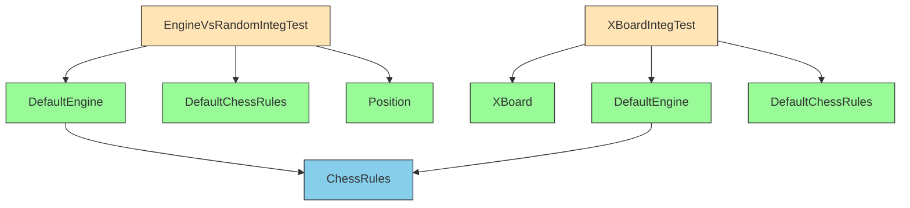

# Integration Tests Module

## Overview

The integration_tests module contains end-to-end tests that verify the proper functioning of the DokChess chess engine when integrated with various components. These tests ensure that different parts of the system work together correctly, rather than testing individual units in isolation.

## Purpose

This module serves to:
- Validate the integration between the chess engine and other system components
- Test complete gameplay scenarios
- Ensure that the engine behaves correctly when interacting with the UI and other subsystems
- Verify that the engine can handle real-world usage patterns

## Architecture Overview

The integration tests module consists of two primary test classes that demonstrate different integration scenarios:

1. **EngineVsRandomIntegTest** - Tests the engine's ability to play against a simplified random opponent
2. **XBoardIntegTest** - Tests the integration with the XBoard protocol interface

## Core Components

### EngineVsRandomIntegTest

This test demonstrates the engine playing a complete game against a simplified opponent that makes moves based on a preference algorithm favoring captures and pawn moves. It tests:

- Engine move determination capabilities
- Game state management
- Integration with the chess rules engine
- Complete game flow from start to finish

For detailed information about this sub-module, see [Engine vs Random Integration Documentation](engine_vs_random_integration.md).

### XBoardIntegTest

This test verifies the integration with the XBoard protocol, which is a standard protocol for communication between chess engines and graphical user interfaces. It tests:

- Protocol handling
- Engine response to commands
- Communication between the engine and UI layer
- Proper move processing through the XBoard interface

For detailed information about this sub-module, see [XBoard Integration Documentation](xboard_integration.md).

## Dependencies

The integration tests depend on several core modules:
- [domain](domain.md) - For chess position and move representations
- [engine](engine.md) - For the chess engine implementation
- [rules](rules.md) - For chess rule enforcement
- [textui](textui.md) - For XBoard protocol integration

## Test Scenarios

### Engine vs Random Test
Tests a complete game where the engine plays as white against a computer opponent that makes moves based on a simple heuristic.

### XBoard Protocol Test
Verifies that the engine can properly communicate through the XBoard protocol, responding to commands and generating appropriate moves.

## Related Documentation

For more detailed information about the components involved, please refer to:
- [Domain Module Documentation](domain.md)
- [Engine Module Documentation](engine.md)
- [Rules Module Documentation](rules.md)
- [TextUI Module Documentation](textui.md)