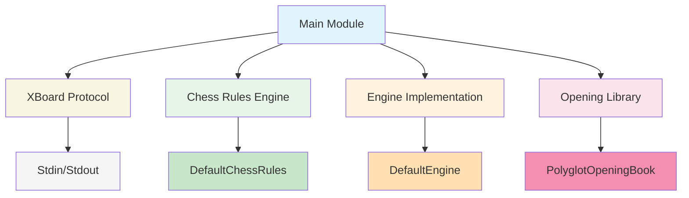
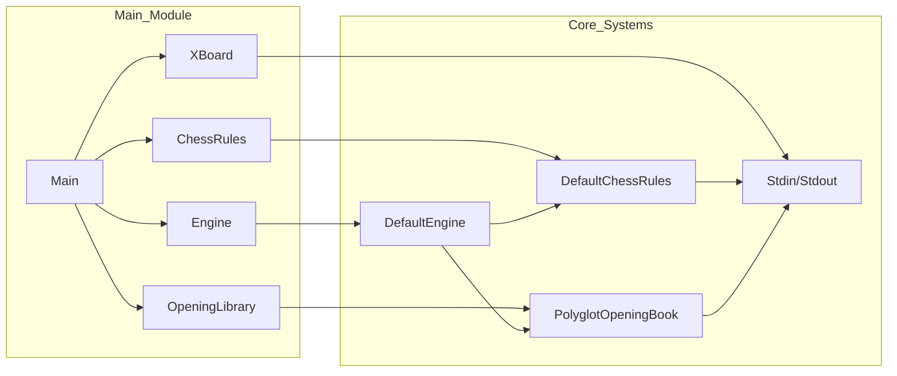
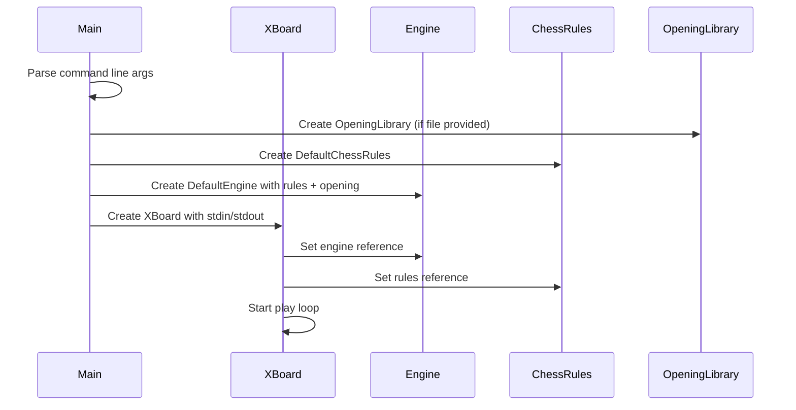

# Main Module Documentation

## Overview

The Main module serves as the primary entry point for the DokChess chess engine application. It orchestrates the integration of various subsystems including the chess rules engine, opening library, and XBoard protocol interface to provide a complete chess playing experience through the command line.

## Purpose and Functionality

The Main module is responsible for:
- Initializing the core chess engine components
- Setting up the XBoard protocol interface for communication
- Loading optional opening books for enhanced play
- Managing the main execution loop for the chess application

## Architecture

The Main module acts as the central coordinator that wires together several key components:



## Component Interactions

The following diagram illustrates how the main components interact with each other:



## Component Relationships

### Main Class
The `Main` class is the sole public class in this module and serves as the application's entry point. It performs the following key functions:

1. **Command Line Argument Processing**: 
   - Parses optional command-line arguments for opening book file paths
   - Validates file accessibility and readability
   - Handles error conditions gracefully

2. **Component Initialization**:
   - Creates and configures the chess rules engine (`DefaultChessRules`)
   - Initializes the engine implementation (`DefaultEngine`) with rules and optional opening library
   - Sets up the XBoard protocol interface with standard input/output streams

3. **System Integration**:
   - Connects all components through dependency injection
   - Establishes the communication channel via XBoard protocol
   - Starts the main execution loop

### Process Flow

The following sequence diagram illustrates the main execution flow:



### Key Dependencies

The Main module depends on several other modules:

- **[domain](domain.md)**: Provides fundamental chess domain objects (Position, Piece, Move, etc.)
- **[engine](engine.md)**: Contains the core engine logic and evaluation systems
- **[opening](opening.md)**: Manages opening book functionality for improved play
- **[rules](rules.md)**: Defines the core chess rules implementation
- **[textui](textui.md)**: Handles text-based user interface and XBoard protocol

## Data Flow


## Usage

To run the application:
```bash
java -cp dokchess.jar org.dokchess.Main [opening_book_file]
```

Where:
- `opening_book_file` is optional and specifies a Polyglot opening book file
- If omitted, the engine will operate without opening book support

## Integration Points

The Main module integrates with other modules through:

1. **Engine Interface**: Uses the Engine abstraction to delegate chess moves
2. **Rules Interface**: Relies on ChessRules for game state validation
3. **Opening Library**: Optionally loads and uses opening book data
4. **XBoard Protocol**: Communicates with external interfaces via XBoard

## Error Handling

The module implements robust error handling:
- Validates opening book file existence and readability
- Provides meaningful error messages to stderr
- Exits gracefully with appropriate status codes on failure

## Configuration

The module supports configuration through:
- Command-line arguments for opening book specification
- Default behavior when no arguments are provided
- Runtime configuration of opening book selection mode

## Related Modules

- [Domain Module](domain.md): Provides core chess domain objects
- [Engine Module](engine.md): Implements chess engine logic
- [Opening Module](opening.md): Manages opening book functionality
- [Rules Module](rules.md): Defines chess rules implementation
- [TextUI Module](textui.md): Handles user interface and protocol communication

## Summary

The Main module serves as the central coordination point for the DokChess application, bringing together all the core subsystems to create a functional chess engine. It provides a clean entry point that handles initialization, configuration, and the main execution loop while maintaining loose coupling with other modules through well-defined interfaces.