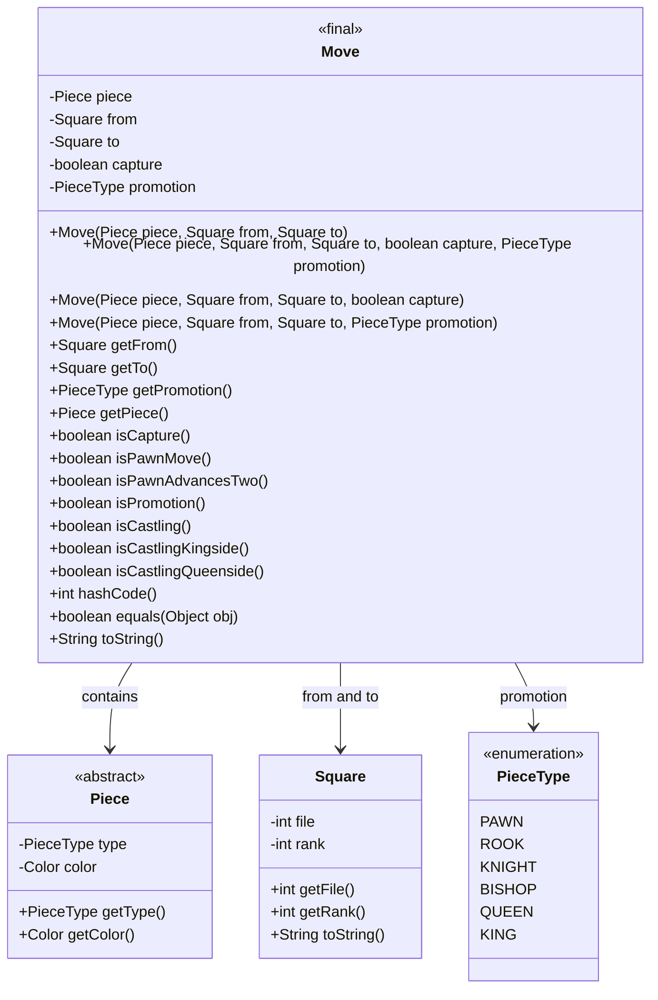
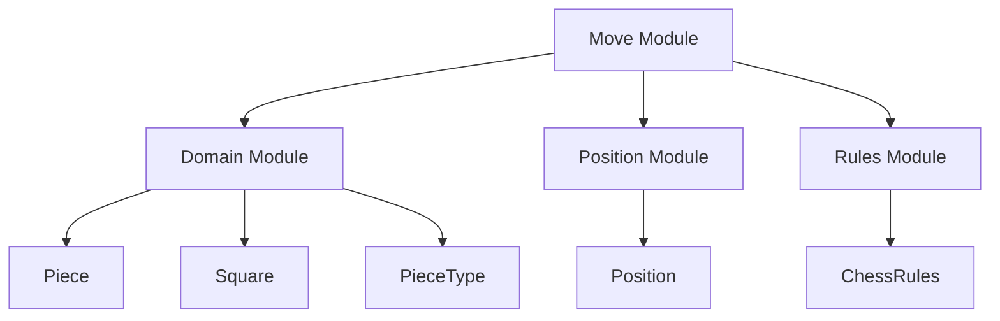
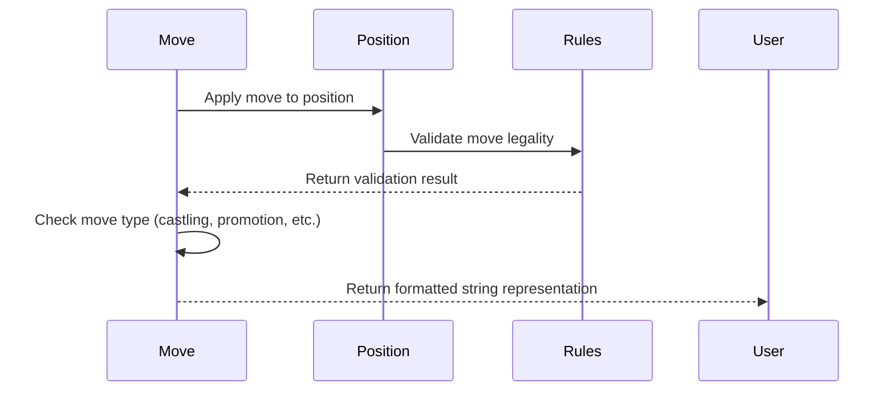

# Move Module Documentation

## Introduction

The Move module is a core component of the DokChess chess engine that represents individual moves within a chess game. This module provides the fundamental data structure for describing chess moves, including basic movement information, capture details, and special move types such as promotions and castling.

## Purpose and Core Functionality

The primary purpose of the Move module is to encapsulate all relevant information about a single chess move in an immutable data structure. This includes:

- Basic move information: source square, target square, and the piece being moved
- Special move characteristics: captures, promotions, and castling
- Move validation methods for different move types
- Human-readable string representation of moves

## Architecture and Component Relationships

### Core Components

The main component in this module is the `Move` class which serves as the central data structure for representing chess moves.



### Dependencies

The Move module depends on several other core modules:

1. **Domain Module**: Uses `Piece`, `Square`, and `PieceType` classes from the domain package
2. **Position Module**: Interacts with `Position` objects to validate moves
3. **Rules Module**: May reference move validation logic from chess rules



## Detailed Component Analysis

### Move Class

The `Move` class is designed to be immutable and provides comprehensive functionality for representing chess moves:

#### Constructor Variants
- Basic constructor for simple moves
- Full constructor supporting capture and promotion flags
- Convenience constructors for common scenarios

#### Key Methods
- **Accessors**: Getters for all move properties
- **Move Type Detection**: Methods to identify special move types
- **Equality and Hashing**: Proper implementation for use in collections
- **String Representation**: Human-readable format for debugging and display

#### Special Move Detection
The Move class includes specialized methods for identifying different types of moves:
- Capture detection (`isCapture()`)
- Pawn-specific moves (`isPawnMove()`, `isPawnAdvancesTwo()`)
- Promotion detection (`isPromotion()`)
- Castling detection (`isCastling()`, `isCastlingKingside()`, `isCastlingQueenside()`)

## Integration with Other Modules

### Relationship with Domain Module
The Move module directly depends on the Domain module for:
- `Piece` objects to identify what piece is moving
- `Square` objects to represent move coordinates
- `PieceType` enumeration for promotion handling

### Relationship with Position Module
Moves interact with positions through:
- Validating moves against current board state
- Applying moves to create new positions
- Checking move legality

### Relationship with Rules Module
The Move module works in conjunction with rules to:
- Validate move legality
- Determine special move characteristics
- Handle move-specific rule enforcement

## Data Flow



## Usage Examples

### Creating Moves
```java
// Simple move
Move move = new Move(piece, fromSquare, toSquare);

// Capture move
Move capture = new Move(piece, fromSquare, toSquare, true);

// Promotion move
Move promotion = new Move(pawn, fromSquare, toSquare, PieceType.QUEEN);
```

### Move Analysis
```java
if (move.isCapture()) {
    // Handle capture logic
}

if (move.isPromotion()) {
    // Handle promotion logic
}

if (move.isCastling()) {
    // Handle castling logic
}
```

## Implementation Details

### Immutability
The Move class is designed to be immutable, ensuring thread safety and predictable behavior. All fields are final, preventing modification after construction.

### Equality and Hash Code
The implementation properly overrides `equals()` and `hashCode()` methods to ensure correct behavior in collections and maps.

### String Representation
The `toString()` method provides a human-readable representation of moves in standard algebraic notation, making debugging and user interfaces easier to understand.

## Related Documentation

For a complete understanding of how moves fit into the chess engine architecture, please also refer to:
- [Domain Module Documentation](domain.md)
- [Position Module Documentation](position.md)
- [Rules Module Documentation](rules.md)
- [Engine Module Documentation](engine.md)