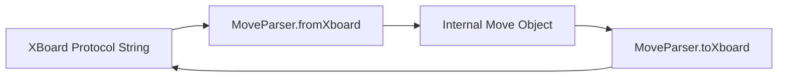
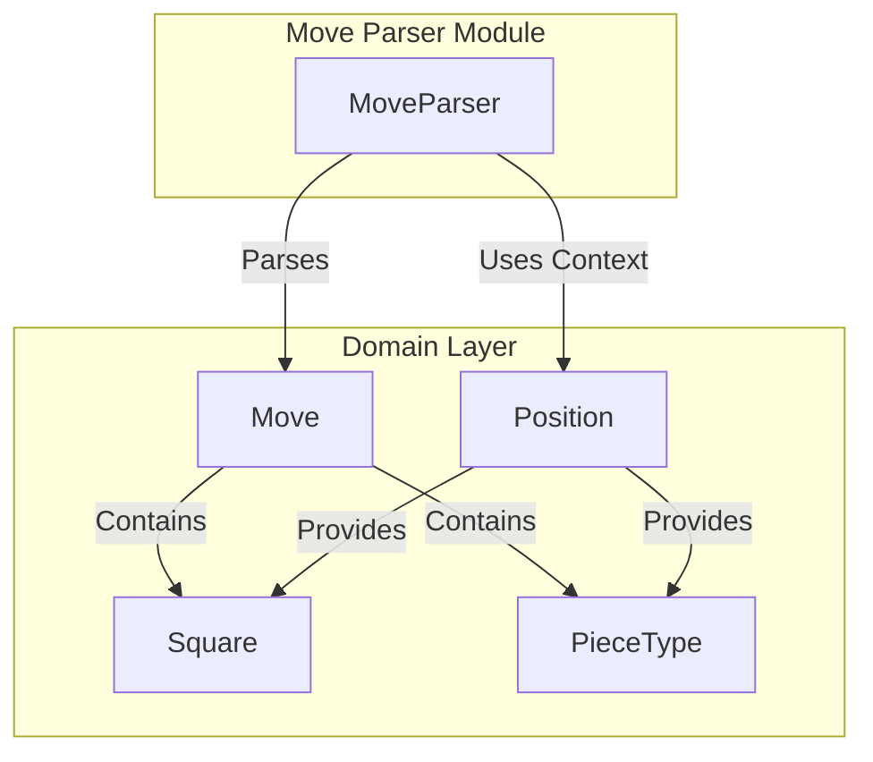

# Move Parser Module Documentation

## Overview

The Move Parser module is responsible for converting chess moves between internal representation and the XBoard protocol format. This module serves as a bridge between the game engine's internal move objects and the external communication protocol used by chess interfaces like XBoard.

## Purpose and Core Functionality

The primary purpose of the MoveParser class is to handle two-way conversion:
1. **Parsing**: Converting XBoard move strings (like "e2e4", "e7e8q") into internal Move objects
2. **Formatting**: Converting internal Move objects back into XBoard protocol strings

The parser handles standard chess notation including pawn promotions and captures, ensuring proper context is maintained during parsing.

## Module Architecture

### Core Component

- **MoveParser** (`src/main/java/org/dokchess/textui/xboard/MoveParser.java`)
  - Implements parsing from XBoard format to internal Move objects
  - Implements formatting from internal Move objects to XBoard format
  - Uses Position context to determine capture information and pawn promotions

### Dependencies

The MoveParser depends on:
- `org.dokchess.domain.Move` - Internal move representation
- `org.dokchess.domain.Position` - Game state for context
- `org.dokchess.domain.Square` - Chess board square representation
- `org.dokchess.domain.PieceType` - Piece type enumeration

## Data Flow



## Component Interactions



## Detailed Component Description

### MoveParser Class

The MoveParser class contains two main methods:

#### `fromXboard(String input, Position position)`
- **Purpose**: Parses XBoard formatted move strings into internal Move objects
- **Input**: 
  - `input`: String representation of move (e.g., "e2e4", "e7e8q")
  - `position`: Current game position for context
- **Processing**:
  - Validates move format using regex pattern matching
  - Extracts source and target squares
  - Determines if move is a capture
  - Handles pawn promotions (when pawn reaches promotion rank)
- **Output**: Move object or null if invalid

#### `toXboard(Move move)`
- **Purpose**: Converts internal Move objects into XBoard protocol strings
- **Input**: Move object
- **Processing**:
  - Formats move as "move e2e4" string
  - Appends promotion piece letter if applicable
- **Output**: Formatted XBoard protocol string

## Integration Points

This module integrates with:
- [XBoard](xboard.md) - Text-based user interface that uses this parser
- [Domain Layer](domain.md) - Uses core domain objects for move representation
- [Engine](engine.md) - Receives parsed moves for execution

## Usage Examples

### Parsing a Move
```java
MoveParser parser = new MoveParser();
Position position = ... // current game position
Move move = parser.fromXboard("e7e8q", position);
// Returns Move object representing pawn promotion
```

### Formatting a Move
```java
MoveParser parser = new MoveParser();
Move move = new Move(...); // some move object
String xboardFormat = parser.toXboard(move);
// Returns "move e2e4" or "move e7e8q"
```

## Validation Rules

The parser validates moves using these rules:
1. Format validation using regex: `[a-h][1-8][a-h][1-8][qrnb]?`
2. Square coordinate validation (files a-h, ranks 1-8)
3. Promotion piece validation (q, r, n, b)
4. Capture detection based on target square occupancy

## Error Handling

The parser returns `null` when:
- Input doesn't match expected format
- Invalid square coordinates
- Invalid promotion piece letters

## Related Modules

- [Text UI Module](textui.md) - Contains XBoard integration
- [Domain Module](domain.md) - Provides core data structures
- [Engine Module](engine.md) - Uses parsed moves for game logic