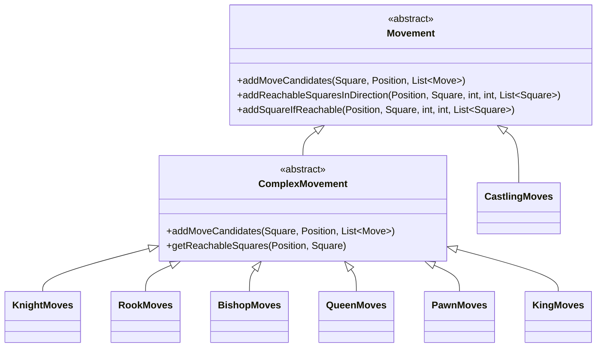
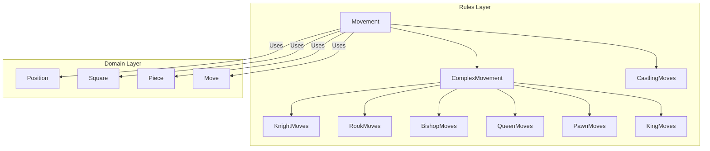
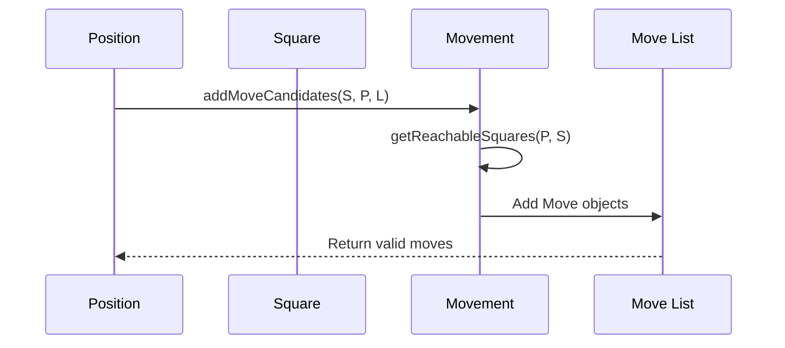

# Movement Base Module Documentation

## Overview

The movement_base module serves as the foundational layer for defining and implementing chess piece movements in the DokChess engine. It provides the abstract base classes and core utilities necessary for implementing various chess piece movement rules.

This module is part of the broader rules module hierarchy and forms the basis for specific piece movement implementations such as pawn moves, knight moves, etc. The module defines the fundamental interfaces and abstract classes that govern how chess pieces can move on the board.

## Module Structure

The movement_base module contains two primary classes:

1. **Movement** - The abstract base class that defines the core interface for piece movement logic
2. **ComplexMovement** - An abstract subclass of Movement that provides a default implementation for complex movement patterns

## Architecture and Relationships

### Class Hierarchy



### Component Interactions



## Core Components

### Movement (Abstract Base Class)

The `Movement` class is the foundation for all chess piece movement logic. It provides:

1. **Abstract method**: `addMoveCandidates()` - Defines the interface for computing valid move candidates from a given square
2. **Helper methods**: 
   - `addReachableSquaresInDirection()` - Handles sliding movements (like rooks, bishops, queens)
   - `addSquareIfReachable()` - Handles single-step movements (like kings, knights)
   - `isOnBoard()` - Utility for validating board coordinates

### ComplexMovement (Abstract Subclass)

The `ComplexMovement` class extends `Movement` and provides a default implementation for complex movement patterns:

1. **Overrides `addMoveCandidates()`** - Provides a standard pattern for generating moves from reachable squares
2. **Abstract `getReachableSquares()`** - Forces subclasses to implement their specific reachability logic

## Data Flow



## Integration with Other Modules

The movement_base module integrates closely with several other modules in the system:

- **Domain Layer**: Uses `Position`, `Square`, `Piece`, and `Move` objects from the domain package
- **Rules Layer**: Forms the base for all piece-specific movement implementations
- **Engine Layer**: These movement rules are used by the engine to validate and generate legal moves during game play

## Usage Patterns

### Implementing New Piece Movements

When implementing a new piece movement, developers should extend either `Movement` directly or `ComplexMovement`:

```java
public class MyPieceMoves extends ComplexMovement {
    @Override
    protected List<Square> getReachableSquares(Position position, Square from) {
        // Implementation specific to the piece
        List<Square> reachable = new ArrayList<>();
        // ... logic to determine reachable squares
        return reachable;
    }
}
```

### Movement Validation

The movement system ensures that:
1. Pieces can only move to valid squares on the board
2. Captures are only allowed against opponent pieces
3. Movement patterns follow chess rules for each piece type

## Dependencies

This module depends on:
- `org.dokchess.domain.Position` - For board state information
- `org.dokchess.domain.Square` - For square coordinates and identification
- `org.dokchess.domain.Piece` - For piece properties and colors
- `org.dokchess.domain.Move` - For representing moves

## Related Documentation

For more detailed information about related modules, see:
- [rules](rules.md) - The broader rules module documentation
- [domain](domain.md) - The domain model documentation
- [piece_moves](piece_moves.md) - Specific piece movement implementations
- [special_moves](special_moves.md) - Special movement types like castling

## Design Principles

1. **Separation of Concerns**: Movement logic is separated from game rules and engine logic
2. **Extensibility**: Easy to add new piece movement types through inheritance
3. **Reusability**: Common movement utilities are provided for different piece types
4. **Type Safety**: Strong typing with domain objects ensures correctness

## Future Considerations

- Potential for adding movement validation hooks
- Support for advanced movement features like en passant
- Integration with movement history tracking