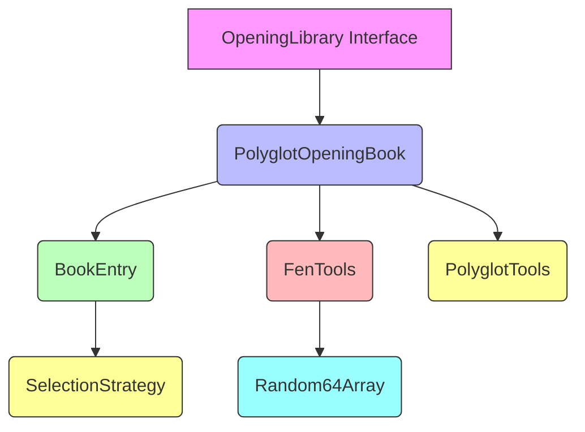
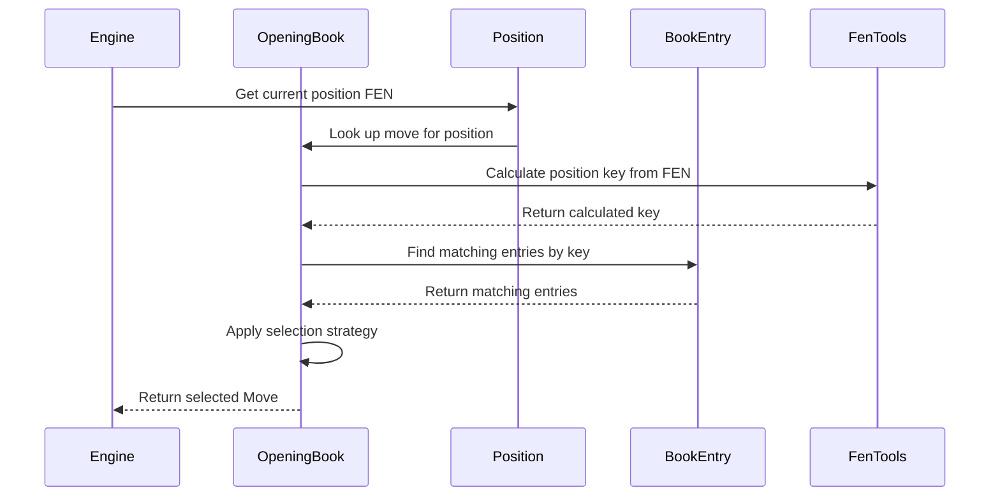

# Opening Module Documentation

## Overview

The opening module in DokChess provides functionality for managing and utilizing opening books in chess games. It enables the engine to make informed opening moves based on pre-computed opening strategies stored in polyglot-format opening books.

## Purpose

The primary purpose of this module is to:
- Load and parse polyglot (.bin) opening book files
- Provide lookup functionality for opening moves based on current game positions
- Support different selection strategies for choosing moves when multiple options exist
- Integrate with the broader chess engine to provide opening book support

## Architecture Overview

The opening module consists of several key components that work together to provide opening book functionality:



## Core Components

### 1. OpeningLibrary Interface

The `OpeningLibrary` interface defines the contract for opening book implementations:

- **Location**: `src/main/java/org/dokchess/opening/OpeningLibrary.java`
- **Purpose**: Defines the standard method for looking up opening moves
- **Method**: `Move lookUpMove(Position position)` - returns a suitable opening move for the given position, or null if none available
- **See Also**: [Opening Library Interface Documentation](opening_opening_library.md)

### 2. PolyglotOpeningBook Implementation

The main implementation that loads and uses polyglot opening books:

- **Location**: `src/main/java/org/dokchess/opening/polyglot/PolyglotOpeningBook.java`
- **Purpose**: Handles loading of .bin opening book files and provides move lookup functionality
- **Features**:
  - Supports different selection modes (FIRST, MOST_PLAYED, RANDOM)
  - Parses binary polyglot book format
  - Converts FEN notation to internal keys for position matching
  - Provides move creation from book entries
- **See Also**: [Polyglot Opening Book Documentation](polyglot_opening_book.md)

### 3. BookEntry Class

Represents individual entries in a polyglot opening book:

- **Location**: `src/main/java/org/dokchess/opening/polyglot/BookEntry.java`
- **Purpose**: Parses and represents a single entry from a polyglot book
- **Functionality**:
  - Extracts key, move, and weight information from raw book data
  - Provides methods to decode chess moves from binary format
  - Implements Comparable interface for sorting by weight
- **See Also**: [Book Entry Documentation](book_entry.md)

### 4. FenTools Utility Class

Provides utilities for converting FEN notation to hash keys:

- **Location**: `src/main/java/org/dokchess/opening/polyglot/FenTools.java`
- **Purpose**: Calculates hash keys for positions based on FEN notation
- **Key Features**:
  - Uses a large array of random numbers for hashing
  - Calculates piece positions, castling rights, en passant, and turn information
  - Generates unique keys for identical positions
- **See Also**: [FEN Tools Documentation](fen_tools.md)

### 5. PolyglotTools Utility Class

Helper methods for polyglot-specific operations:

- **Location**: `src/main/java/org/dokchess/opening/polyglot/PolyglotTools.java`
- **Purpose**: Provides utility methods for bit manipulation and conversion
- **Functions**:
  - Converts between byte arrays and integers/longs
  - Converts file/rank coordinates to algebraic notation
- **See Also**: [Polyglot Tools Documentation](polyglot_tools.md)

### 6. SelectionMode Enum

Defines strategies for selecting moves when multiple book entries match:

- **Location**: `src/main/java/org/dokchess/opening/polyglot/SelectionMode.java`
- **Values**:
  - `FIRST`: Select the first matching entry
  - `MOST_PLAYED`: Select the entry with highest weight (most common move)
  - `RANDOM`: Select randomly among matching entries
- **See Also**: [Selection Mode Documentation](polyglot_opening_book.md)

## Data Flow



## Integration with Other Modules

The opening module integrates with several other parts of the system:

1. **Domain Layer**: Uses `Position` and `Move` objects from the domain package
2. **Engine**: Provides opening moves to the engine during game play
3. **Rules**: Works with chess rules to validate moves found in the opening book

## Usage Example

```java
// Create an opening book from a file
OpeningLibrary openingBook = new PolyglotOpeningBook(new File("opening_book.bin"));

// Look up a move for the current position
Move openingMove = openingBook.lookUpMove(currentPosition);

// If a move is found, use it
if (openingMove != null) {
    // Execute the opening move
    engine.makeMove(openingMove);
}
```

## Design Considerations

1. **Performance**: Uses efficient key-based lookup rather than linear search through all entries
2. **Flexibility**: Supports different selection strategies for varied gameplay styles
3. **Standards Compliance**: Follows the polyglot opening book format specification
4. **Extensibility**: Interface-based design allows for alternative opening book implementations

## Dependencies

- Domain layer components (`Position`, `Move`)
- Java standard libraries for I/O operations
- No external dependencies beyond the core Java platform

## Future Enhancements

Potential improvements could include:
- Support for different opening book formats
- Caching mechanisms for frequently accessed positions
- Enhanced move selection algorithms
- Integration with online opening databases