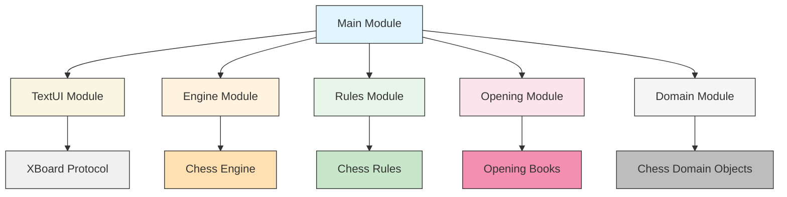

# DokChess-EN Repository Overview

## Purpose

The dokchess-en repository is a comprehensive Java implementation of a chess engine that provides complete chess game functionality including position representation, move generation, rule enforcement, and user interface capabilities. The engine supports standard chess rules, opening book integration, and can communicate via the XBoard protocol for use with graphical chess interfaces.

## End-to-End Architecture

The system follows a modular architecture with distinct layers that work together to provide complete chess functionality:

## Core Modules Documentation

### Domain Module
The foundation of the system, containing core chess data structures:
- **Position**: Represents complete chess positions with piece placement, castling rights, and FEN representation
- **Piece**: Defines chess pieces with type and color information
- **Square**: Represents board positions with coordinate system
- **Move**: Encapsulates chess moves with source/target squares and special move details
- **ForsythEdwardsNotation**: Handles FEN string conversions

### Engine Module
The decision-making core that determines optimal moves:
- **DefaultEngine**: Orchestrates move determination using opening books or search algorithms
- **Search Algorithms**: Implements minimax with parallel processing for efficient move evaluation
- **Evaluation Functions**: Provides scoring mechanisms for position assessment
- **Move Determination Chain**: Supports opening book lookups and search strategies

### Rules Module
Enforces standard chess rules and movement logic:
- **ChessRules Interface**: Defines rule contract for chess validation
- **DefaultChessRules**: Implements standard chess rules including check/checkmate detection
- **Piece Movement Handlers**: Specialized classes for each piece type's movement rules
- **Special Moves**: Castling, en passant, and pawn promotion handling

### Opening Module
Provides opening book functionality for improved early-game play:
- **OpeningLibrary Interface**: Standardizes opening book access
- **Polyglot Opening Book**: Loads and uses standard .bin opening book files
- **Book Entry Management**: Handles individual move entries and selection strategies
- **FEN Conversion Tools**: Converts positions to hash keys for fast lookup

### TextUI Module
Implements text-based user interface using XBoard protocol:
- **XBoard Class**: Handles XBoard protocol communication with GUIs
- **MoveParser**: Converts between string and internal move representations
- **Protocol Integration**: Enables external chess GUI connectivity

### Main Module
Coordinates all components and provides application entry point:
- **Application Startup**: Initializes all subsystems and handles command-line arguments
- **Component Wiring**: Connects all modules through dependency injection
- **Execution Loop**: Manages the main gameplay loop

### Integration Tests
Verifies system-wide functionality:
- **Engine vs Random Testing**: Validates engine performance against simplified opponents
- **XBoard Protocol Testing**: Ensures proper communication with external interfaces

## System Flow

1. **Initialization**: Main module sets up all components and starts the XBoard interface
2. **Game State Management**: Domain module maintains chess positions and pieces
3. **Move Generation**: Rules module generates legal moves for current position
4. **Move Selection**: Engine module determines best moves using search or opening books
5. **User Interaction**: TextUI module handles communication with external interfaces
6. **Validation**: Rules module ensures all moves follow chess regulations
7. **Persistence**: Domain module provides FEN string representations for save/load operations

## Key Features

- Full chess rule compliance with check/checkmate/stalemate detection
- Opening book support with polyglot format compatibility
- Parallel search algorithms for efficient move evaluation
- XBoard protocol support for GUI integration
- Modular design enabling easy extension and testing
- Comprehensive test coverage including integration tests