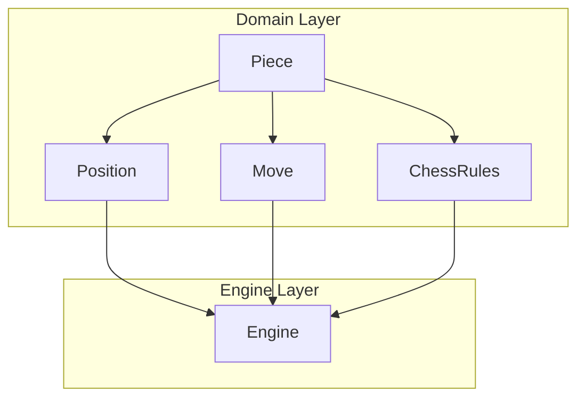

# Piece Module Documentation

## Overview

The **piece** module in DokChess represents the fundamental building blocks of chess gameplay. It contains the core domain objects that define chess pieces, squares on the board, and their relationships. This module provides the foundational data structures necessary for representing the state of a chess game and performing basic operations on chess pieces and board positions.

## Core Components

### Piece Class
The `Piece` class represents a single chess piece in the game. Each piece has two essential properties:
- **Colour**: Either WHITE or BLACK
- **Type**: The type of piece (PAWN, ROOK, KNIGHT, BISHOP, QUEEN, KING)

The class is immutable, ensuring thread safety and predictable behavior. Pieces are represented in Forsyth-Edwards Notation (FEN) format where uppercase letters represent white pieces and lowercase letters represent black pieces.

### Square Class
The `Square` class represents a single square on the chessboard. It stores:
- **File**: Column of the square (0-7, corresponding to files a-h)
- **Rank**: Row of the square (0-7, corresponding to ranks 1-8)

Squares can be created either by coordinates (rank, file) or by algebraic notation (e.g., "e4"). The class provides methods for converting between these representations and implements proper equality and hashcode methods for use in collections.

### Squares Class
The `Squares` class is a utility class containing static constants for all 64 squares on a chessboard. These predefined squares are primarily used in unit tests to simplify test case creation and ensure consistency across different test scenarios.

## Module Relationships

This module is closely related to other core modules in the DokChess system:

- **[position](position.md)**: The Position class uses Piece and Square objects to represent the complete state of a chess game
- **[move](move.md)**: Move operations involve Piece and Square objects to describe piece movements
- **[rules](rules.md)**: Chess rules implementation depends on Piece types and Square positions to validate moves
- **[engine](engine.md)**: The chess engine uses Piece and Square objects to evaluate positions and determine moves
- **[domain](domain.md)**: This module is part of the core domain layer that defines fundamental chess concepts

## Architecture Diagram



## Data Flow

1. **Game State Representation**: The `Position` class aggregates multiple `Piece` objects positioned on `Square` objects to represent the complete game state
2. **Move Operations**: When a move is made, `Move` objects reference the affected `Piece` and `Square` objects to track changes
3. **Rule Validation**: `ChessRules` classes use `Piece` types and `Square` positions to validate legal moves
4. **Engine Processing**: The `Engine` evaluates positions by examining `Piece` arrangements on `Square` grids

## Usage Examples

### Creating a Piece
```java
Piece whitePawn = new Piece(PieceType.PAWN, Colour.WHITE);
Piece blackQueen = new Piece(PieceType.QUEEN, Colour.BLACK);
```

### Creating a Square
```java
Square squareE4 = new Square("e4");  // Algebraic notation
Square squareA1 = new Square(0, 0);  // Coordinate notation
```

### Using Predefined Squares
```java
// In tests or initialization
Square startingSquare = Squares.e2;
Square targetSquare = Squares.e4;
```

## Implementation Details

### Immutability
All classes in this module are designed to be immutable:
- `Piece` fields are final and cannot be modified after construction
- `Square` fields are final and cannot be modified after construction
- This design ensures thread safety and prevents accidental modification of game state

### FEN Representation
The `asLetter()` method in `Piece` class provides FEN-compatible string representation:
- White pieces: K, Q, R, B, N, P (uppercase)
- Black pieces: k, q, r, b, n, p (lowercase)

### Coordinate System
The coordinate system uses:
- Files (columns): 0-7 (a-h)
- Ranks (rows): 0-7 (8-1, with 0 being rank 8)

This follows standard chess notation conventions where the bottom-left corner (a1) is considered position (0,0).

### Hash Code and Equality
Both `Piece` and `Square` classes implement proper `hashCode()` and `equals()` methods:
- `Piece` uses a combination of color and type ordinals for hashing
- `Square` uses rank * 8 + file for efficient hashing
- Both classes ensure proper object comparison for use in collections

## Integration Points

This module integrates with:
- **[domain](domain.md)**: Provides core chess domain objects
- **[rules](rules.md)**: Uses piece types and positions for move validation
- **[engine](engine.md)**: Utilizes pieces and squares for position evaluation
- **[position](position.md)**: Core component for game state management
- **[move](move.md)**: Essential for describing piece movements

## Testing Considerations

The `Squares` utility class makes testing easier by providing consistent square references. Unit tests can rely on these predefined constants rather than creating new square instances repeatedly.

## Future Considerations

While the current implementation focuses on basic piece and square functionality, future enhancements might include:
- Enhanced piece movement patterns
- Additional piece attributes (e.g., moved status for castling)
- More sophisticated square analysis capabilities
- Support for chess variants with different piece sets