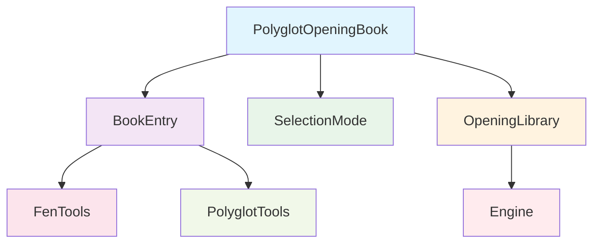
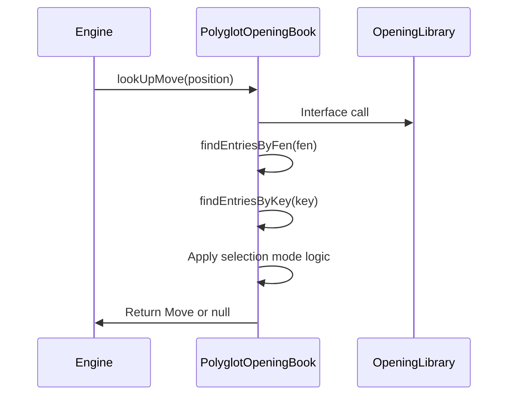
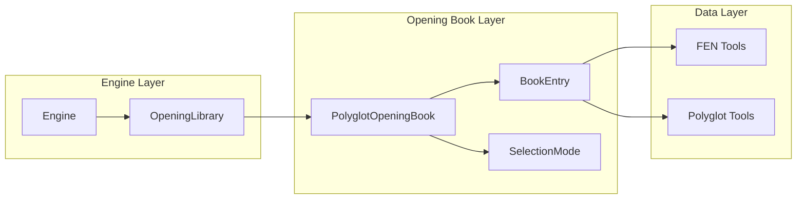

# Polyglot Opening Book Module Documentation

## Overview

The `polyglot_opening_book` module provides implementation for reading and utilizing Polyglot (.bin) opening books in the DokChess chess engine. This module enables the engine to make informed opening moves based on pre-computed opening theory stored in standardized Polyglot format files.

## Purpose and Core Functionality

The primary purpose of this module is to:
- Load Polyglot opening book files (.bin format)
- Provide efficient lookup of opening moves based on current board positions
- Support different selection strategies when multiple moves are available for a position
- Integrate seamlessly with the broader chess engine architecture

The module consists of two main components:
1. **PolyglotOpeningBook** - The main class that loads and manages the opening book data
2. **SelectionMode** - An enumeration defining different strategies for selecting moves when multiple options exist

## Module Architecture

### Component Relationships

### Data Flow

## Key Components

### PolyglotOpeningBook Class

The `PolyglotOpeningBook` class is the central component that handles:
- Loading Polyglot book files from disk or input streams
- Storing book entries in memory for fast lookup
- Implementing the `OpeningLibrary` interface
- Providing move selection based on configured `SelectionMode`

#### Key Methods:
- `lookUpMove(Position position)` - Main method for finding opening moves
- `setSelectionMode(SelectionMode selectionMode)` - Configures move selection strategy
- `readData(File file)` / `readData(InputStream inputStream)` - Loads book data
- `findEntriesByFen(String fen)` - Finds matching entries by FEN notation
- `findEntriesByKey(long key)` / `findEntriesByKey(byte[] key)` - Finds entries by position key

### SelectionMode Enum

The `SelectionMode` enum defines three strategies for handling multiple matching entries:
1. **FIRST** - Returns the first matching entry in the book
2. **MOST_PLAYED** - Sorts entries by weight and returns the highest-weighted one
3. **RANDOM** - Shuffles entries and returns the first one

## Integration with System Architecture

This module integrates with the broader chess system through the `OpeningLibrary` interface, which allows the engine to abstract away the specific implementation details of opening book storage and retrieval.

## Usage Pattern

The typical usage pattern involves:
1. Creating a `PolyglotOpeningBook` instance with a .bin file
2. Optionally setting the desired `SelectionMode`
3. Calling `lookUpMove()` during game play when an opening move is needed
4. Returning `null` when no opening move is found for the current position

## Dependencies

This module depends on:
- [domain](domain.md) - For `Position`, `Move`, `Piece`, and `Square` classes
- [opening](opening.md) - For the `OpeningLibrary` interface
- [fen_tools](fen_tools.md) - For FEN-to-key conversion utilities
- [polyglot_tools](polyglot_tools.md) - For binary data manipulation

## Implementation Details

### File Format Handling
The module reads Polyglot files in their native binary format, where each entry is 16 bytes containing:
- Position key (8 bytes)
- Move information (2 bytes)
- Weight (2 bytes)
- Learn value (4 bytes)

### Performance Considerations
- All book entries are loaded into memory for fast lookup
- Entry searching uses byte-by-byte comparison for efficiency
- Sorting and shuffling operations are performed only when necessary

### Thread Safety
The current implementation is not thread-safe. Concurrent access to the same `PolyglotOpeningBook` instance should be synchronized by the caller.

## Related Modules

- [Opening Library](opening.md) - Defines the interface for opening book implementations
- [FEN Tools](fen_tools.md) - Provides utilities for FEN notation processing
- [Polyglot Tools](polyglot_tools.md) - Handles binary data conversions for Polyglot format
- [Engine](engine.md) - Uses this module for opening move decisions