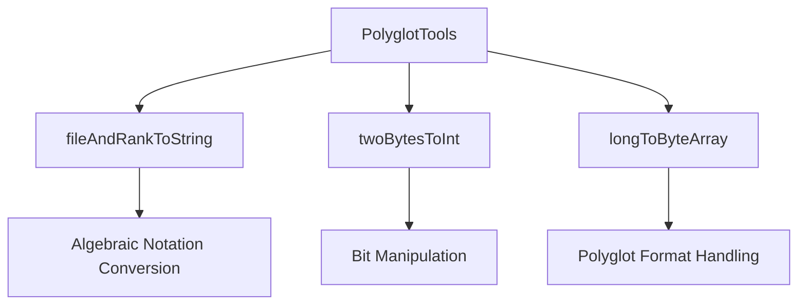
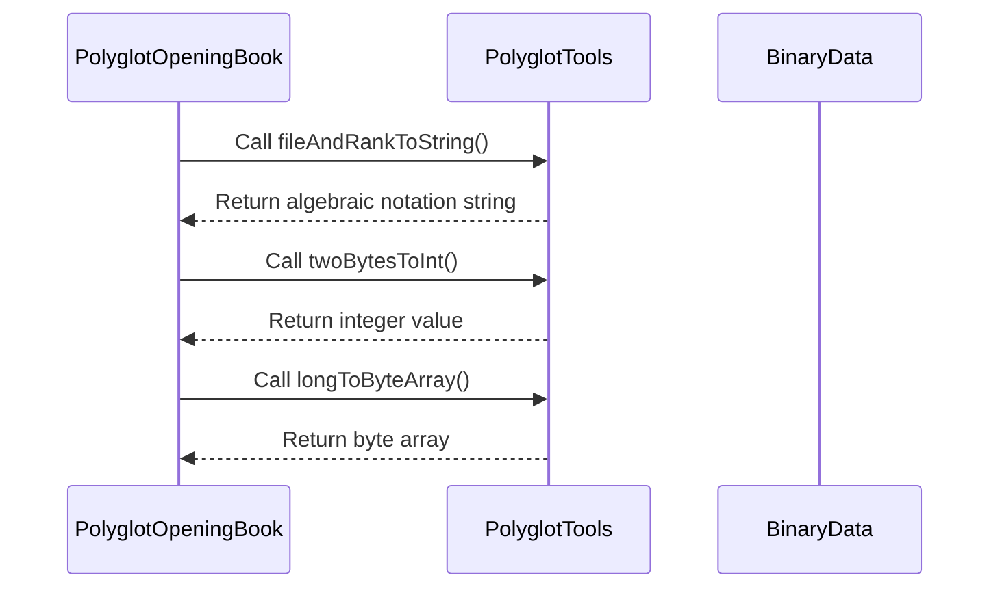

# Polyglot Tools Module Documentation

## Overview

The `polyglot_tools` module provides utility functions for handling Polyglot opening book formats in the DokChess chess engine. This module contains helper methods for converting chess notation representations and performing bit-level operations necessary for working with Polyglot-style opening books.

## Purpose and Functionality

The primary purpose of this module is to provide low-level utilities for:
- Converting chess board coordinates (file/rank) to algebraic notation strings
- Converting two-byte values to integers
- Converting long values to byte arrays for Polyglot format compatibility

These utilities are essential for reading and writing Polyglot opening books, which are commonly used in chess engines for opening move selection.

## Module Structure

The module contains a single utility class `PolyglotTools` with the following key methods:

### Key Components

1. **`fileAndRankToString(int file, int rank)`** - Converts file and rank numbers to algebraic notation (e.g., "e5")
2. **`twoBytesToInt(byte[] source)`** - Converts two bytes to an integer using bit manipulation
3. **`longToByteArray(long source)`** - Converts a long value to an 8-byte array for Polyglot format

## Architecture and Dependencies

This module is part of the opening subsystem in DokChess and specifically works with the Polyglot opening book format. It depends on basic Java language features and has no external dependencies beyond standard Java libraries.

### Component Relationships



## Integration with Other Modules

This module is primarily used by the [polyglot_opening_book](polyglot_opening_book.md) module, which handles the actual reading and writing of Polyglot opening books. The tools provided here are essential for parsing the binary format of these books.

### Data Flow



## Usage Examples

### Converting Coordinates to Algebraic Notation
```java
// Convert file 4, rank 5 to "e5"
String position = PolyglotTools.fileAndRankToString(4, 5);
// Result: "e5"
```

### Converting Two Bytes to Integer
```java
byte[] bytes = {0x12, 0x34};
int value = PolyglotTools.twoBytesToInt(bytes);
// Result: 0x3412 (or 13330 in decimal)
```

### Converting Long to Byte Array
```java
long value = 0x123456789ABCDEF0L;
byte[] bytes = PolyglotTools.longToByteArray(value);
// Returns 8-byte array representing the long value
```

## Implementation Details

The implementation uses:
- Static constants for file and rank character mappings
- Bit manipulation techniques for efficient conversion
- Binary string operations for long-to-byte conversion
- Immutable string building for performance

## Related Modules

- [polyglot_opening_book](polyglot_opening_book.md) - Uses these tools for opening book operations
- [book_entry](book_entry.md) - Represents individual entries in Polyglot books
- [fen_tools](fen_tools.md) - Handles FEN string operations

## Design Considerations

1. **Immutability**: All methods are static and the class is final, making it a pure utility class
2. **Performance**: Uses efficient bit manipulation and string building techniques
3. **Compatibility**: Designed specifically for Polyglot format requirements
4. **Safety**: Private constructor prevents instantiation

## Future Enhancements

Potential improvements could include:
- Additional format conversion utilities
- Better error handling for invalid inputs
- More comprehensive testing for edge cases
- Performance optimizations for frequently called methods