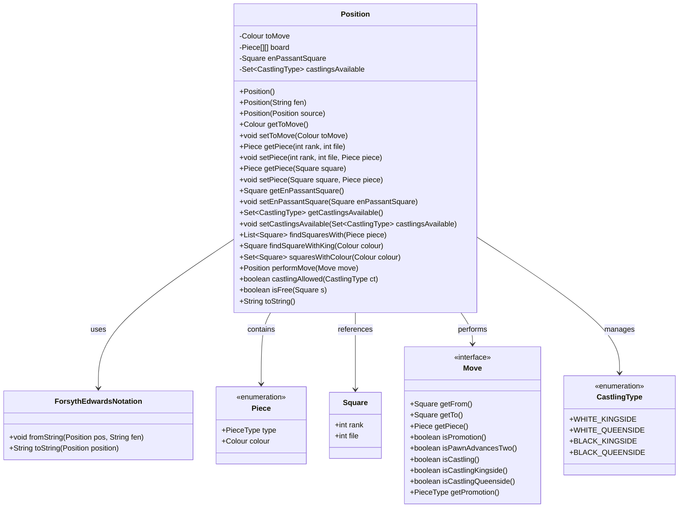
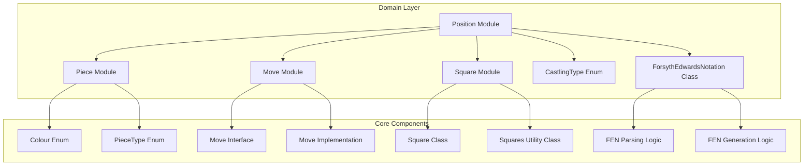
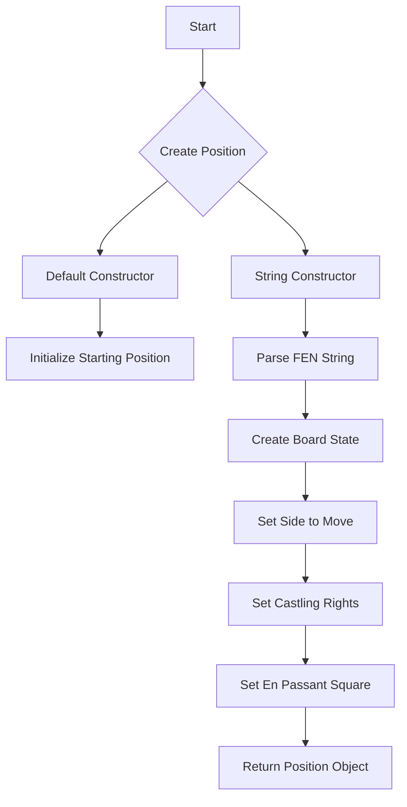
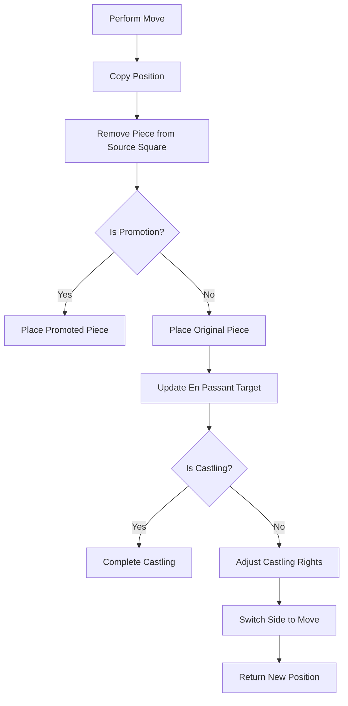

# Position Module Documentation

## Overview

The Position module represents the core chess position concept in the DokChess engine. It encapsulates the complete state of a chess game at any given moment, including piece placement, side to move, castling rights, and en passant targets. This module serves as the foundation for all chess logic and game state management.

## Purpose and Core Functionality

The Position class is the central data structure that represents a chess position. It maintains:
- Piece placement on the 8×8 board
- Which side is to move next
- Available castling rights for both players
- En passant target square (if applicable)
- Methods for creating positions from FEN notation and performing moves

## Architecture and Component Relationships

### Core Classes



### Module Dependencies



## Data Flow and Process Flows

### Position Creation Process



### Move Execution Process



## Key Features and Methods

### Position Construction

The Position class supports multiple construction methods:
- **Default constructor**: Creates the standard starting position
- **String constructor**: Parses a FEN string to create a specific position
- **Copy constructor**: Creates a deep copy of another position

### Board Management

The board is represented as a 2D array of Pieces:
- 8×8 grid (ranks 0-7, files 0-7)
- Each square can contain a Piece or be null
- Provides methods to get/set pieces by coordinates or Square objects

### Game State Management

Key game state elements:
- **Side to move**: Tracks which player's turn it is
- **Castling rights**: Maintains available castling options for both sides
- **En passant target**: Tracks possible en passant captures
- **Piece location**: All pieces are tracked by their square positions

### Move Handling

The `performMove()` method:
1. Creates a copy of the current position
2. Applies the move to the copied position
3. Handles special cases like promotions, en passant, and castling
4. Updates game state appropriately
5. Returns the new position

### FEN Integration

The ForsythEdwardsNotation class provides:
- **Parsing**: Converts FEN strings into Position objects
- **Generation**: Converts Position objects back to FEN strings
- **Format Support**: Handles all standard FEN fields (piece placement, side to move, castling, en passant)

## Integration with Other Modules

The Position module integrates closely with several other modules:

1. **Piece Module** ([piece.md](piece.md)): Uses Piece objects to represent chess pieces
2. **Move Module** ([move.md](move.md)): Interacts with Move objects to execute game actions
3. **Square Module** ([square.md](square.md)): Works with Square objects for board coordinates
4. **Engine Module** ([engine.md](engine.md)): Core position objects are used throughout the engine for game state tracking

## Usage Examples

### Creating Positions

```java
// Create starting position
Position startPos = new Position();

// Create position from FEN
Position customPos = new Position("rnbqkbnr/pppppppp/8/8/8/8/PPPPPPPP/RNBQKBNR w KQkq - 0 1");

// Copy existing position
Position copyPos = new Position(originalPos);
```

### Performing Moves

```java
// Execute a move
Position newPosition = currentPosition.performMove(move);
```

### Querying Position Information

```java
// Check whose turn it is
Colour side = position.getToMove();

// Find king's square
Square kingSquare = position.findSquareWithKing(Colour.WHITE);

// Check if square is empty
boolean isEmpty = position.isFree(square);

// Get piece at position
Piece piece = position.getPiece(square);
```

## Design Considerations

### Immutability Pattern

The Position class follows an immutable pattern for external usage:
- Public constructors create copies of existing positions
- Internal copy constructor allows efficient position manipulation
- All modification methods return new Position instances rather than modifying existing ones

### Memory Efficiency

- Uses efficient array-based board representation
- Implements smart copying strategies to minimize memory allocation
- Reuses board arrays where possible during move execution

### Extensibility

The design allows for easy extension:
- FEN parsing can be extended for custom formats
- Additional game rules can be incorporated through the Position interface
- Move validation can be enhanced while maintaining position integrity

## Related Documentation

For a complete understanding of the chess domain model, please also refer to:
- [Piece Module Documentation](piece.md)
- [Move Module Documentation](move.md)
- [Square Module Documentation](square.md)
- [Engine Module Documentation](engine.md)