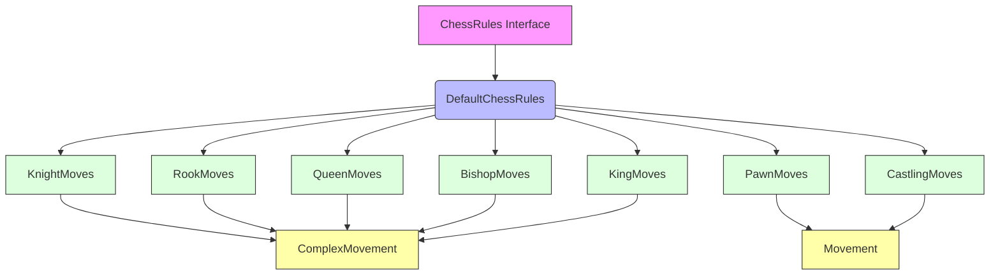

# Rules Module Documentation

## Overview

The rules module implements the standard chess rules and movement logic for the DokChess engine. It defines how each chess piece moves, handles special moves like castling and en passant, and determines legal moves, check, checkmate, and stalemate conditions.

## Architecture

The rules module follows a clear architectural pattern where different piece movements are handled by specialized classes that inherit from a common base class. The module also includes utility tools for checking square attacks and determining game states.

## Core Components

### Main Interface: ChessRules
- **Location**: `src/main/java/org/dokchess/rules/ChessRules.java`
- **Purpose**: Defines the contract for chess rule implementations
- **Responsibilities**:
  - Get starting position
  - Get legal moves for a position
  - Check for check, checkmate, and stalemate conditions
- **Documentation**: [Core Rules Documentation](core_rules.md)

### Main Implementation: DefaultChessRules
- **Location**: `src/main/java/org/dokchess/rules/DefaultChessRules.java`
- **Purpose**: Standard implementation of chess rules
- **Responsibilities**:
  - Coordinates movement calculations for all piece types
  - Handles move validation by checking for illegal moves that would put own king in check
  - Implements check, checkmate, and stalemate detection
- **Documentation**: [Core Rules Documentation](core_rules.md)

### Movement Base Classes
- **Movement**: `src/main/java/org/dokchess/rules/Movement.java`
- **ComplexMovement**: `src/main/java/org/dokchess/rules/ComplexMovement.java`
- **Documentation**: [Movement Base Classes Documentation](movement_base.md)

### Individual Piece Movement Handlers
- **KnightMoves**: `src/main/java/org/dokchess/rules/KnightMoves.java`
- **RookMoves**: `src/main/java/org/dokchess/rules/RookMoves.java`
- **BishopMoves**: `src/main/java/org/dokchess/rules/BishopMoves.java`
- **QueenMoves**: `src/main/java/org/dokchess/rules/QueenMoves.java`
- **PawnMoves**: `src/main/java/org/dokchess/rules/PawnMoves.java`
- **KingMoves**: `src/main/java/org/dokchess/rules/KingMoves.java`
- **Documentation**: [Piece Movement Handlers Documentation](piece_moves.md)

### Special Movement Handling
- **CastlingMoves**: `src/main/java/org/dokchess/rules/CastlingMoves.java`
- **Documentation**: [Special Moves Documentation](special_moves.md)

### Utility Tools
- **Tools**: `src/main/java/org/dokchess/rules/Tools.java`
- **Documentation**: [Tools Documentation](tools.md)

## Module Relationships

The rules module works closely with other modules in the system:

1. **Domain Module**: Depends on `Position`, `Square`, `Piece`, and related domain objects
2. **Engine Module**: Uses the rules to validate moves during search algorithms
3. **Opening Module**: May reference rules for position validation

## Data Flow

1. Game state is represented by a `Position` object
2. When legal moves are requested, `DefaultChessRules` iterates through all pieces of the current player
3. Each piece type uses its specific movement handler to generate possible moves
4. All generated moves are validated against the rules to prevent illegal moves (like moving into check)
5. Final move set is returned to the caller

## Key Features

- Complete implementation of standard chess rules
- Support for all piece movements including special cases
- Proper handling of check, checkmate, and stalemate conditions
- En passant capture support
- Pawn promotion support
- Castling validation with safety checks
- Attack detection for king safety calculations

## Dependencies

The rules module depends on:
- Domain module for position representation and piece definitions
- Engine module for integration with search algorithms
- Opening module for opening book usage

## Integration Points

The rules module integrates with:
- Engine module for move validation during game tree searches
- Text UI for displaying legal moves
- Main application for game state management