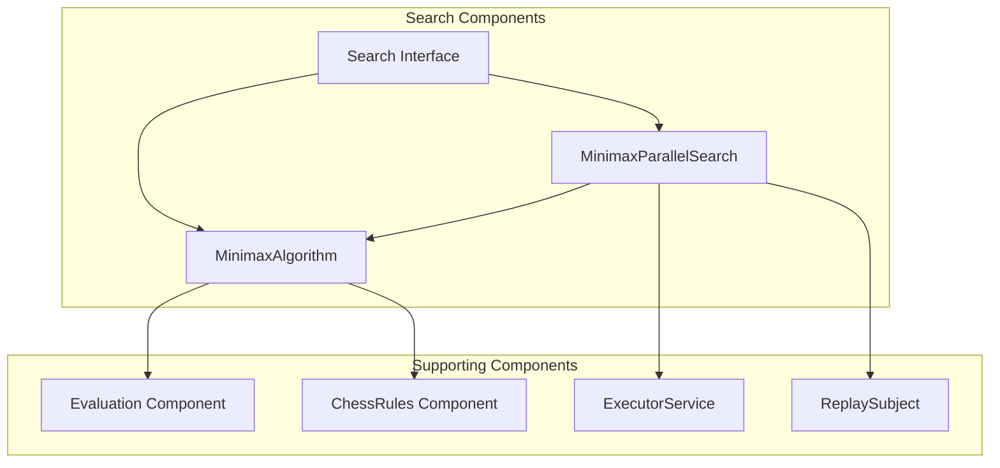
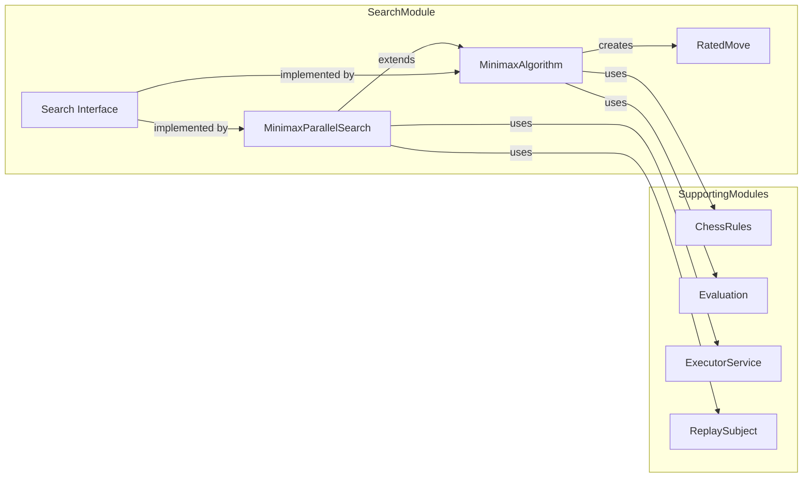
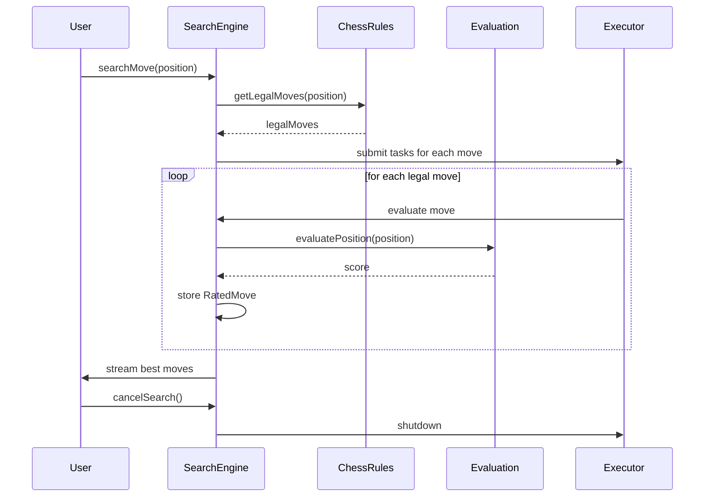
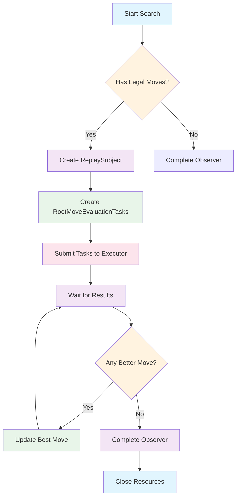

# Search Module Documentation

## Overview

The search module is responsible for implementing chess move search algorithms, specifically the minimax algorithm with alpha-beta pruning optimizations. It provides the core engine functionality for determining the best moves in a given chess position. The module handles both synchronous and asynchronous search operations, supporting parallel execution for improved performance.

## Module Structure

The search module contains several key components that work together to implement the chess search functionality:

- **Search Interface**: Defines the contract for search operations
- **MinimaxAlgorithm**: Implements the core minimax algorithm with depth limitation
- **MinimaxParallelSearch**: Extends minimax to support parallel processing of root moves
- **RatedMove**: Represents a move with its evaluation score

## Architecture



## Component Interactions



## Core Components

### Search Interface

The `Search` interface defines the contract for all search implementations:

```java
public interface Search {
    void searchMove(Position position, Observer<Move> observer);
    void cancelSearch();
    void close();
}
```

This interface supports asynchronous search operations through RxJava's Observer pattern, allowing for streaming of progressively better moves during search.

### MinimaxAlgorithm

The `MinimaxAlgorithm` class implements the core minimax search algorithm:

- **Depth-limited search**: Uses configurable maximum depth for search
- **Evaluation integration**: Works with pluggable evaluation functions
- **Special case handling**: Properly handles checkmate and stalemate conditions
- **Recursive implementation**: Uses recursive minimax with alternating min/max layers

Key features:
- Implements proper checkmate scoring with depth consideration
- Handles stalemate as balanced positions
- Supports configurable search depth
- Integrates with chess rules for legal move generation

### MinimaxParallelSearch

The `MinimaxParallelSearch` extends `MinimaxAlgorithm` to provide parallel execution capabilities:

- **Parallel root move evaluation**: Each legal move is evaluated in separate threads
- **Thread pool management**: Uses fixed thread pool based on available processors
- **Real-time result streaming**: Provides intermediate results as `RatedMove` objects
- **Best move optimization**: Tracks and reports the strongest move as results come in

The implementation includes specialized inner classes:
- `RootMoveEvaluationTask`: Worker threads that evaluate individual moves
- `BestMoveReporter`: Tracks and reports the best move as results come in

### MinimaxParallelSearch

The `MinimaxParallelSearch` extends `MinimaxAlgorithm` to provide parallel execution:

```java
public class MinimaxParallelSearch extends MinimaxAlgorithm implements Search
```

Key aspects:
- **Parallel execution**: Each legal root move is evaluated in separate threads
- **Thread pooling**: Uses fixed thread pool based on available processors
- **Real-time updates**: Streams intermediate results as `RatedMove` objects
- **Best move tracking**: Maintains and reports the strongest move seen so far

The implementation uses:
- `RootMoveEvaluationTask`: Worker threads that evaluate individual moves
- `BestMoveReporter`: Tracks and reports the best move as results come in
- `ReplaySubject`: For streaming search results to observers

### RatedMove

The `RatedMove` class represents a move with its evaluation score:

```java
public class RatedMove implements Comparable<RatedMove> {
    private Move move;
    private int rating;
    
    public RatedMove(Move move, int rating) { ... }
    public Move getMove() { ... }
    public int getRating() { ... }
}
```

This class enables sorting and comparison of moves based on their evaluation scores, making it easy to identify the best move among several candidates.

## Data Flow



## Process Flow



## Integration with Other Modules

The search module integrates with several other components in the system:

1. **Domain Layer** (`domain/`): Uses `Position`, `Move`, and `Colour` classes for representing chess states
2. **Rules Layer** (`rules/`): Depends on `ChessRules` for legal move generation and game state detection
3. **Evaluation Layer** (`engine/eval/`): Integrates with `Evaluation` implementations for position scoring
4. **Engine Layer** (`engine/`): Forms the core of the engine's decision-making process

The module follows a layered architecture approach where:
- The `Search` interface provides a clean abstraction
- `MinimaxAlgorithm` implements the core logic
- `MinimaxParallelSearch` adds performance enhancements
- All components work with the domain objects and integrate with the rules and evaluation systems

## Usage Pattern

The typical usage pattern involves:

1. Creating a search instance (usually `MinimaxParallelSearch`)
2. Configuring it with appropriate `ChessRules` and `Evaluation` implementations
3. Setting the desired search depth
4. Calling `searchMove()` with a starting position
5. Observing the results through the provided `Observer<Move>`

## Performance Considerations

- **Parallel Processing**: Utilizes multiple CPU cores for root move evaluation
- **Memory Management**: Uses thread pools to manage concurrent tasks efficiently
- **Early Termination**: Cancels ongoing searches when requested
- **Resource Cleanup**: Properly shuts down executors and completes observers

## Dependencies

The search module depends on:
- Domain classes (`Position`, `Move`, `Colour`)
- Rules module (`ChessRules`)
- Evaluation module (`Evaluation`)
- RxJava for reactive programming patterns
- Java concurrency utilities for thread management

## Related Documentation

For more information on related components, see:
- [Engine Module](engine.md)
- [Rules Module](rules.md)
- [Evaluation Module](engine/eval.md)
- [Domain Module](domain.md)