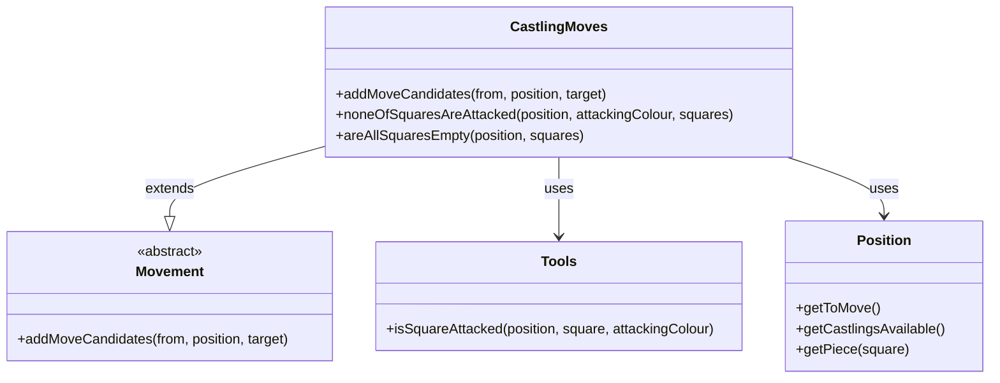

# Special Moves Module Documentation

## Overview

The special_moves module handles chess special moves, specifically castling. This module is part of the broader rules system in the DokChess engine and provides the logic for generating valid castling moves based on game state conditions.

## Purpose and Functionality

The primary purpose of this module is to implement the castling move generation according to standard chess rules. Castling is a special move involving the king and a rook, where the king moves two squares toward a rook, and the rook moves to the square the king crossed.

### Key Features:
- Generates valid kingside and queenside castling moves
- Checks preconditions: king and rook haven't moved, path is clear, squares aren't attacked
- Handles both white and black castling variants
- Integrates with the broader movement system

## Module Structure

The special_moves module contains only one core component:

- **CastlingMoves**: Implements the logic for generating castling moves

## Component Details

### CastlingMoves Class

The `CastlingMoves` class extends the `Movement` base class and implements the specific rules for castling moves.

#### Key Methods:
1. `addMoveCandidates()` - Main method that generates valid castling moves
2. `noneOfSquaresAreAttacked()` - Helper method to check if squares are under attack
3. `areAllSquaresEmpty()` - Helper method to verify path clearance

#### Implementation Details:
- Castling is only allowed when:
  - The king hasn't moved
  - The rook involved hasn't moved
  - All squares between king and rook are empty
  - None of the squares the king moves through are under attack
- Supports both kingside and queenside castling for both colors

## Integration with System Architecture

This module integrates with several other components in the system:

### Dependencies:
- **Domain Layer**: Uses `Position`, `Square`, `Piece`, `Colour`, `CastlingType`
- **Movement Base**: Inherits from `Movement` class
- **Tools Module**: Uses `Tools.isSquareAttacked()` for attack checking
- **Rules Core**: Part of the broader chess rules implementation

### Data Flow:
```
[Position] → [CastlingMoves.addMoveCandidates()] → [List<Move>] 
     ↑                              ↓
[ChessRules] ← [Movement] ← [Engine] ← [Game Logic]
```

## Component Relationships



## Usage Context

This module is called during move generation in the chess rules system. It's typically invoked by:

1. **ChessRules** - When generating legal moves for a position
2. **Engine** - During search algorithms when considering possible moves
3. **Game Logic** - When validating player moves

## Related Modules

- [Rules Core](rules_core.md) - Contains the main chess rules interface
- [Movement Base](movement_base.md) - Provides base movement functionality
- [Tools](tools.md) - Contains utility methods for chess calculations
- [Domain](domain.md) - Contains core chess domain objects

## Implementation Notes

1. **Performance**: The castling validation checks are optimized to short-circuit when conditions fail
2. **Safety**: All squares the king moves through are checked for attacks
3. **Completeness**: Handles all four castling variants (white kingside, queenside, black kingside, queenside)
4. **Integration**: Seamlessly integrates with existing move generation infrastructure

## Future Considerations

- Extension to handle other special moves (en passant, pawn promotion)
- Potential optimization for repeated position checks
- Integration with move validation systems