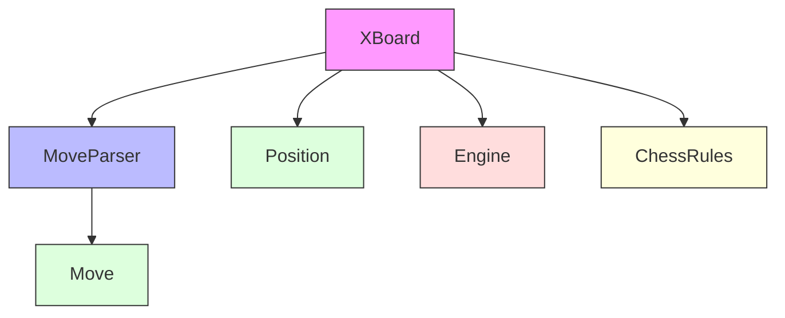
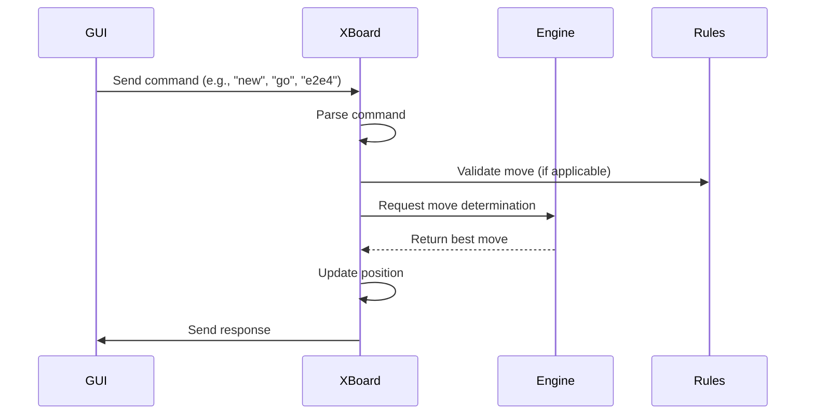

# TextUI Module Documentation

## Overview

The `textui` module provides a text-based user interface for the DokChess chess engine, specifically implementing the XBoard protocol for communication with graphical user interfaces. This module serves as the bridge between the chess engine and external applications that support the XBoard protocol, such as chess GUIs.

## Architecture Overview

The textui module consists of two primary components that work together to implement the XBoard protocol:

## Core Components

### XBoard Class
The `XBoard` class is the main entry point for the text UI. It implements the XBoard protocol by reading commands from a reader, processing them, and writing responses to a writer. Key responsibilities include:

- Handling XBoard protocol commands like `xboard`, `protover 2`, `new`, and `go`
- Managing the game state through `Position` objects
- Integrating with the chess engine to determine and perform moves
- Validating moves against chess rules when configured
- Implementing the RxJava Observer pattern to handle asynchronous move determination

For detailed documentation of the XBoard class, see [xboard.md](xboard.md).

### MoveParser Class
The `MoveParser` class handles the conversion between string representations of moves (as used in the XBoard protocol) and internal `Move` objects. Its responsibilities include:

- Parsing move strings like "e2e4" or "e7e8q" into `Move` objects
- Adding contextual information like captures and promotions
- Formatting `Move` objects back into XBoard protocol strings

For detailed documentation of the MoveParser class, see [move_parser.md](move_parser.md).

## Integration with Other Modules

The textui module integrates with several other core modules:

- **Domain Layer**: Uses `Position` and `Move` objects from the domain layer
- **Engine**: Communicates with the chess engine to determine moves and perform actions
- **Rules**: Validates moves against chess rules when needed
- **Opening Library**: May interact with opening books for move selection

## Data Flow

## Usage

The XBoard protocol is typically used by launching the application with the text UI enabled, then connecting it to a chess GUI that supports the XBoard protocol. The application reads commands from standard input and writes responses to standard output.

## Module Dependencies

This module depends on:
- Domain layer components for chess representation
- Engine layer for move calculation
- Rules layer for move validation
- RxJava for reactive programming patterns