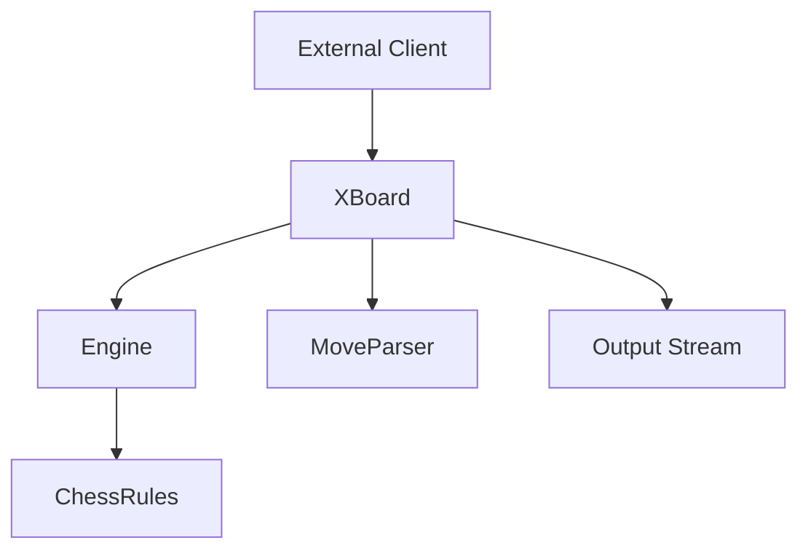

# Text UI XBoard Module Documentation

## Overview

The `textui/xboard` module implements the XBoard protocol for text-based user interface in the DokChess chess engine. This module enables communication between the chess engine and XBoard-compatible graphical interfaces or command-line clients.

## Purpose and Functionality

The primary purpose of this module is to provide an implementation of the XBoard protocol, which is a standard protocol for communicating with chess engines. The module handles:

- XBoard protocol command parsing and execution
- Communication with external chess interfaces
- Move generation and response formatting
- Protocol version negotiation
- Game state management through the XBoard interface

## Module Structure

The module contains two main classes:

- `XBoard.java` - Main implementation of the XBoard protocol
- `MoveParser.java` - Parses move notation from XBoard commands

## Core Components

### XBoard Class

The `XBoard` class is the main entry point for XBoard protocol handling. It manages:
- Input/output streams for communication
- Engine integration for move calculation
- Chess rules enforcement
- Protocol state management

### MoveParser Class

The `MoveParser` class handles parsing of chess moves from XBoard protocol format into internal representations.

## Component Relationships

### Dependencies

This module depends on:
1. **[engine](engine.md)** - For move calculation and engine integration
2. **[rules](rules.md)** - For chess rule enforcement

### Data Flow

## Key Features

- Implements XBoard protocol version 2
- Supports standard XBoard commands
- Handles move notation conversion
- Manages game state through protocol communication
- Provides proper response formatting

## Usage

This module is typically used by:
- Graphical chess interfaces that support XBoard protocol
- Command-line chess clients
- Testing frameworks that need to communicate with chess engines via XBoard

## Related Modules

- [engine](engine.md) - Core chess engine implementation
- [rules](rules.md) - Chess rules enforcement