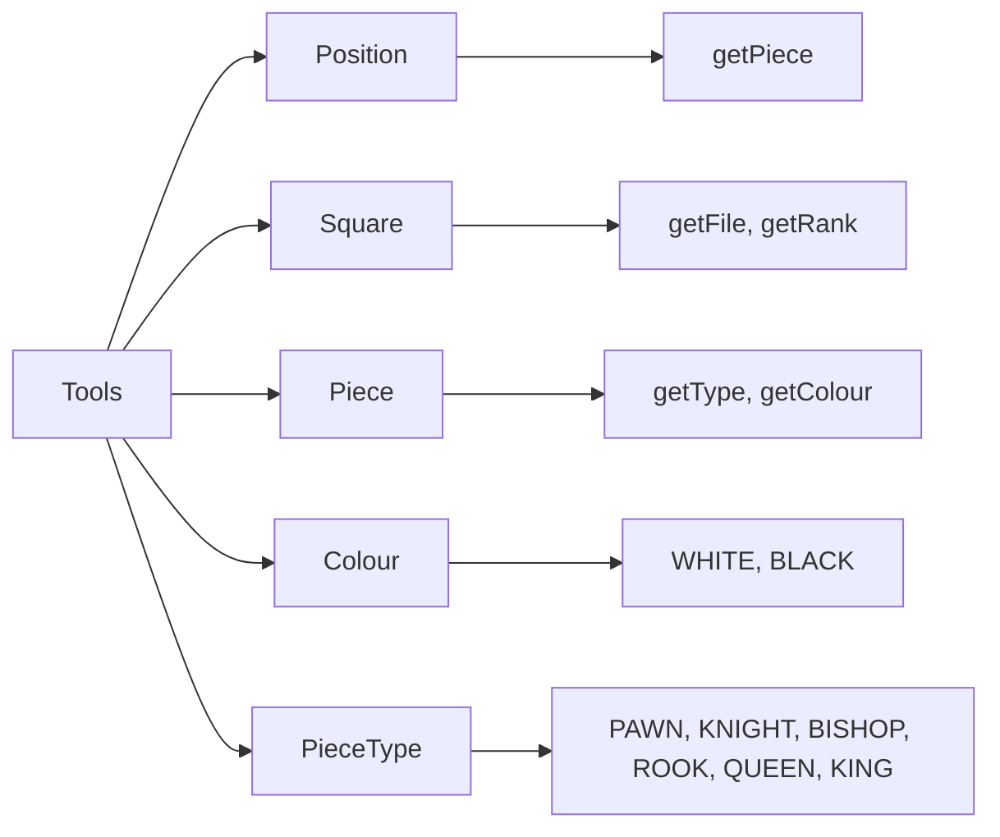
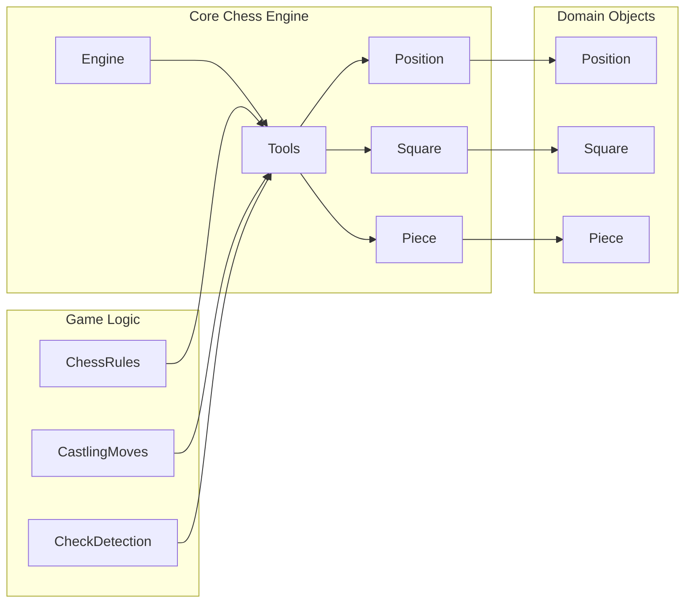

# Tools Module Documentation

## Overview

The Tools module provides utility functions for chess-related operations, specifically focused on determining whether squares are attacked by pieces of a particular color. This functionality is essential for check/checkmate detection and castling legality calculations in the chess engine.

## Purpose and Core Functionality

The primary purpose of this module is to implement the `isSquareAttacked` method which determines whether a specific square on the chessboard is under attack by any piece of a given color. This is a fundamental operation in chess engines for:

- Check detection
- Checkmate detection  
- Castling legality validation
- Move generation and validation

The implementation handles all piece types:
- Sliding pieces (queen, rook, bishop) using ray tracing
- Knight moves using direct square checking
- Pawn attacks using directional checking
- King moves using direct square checking

## Module Architecture

The module consists of a single utility class `Tools` with static methods that perform chess board analysis operations.

### Key Components

- **Tools**: Main utility class containing static methods for square attack detection
- **isSquareAttacked**: Primary method for determining if a square is attacked
- **isAttackedAlongRay**: Helper method for ray-based attack detection
- **isSquareAttackedFromSquare**: Helper method for direct square attack detection

## Data Flow and Dependencies

The Tools module depends on several core domain objects:

- `Position`: Provides the chess board state
- `Square`: Represents individual board positions
- `Piece`: Contains piece information including type and color
- `Colour`: Enum representing piece colors (WHITE/BLACK)
- `PieceType`: Enum representing different piece types

### Component Interactions



## Implementation Details

### Main Method: `isSquareAttacked`

The `isSquareAttacked` method performs a comprehensive check for all possible attack patterns:

1. **Diagonal Attacks**: Checks for queen or bishop attacks along diagonal rays
2. **Orthogonal Attacks**: Checks for queen or rook attacks along orthogonal rays  
3. **Knight Attacks**: Checks for knight attacks from all 8 possible knight move positions
4. **Pawn Attacks**: Checks for pawn attacks from adjacent squares (considering pawn direction)
5. **King Attacks**: Checks for king attacks from adjacent squares

Each attack pattern uses specialized helper methods to ensure correctness and efficiency.

### Helper Methods

#### `isAttackedAlongRay`
This method traces rays from a square in specified directions until it encounters a piece or goes out of bounds. It's used for sliding pieces (queen, rook, bishop).

#### `isSquareAttackedFromSquare` 
This method checks if a specific square (relative to the target square) contains a piece of the correct type and color. Used for non-sliding pieces (knights, pawns, kings).

## Integration with Other Modules

The Tools module integrates with several core modules:

- **Domain Layer** ([domain.md](domain.md)): Uses Position, Square, Piece, Colour, and PieceType classes
- **Rules Layer** ([rules.md](rules.md)): Provides foundational chess logic for attack detection
- **Engine Layer** ([engine.md](engine.md)): Used by the engine for game state analysis

### System Architecture Flow



## Usage Examples

The Tools module is typically used internally by other chess engine components:

```java
// Check if a square is attacked by white pieces
boolean isAttacked = Tools.isSquareAttacked(position, square, Colour.WHITE);

// Used in check detection during move generation
if (Tools.isSquareAttacked(position, kingSquare, opponentColour)) {
    // Handle check scenario
}
```

## Performance Considerations

The implementation is optimized for performance by:
- Using efficient ray tracing algorithms
- Early termination when attacks are detected
- Pre-computing piece type sets for queen/bishop and queen/rook combinations
- Avoiding unnecessary object creation

## Related Documentation

For a complete understanding of how this module fits into the chess engine architecture, please also refer to:

- [Domain Module Documentation](domain.md)
- [Rules Module Documentation](rules.md) 
- [Engine Module Documentation](engine.md)