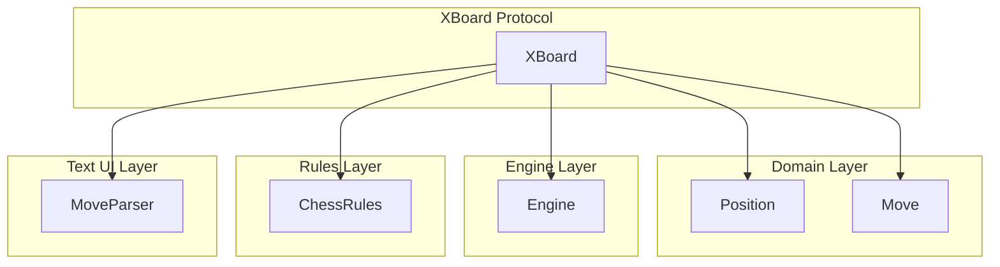
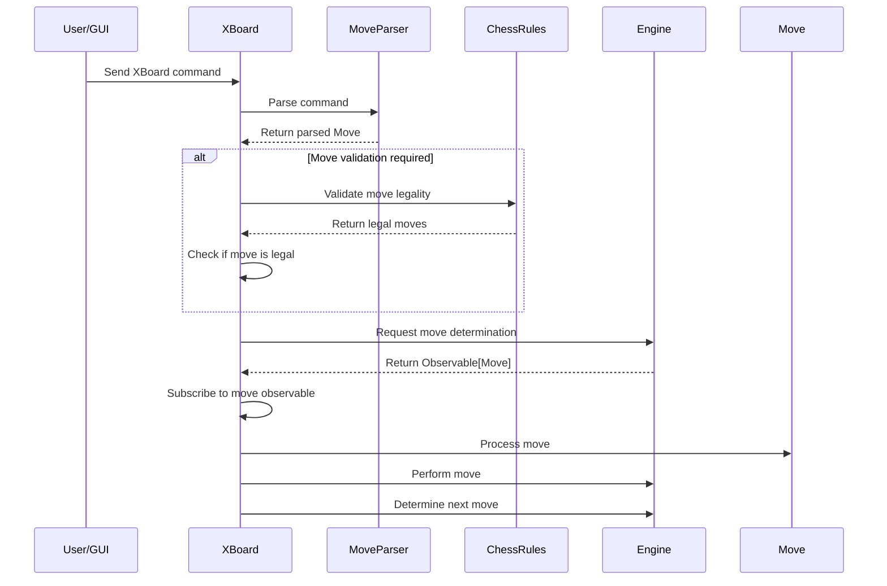
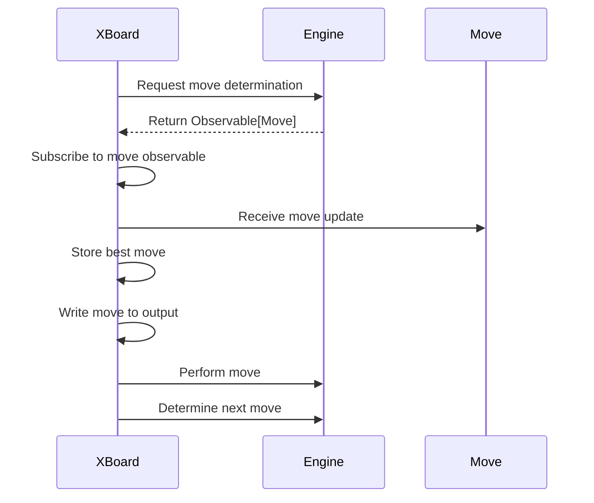

# XBoard Module Documentation

## Overview

The XBoard module provides an implementation of the XBoard protocol adapter for chess engines. It serves as the interface between a graphical user interface (GUI) and the chess engine, handling communication through the XBoard protocol standard. This module enables external programs to control the chess engine via text-based commands.

## Purpose and Core Functionality

The primary purpose of the XBoard module is to facilitate communication between chess GUI applications and the chess engine through the XBoard protocol. It handles:
- Reading commands from a reader (typically stdin)
- Parsing XBoard protocol commands
- Validating moves against chess rules
- Communicating with the chess engine to determine moves
- Writing responses back to a writer (typically stdout)
- Managing game state through position updates

## Architecture and Component Relationships

### Main Component: XBoard

The central component of this module is the `XBoard` class which implements the Observer pattern for receiving move decisions from the engine.

### Key Dependencies

The XBoard module depends on several other modules in the system:

1. **Domain Layer** - Uses `Move` and `Position` classes for representing chess moves and board states
2. **Engine Layer** - Interacts with the `Engine` interface to determine moves and perform actions
3. **Rules Layer** - Utilizes `ChessRules` for validating moves
4. **Text UI Layer** - Uses `MoveParser` for parsing XBoard notation

### Component Interaction Diagram



## Data Flow

### Input Processing Flow



### Output Generation Flow



## Module Integration

The XBoard module integrates with other modules in the system as follows:

1. **Domain Layer Integration**: Uses `Position` and `Move` objects to represent the chess board state and moves
2. **Engine Layer Integration**: Communicates with the `Engine` interface to get move recommendations
3. **Rules Layer Integration**: Validates moves against `ChessRules` when configured
4. **Text UI Layer Integration**: Uses `MoveParser` to convert between XBoard notation and internal representations

## Key Features

### Protocol Support
- Implements basic XBoard protocol features including:
  - `xboard` command acknowledgment
  - `protover 2` feature negotiation
  - `new` command for game initialization
  - `go` command for engine move determination
  - Move parsing and validation

### Error Handling
- Handles invalid moves gracefully by reporting errors
- Manages I/O exceptions during reading/writing
- Provides error feedback to users through the protocol

### State Management
- Maintains current game position
- Tracks best move decisions
- Manages engine lifecycle through proper setup and cleanup
- Thread-safe output handling

## Usage Example

```java
// Create XBoard instance
XBoard xboard = new XBoard();

// Set up dependencies
xboard.setInput(System.in);
xboard.setOutput(System.out);
xboard.setChessRules(new DefaultChessRules());
xboard.setEngine(new DefaultEngine());

// Start playing
xboard.play();
```

## Configuration Options

The XBoard module supports several configuration options through setter methods:

1. **Input Stream**: Configure where to read commands from
2. **Output Stream**: Configure where to send responses to
3. **Chess Rules**: Enable/disable move validation
4. **Engine**: Set the engine implementation to use

## Related Modules

For more detailed information about related components, see:
- [Domain Module](domain.md) - For Move and Position definitions
- [Engine Module](engine.md) - For Engine interface and implementations
- [Rules Module](rules.md) - For ChessRules interface and implementations
- [Text UI Module](textui.md) - For MoveParser implementation

## Implementation Details

The XBoard class implements the Observer pattern to receive move decisions from the engine asynchronously. When the engine determines a move, it notifies the XBoard instance through the `onNext()` method, which then writes the move back to the output stream.

The module handles the main event loop in the `play()` method, continuously reading commands, processing them, and responding appropriately according to the XBoard protocol specification. The class uses RxJava's Observable pattern for asynchronous move determination and processing.

Key implementation aspects:
- Uses `BufferedReader` for efficient input reading
- Synchronizes output writing to prevent race conditions
- Implements proper resource management with `engine.close()` 
- Handles command parsing and validation
- Manages game state through position updates

## Limitations

- Supports only a subset of the full XBoard protocol
- Assumes synchronous operation for simplicity
- Limited error recovery mechanisms
- Basic move validation only (no advanced protocol features)
- Single-threaded design for simplicity

## Future Enhancements

Potential improvements could include:
- Full XBoard protocol compliance
- Enhanced error handling and recovery
- Support for additional XBoard features
- Better integration with modern GUI frameworks
- Multi-threaded support for concurrent operations
- Improved performance optimizations