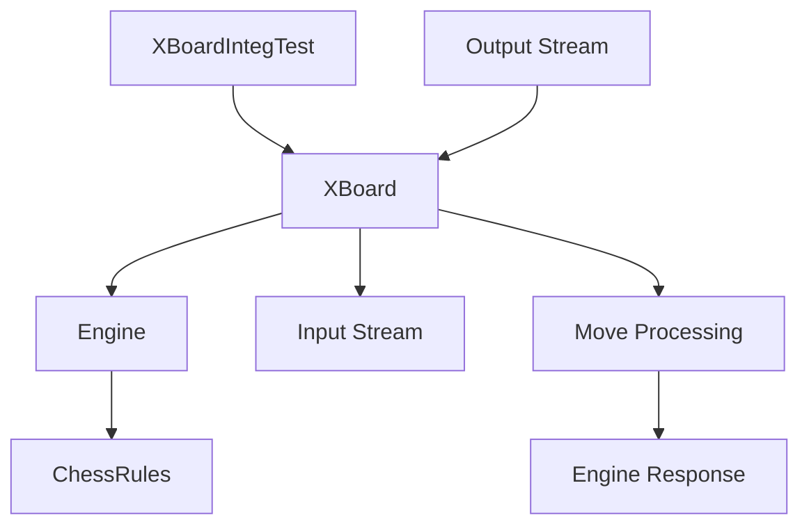

# XBoard Integration Module Documentation

## Overview

The `xboard_integration` module provides integration testing capabilities for the XBoard protocol implementation in the DokChess chess engine. This module focuses on testing the interaction between the XBoard user interface protocol and the chess engine, ensuring proper communication and move processing through integration tests.

## Purpose and Functionality

The primary purpose of this module is to validate the end-to-end functionality of the XBoard protocol implementation by running integration tests that simulate real-world usage scenarios. The module specifically tests:

- XBoard protocol initialization and negotiation
- Move processing through the XBoard interface
- Engine response generation to XBoard commands
- Proper communication between the chess rules engine and XBoard interface

## Module Structure

The module contains a single integration test class:

- `XBoardIntegTest.java` - Tests the XBoard protocol integration with the chess engine

## Component Relationships

### Core Components

The main component in this module is:
- **XBoardIntegTest** - The integration test class that orchestrates the testing of XBoard protocol functionality

### Dependencies

This module depends on several other core modules:

1. **[engine](engine.md)** - Provides the `DefaultEngine` and `Engine` interfaces that handle chess move calculations
2. **[rules](rules.md)** - Provides `ChessRules` and `DefaultChessRules` for chess rule enforcement
3. **[textui/xboard](textui_xboard.md)** - Contains the `XBoard` class that implements the XBoard protocol

### Data Flow

## Integration Test Process

The integration test follows these steps:

1. **Setup**: Creates an XBoard instance with configured engine and rules
2. **Input Simulation**: Provides XBoard protocol commands via a StringReader
3. **Execution**: Calls the play() method to process commands
4. **Monitoring**: Uses a scheduled executor to monitor output for move responses
5. **Validation**: Asserts that the expected move response was generated

## Key Features

- Tests XBoard protocol version negotiation (`protover 2`)
- Validates move command processing (`e2e4`)
- Ensures proper engine response generation
- Verifies communication between XBoard interface and chess engine

## Usage

This module is primarily used for automated integration testing during development and quality assurance. It ensures that the XBoard protocol implementation works correctly with the underlying chess engine and rules.

## Related Modules

- [engine](engine.md) - Core chess engine implementation
- [rules](rules.md) - Chess rules enforcement
- [textui/xboard](textui_xboard.md) - XBoard protocol implementation